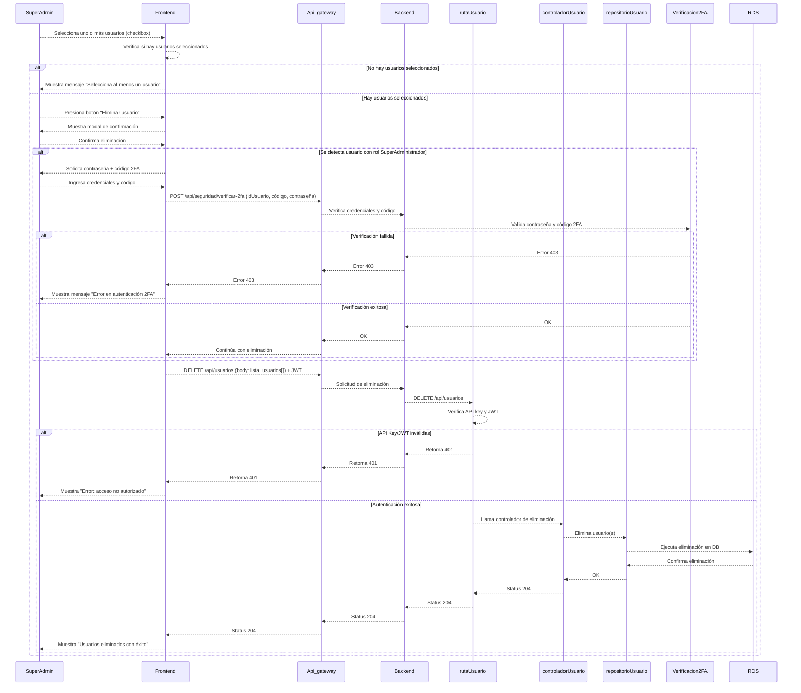
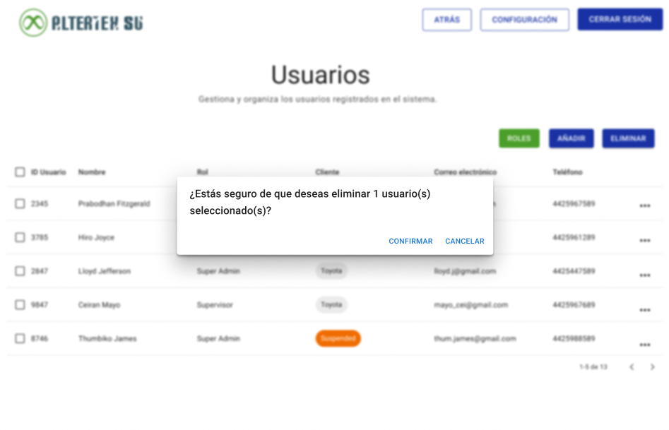

# RF5: Super Administrador Elimina Usuario

**Última actualización:** 24 de abril de 2025

## Historia de Usuario

Como administrador, quiero poder eliminar a un usuario que ya no requiera acceso al sistema para mantener una base de datos precisa y evitar accesos innecesarios.

## **Criterios de Aceptación:**

1. El Super Administrador debe poder eliminar un usuario existente.
2. Antes de eliminar, se debe mostrar una ventana de confirmación para evitar eliminaciones accidentales.
3. Si el usuario es eliminado con éxito, el sistema debe actualizar la lista de usuarios y mostrar un mensaje de éxito.
4. Si ocurre un error en la eliminación, se debe mostrar un mensaje de error indicando el motivo.
5. Si el usuario a eliminar posee el rol de Super Administrador:
   - Se debe solicitar un paso de verificación adicional mediante código 2FA (Google Authenticator), además de la contraseña.
   - Solo los Super Administradores habilitados para acciones críticas podrán realizar esta operación.
6. Si el código 2FA o la contraseña son incorrectos, la eliminación no se ejecuta y se muestra un mensaje de error.
7. La eliminación debe garantizar autenticación por token válida y permisos correspondientes.
8. No se podrá eliminar el usuario que está en uso.

---

## **Diagrama de Secuencia**

> _Descripción_: El diagrama de secuencia ilustra los pasos que sigue el sistema cuando el Super Administrador elimina un usuario. Incluye la confirmación, la eliminación en la base de datos y la actualización de la lista de usuarios.

---

## **Mockup**

> _Descripción_: El mockup muestra la interfaz donde el **Super Administrador** puede eliminar un usuario, con una ventana de confirmación para evitar acciones accidentales.

## **Pruebas Unitarias**

_<u>[Enlace a pruebas RF5 Elimina Usuario](https://docs.google.com/spreadsheets/d/1NLGwGrGA5PVOEzLaqxa8Ts1D_Ng3QzzqNKWJYUzxD-M/edit?usp=sharing)</u>_

## **Código**

_<u>[Pull Request Front-End](https://github.com/CodeAnd-Co/Frontend-Text-Lines/pull/40)</u>_

_<u>[Pull Request Back-End](https://github.com/CodeAnd-Co/Backend-textiles/pull/42)</u>_

---

### Historial de cambios

| **Tipo de Versión** | **Descripción**                                 | **Fecha**  | **Colaborador**               |
| ------------------- | ----------------------------------------------- | ---------- | ----------------------------- |
| **1.0**             | Creación del documento                          | 06/3/2025  | Angélica Rios Cuentas         |
| **1.1**             | Actualización de la documentación del requisito | 08/4/2025  | Carlos Iván Fonseca Mondragón |
| **1.2**             | Actualización al diagrama de secuencia          | 24/4/2025  | Carlos Iván Fonseca Mondragón |
| **1.3**             | Actualización de la documentación del requisito | 24/4/2025  | Carlos Iván Fonseca Mondragón |
| **1.4**             | Actualización de diagrama                       | 06/05/2025 | Hiram Mendoza                 |
| **1.5**             | Actualizar interfaz                             | 22/5/2025  | Diego Antonio García Padilla  |
| **1.6**             | Agregar links de PR                             | 26/05/2025 | Max Toscano                   |
