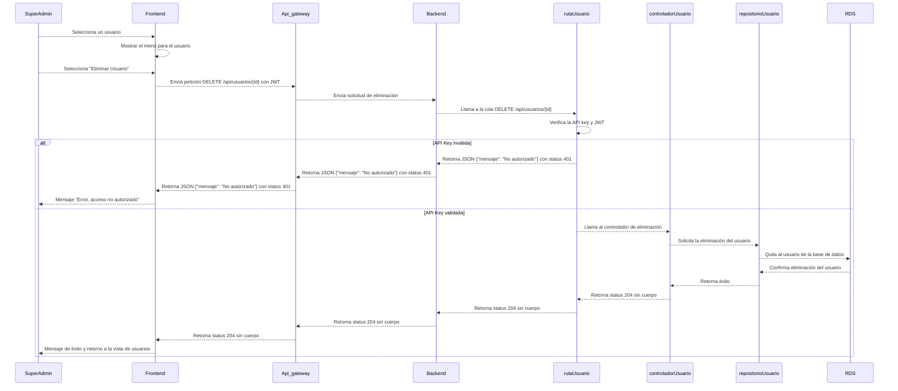

# RF5: Super Administrador Elimina Usuario

---

## Historia de Usuario

Como administrador, quiero poder eliminar a un usuario que ya no requiera acceso al sistema para mantener una base de datos precisa y evitar accesos innecesarios.

## **Criterios de Aceptación:**

1. El Super Administrador debe poder acceder a la opción **"Eliminar Usuario"** dentro del panel de información de un usuario.
2. Antes de eliminar, se debe mostrar una ventana de confirmación para evitar eliminaciones accidentales.
3. Si el usuario es eliminado con éxito, el sistema debe actualizar la lista de usuarios y mostrar un mensaje de confirmación.
4. Si ocurre un error en la eliminación, se debe mostrar un mensaje de error indicando el motivo.

---

## **Diagrama de Secuencia**

> _Descripción_: El diagrama de secuencia ilustra los pasos que sigue el sistema cuando el Super Administrador elimina un usuario. Incluye la confirmación, la eliminación en la base de datos y la actualización de la lista de usuarios.

---

## **Mockup**

> _Descripción_: El mockup muestra la interfaz donde el **Super Administrador** puede eliminar un usuario, con una ventana de confirmación para evitar acciones accidentales.

## **Pruebas Unitarias**

En caso de que alguna de las pruebas unitarias no sea aprobada, se deberá realizar una nueva iteración del proceso de pruebas.
Este proceso continuará de forma iterativa hasta que todas las pruebas sean aprobadas satisfactoriamente, garantizando así la estabilidad y el cumplimiento de los requisitos funcionales definidos en la historia de usuario.

| ID Prueba | Descripción                               | Precondiciones                                                                                                                | Valores de entrada                                                                        | Resultado esperado                                                                                                          | Resultado observado | Aprobado (sí/no) |
| --------- | ----------------------------------------- | ----------------------------------------------------------------------------------------------------------------------------- | ----------------------------------------------------------------------------------------- | --------------------------------------------------------------------------------------------------------------------------- | ------------------- | ---------------- |
| EU001     | Entrar a la lista de usuarios             | - Super administrador autenticado                                                                                             | - Click en la opción de "Usuarios" en el menú                                             | Pantalla de lista de usuarios                                                                                               | Pendiente           | Pendiente        |
| EU002     | Seleccionar usuarios y clic en "Eliminar" | - Super administrador autenticado   - Usuario existente en la lista de usuarios                                          | - Click en la casilla de los usuarios a eliminar   - Click en el botón de "Eliminar" | Pantalla para confirmar eliminación, con el nombre o nombres de los usuarios seleccionados                                  | Pendiente           | Pendiente        |
| EU003     | Eliminar usuario existente                | - Super administrador autenticado   - Usuario existente en la base de datos   - Acceso de super admin en el sistema | ID del usuario a eliminar (a través de un click en el botón de eliminar usuario)          | - Mensaje de éxito y actualización de la lista de usuarios   - Usuarios eliminados no aparecen en la lista actualizada | Pendiente           | Pendiente        |

### Historial de cambios

| **Tipo de Versión** | **Descripción**                                 | **Fecha**  | **Colaborador**               |
| ------------------- | ----------------------------------------------- | ---------- | ----------------------------- |
| **1.0**             | Creación del documento                          | 06/03/2025 | Angélica Rios Cuentas         |
| **1.1**             | Actualización de la documentación del requisito | 08/04/2025 | Carlos Iván Fonseca Mondragón |
