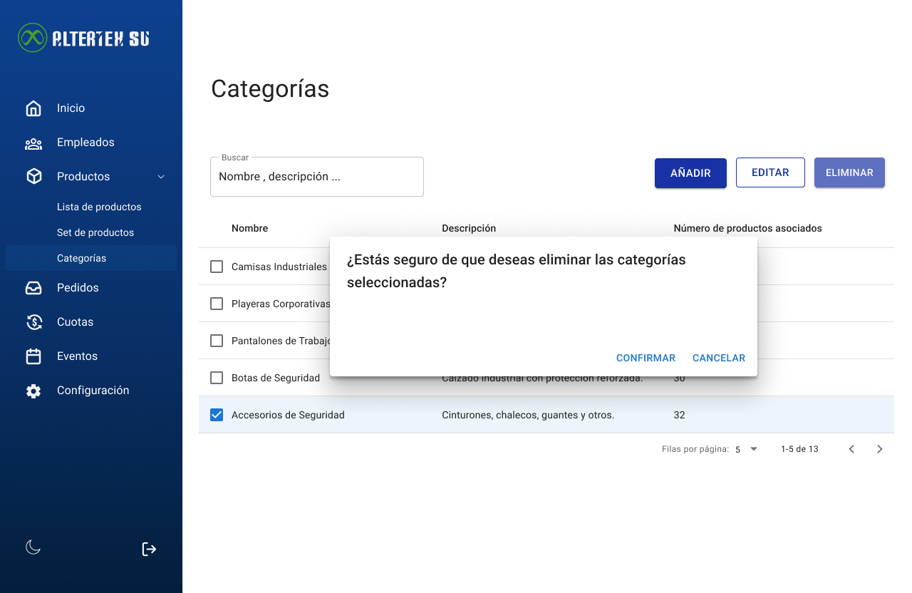

# RF50: Elimina Categoria de Productos

**Última actualización:** 06 de marzo de 2025

---

## Historia de Usuario

Como administrador, quiero eliminar una categoría de productos, asegurándome de recibir una advertencia si tiene productos asociados, para mantener una gestión ordenada y eliminar información innecesaria.

## **Criterios de Aceptación:**

1. El Super Administrador debe poder eliminar una categoría de productos existente.
2. El sistema debe confirmar la acción antes de proceder con la eliminación.
3. Si la categoría es eliminada correctamente, debe desaparecer de la lista de categorías.

---

## **Diagrama de Secuencia**

> _Descripción_: El diagrama de secuencia muestra el proceso mediante el cual el Super Administrador elimina una categoría de productos, y cómo el sistema valida y realiza la acción de eliminación.

---

## **Mockup**

> _Descripción_: El mockup muestra la interfaz donde el Super Administrador puede eliminar una categoría de productos.

> 

## **Pruebas**

_<u>[Enlace a pruebas RF50 Elimina Categoria de Productos.](https://docs.google.com/spreadsheets/d/1NLGwGrGA5PVOEzLaqxa8Ts1D_Ng3QzzqNKWJYUzxD-M/edit?gid=1863559050#gid=1863559050)</u>_
