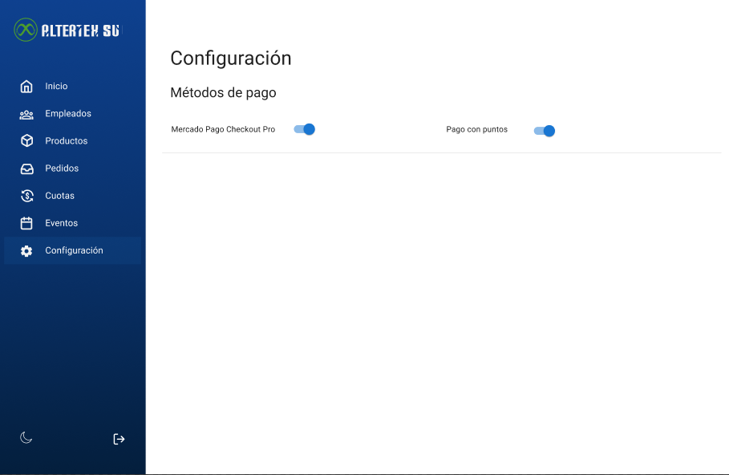

# RF52: Super Administrador, Cliente Consulta Lista de Tipos de Pago

**Última actualización:** 22 de mayo de 2025

---

## Historia de Usuario

Como administrador, deseo visualizar todos los tipos de pago definidos, para gestionar adecuadamente las opciones disponibles para los empleados.

## **Criterios de Aceptación:**

1.  El Super Administrador y el Cliente deben poder consultar la los tipos de pago disponibles.
2.  Se deben mostrar los tipos de pago con switches.

---

## **Diagrama de Secuencia**

> _Descripción_: El diagrama de secuencia muestra el proceso mediante el cual el Super Administrador o Cliente consulta la lista de tipos de pago, cómo se recuperan los datos y se presentan en el sistema.

:::warning Importante
Debido a la dificultad baja del requisito, no se quiere diagrama de secuencia
:::

---

## **Mockup**

> _Descripción_: El mockup muestra la interfaz donde el Super Administrador o Cliente pueden consultar la lista de tipos de pago.

## **Código**

_<u>[Pull Request Front-End](https://github.com/CodeAnd-Co/Frontend-Text-Lines/pull/70)</u>_

_<u>[Pull Request Back-End](https://github.com/CodeAnd-Co/Backend-textiles/pull/58)</u>_

---

| **Tipo de Versión** | **Descripción**                | **Fecha**  | **Colaborador**              |
| ------------------- | ------------------------------ | ---------- | ---------------------------- |
| **1.0**             | Creacion de RF52               |            |                              |
| **1.0**             | Agregar mockup                 | 5/06/2025  | Diego Alfaro                 |
| **1.1**             | Eliminar done                  | 6/05/2025  | Diego Alfaro                 |
| **1.2**             | Actualización de documentación | 22/05/2025 | Diego Antonio García Padilla |
| **1.3**             | Se actualizó documentación.    | 22/05/2025 | Arturo Sánchez Rodríguez     |
| **1.4**             | Agregar links de PR            | 26/05/2025 | Max Toscano                  |
