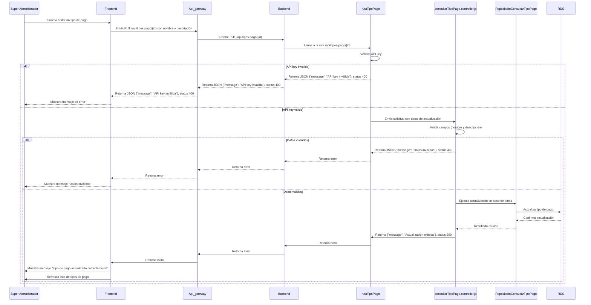
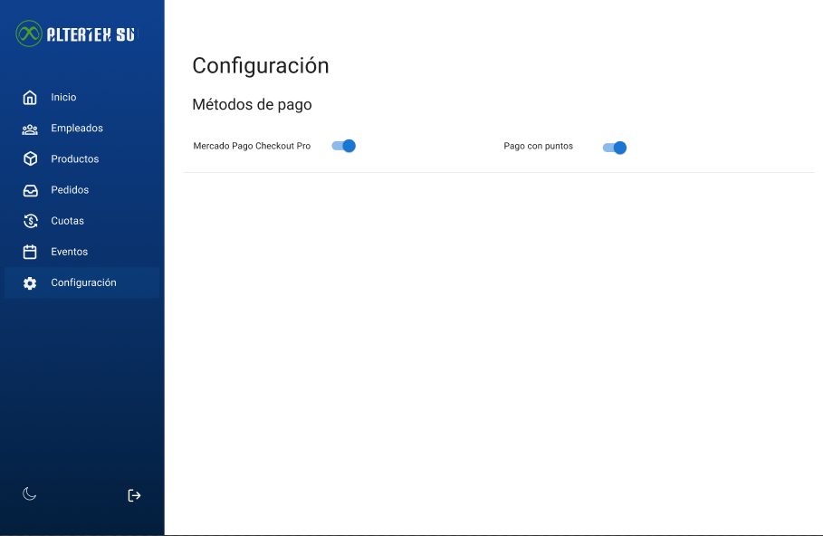

# RF54: Super Administrador Actualiza Tipo de Pago

**Última actualización:** 06 de marzo de 2025

---

## Historia de Usuario

Como administrador, necesito modificar las condiciones o características de un tipo de pago existente para adaptarlo a nuevas políticas o situaciones.

## **Criterios de Aceptación:**

1. El Super Administrador debe poder actualizar los tipos de pago disponibles en el sistema.
2. Los campos editables deben incluir:
   - Tipo de pago
   - Checks para activar y desactivar el tipo de pago
3. El sistema debe validar que los campos sean correctos antes de realizar la actualización.
4. Si el tipo de pago se actualiza correctamente, debe reflejarse de inmediato en la lista de tipos de pago.
5. Si ocurre un error, el sistema debe mostrar un mensaje de error.

---

## **Diagrama de Secuencia**

> _Descripción_: El diagrama de secuencia muestra el proceso mediante el cual el Super Administrador actualiza los tipos de pago y cómo el sistema valida y guarda los cambios.

---

## **Mockup**

> _Descripción_: El mockup muestra la interfaz donde el Super Administrador puede actualizar los datos de un tipo de pago.

## **Historial de Cambios**

| **Tipo de Versión** | **Descripción**                        | **Fecha**  | **Colaborador** |
| ------------------- | -------------------------------------- | ---------- | --------------- |
| **1.0**             | Creacion de RF54                       | 25/04/2025 | Diego Alfaro    |
| **1.1**             | Agregar mockup y diagrama de secuencia | 25/04/2025 | Diego Alfaro    |
| **1.1**             | Eliminar done                          | 6/05/2025  | Diego Alfaro    |
| **1.2**             | Agregar diagrama de secuencia          | 22/05/2025 | Rodrigo Antonio |
