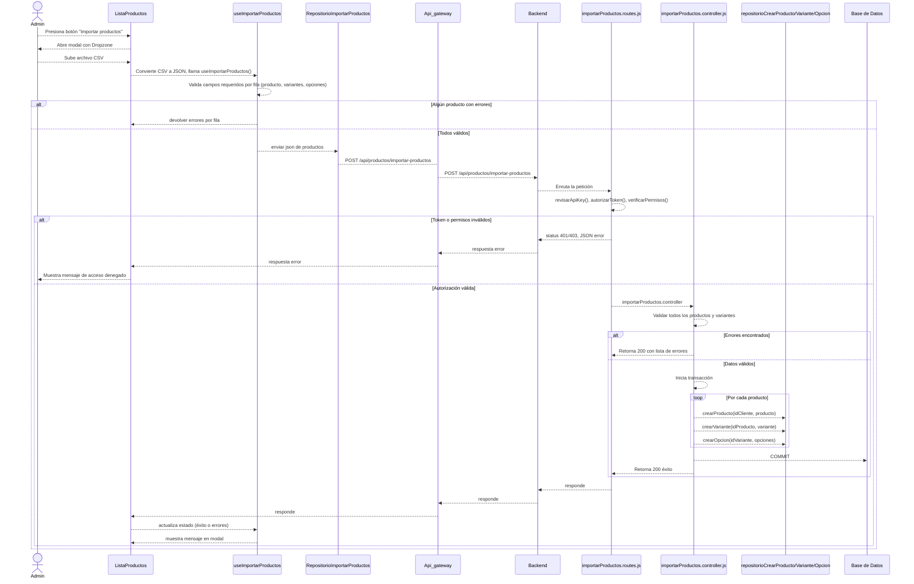
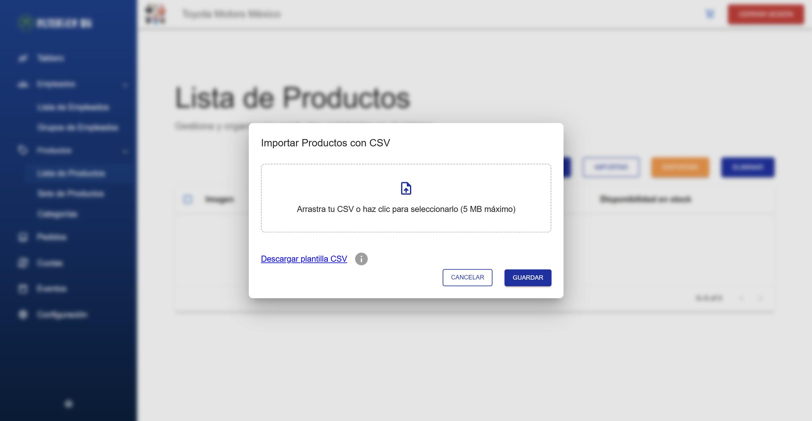

# RF56: Super Administrador Importa Productos

**Última actualización:** 06 de marzo de 2025

---

## Historia de Usuario

Como administrador, quiero importar una lista de productos desde un archivo externo para agilizar el proceso de registro y asegurar que el catálogo de productos esté completo y actualizado.

## **Criterios de Aceptación:**

1. El Super Administrador debe poder importar productos mediante un archivo CSV.
2. El archivo debe contener la información necesaria para crear productos, incluyendo:
   - idProducto: Para agrupar variantes y grupos
   - idProveedor
   - nombreProducto
   - nombreComercial
   - descripcionProducto
   - tipoProducto
   - marca
   - modelo
   - costo
   - precioVenta
   - precioCliente
   - precioPuntos
   - impuesto
   - descuento
   - estado: producto activo o no
   - envio: disponible o no
   - nombreVariante
   - descripcionVariante
   - valorOpcion
   - SKUautomatico
   - SKUcomercial
   - cantidad: Stock disponible
   - costoAdicional
   - descuentoOpcion
   - estadoOpcion
3. El sistema debe validar el formato del archivo antes de realizar la importación.
4. El sistema debe validar cada columna en el csv, si los datos existen o no, e indicar en que producto esta el error.
5. Si se presenta un error en los datos ingresados, la importacion se debe cancelar.
6. Se podrá consultar las consideraciones para hacer una importación exitosa en el ícono de información (i)
7. El archivo CSV no debe pesar más de 5mb.
8. Si la importación es exitosa, los productos deben aparecer en la lista de productos disponibles.
9. Se debe de proporcionar un archivo de plantilla para importar.
10. La importación debe considerar la inyección SQL.

---

## **Diagrama de Secuencia**

> _Descripción_: El diagrama de secuencia muestra el proceso mediante el cual el Super Administrador importa productos, y cómo el sistema valida y procesa la información del archivo.

---

## **Mockup**

> _Descripción_: El mockup muestra la interfaz donde el Super Administrador puede cargar el archivo para importar productos.

> 

## **Pruebas**

_<u>[Enlace a pruebas RF56 Importar Productos.](https://docs.google.com/spreadsheets/d/1NLGwGrGA5PVOEzLaqxa8Ts1D_Ng3QzzqNKWJYUzxD-M/edit?gid=237108171#gid=237108171)</u>_

## **Código**

_<u>[Pull Request Front-End](https://github.com/CodeAnd-Co/Frontend-Text-Lines/pull/168)</u>_

_<u>[Pull Request Back-End](https://github.com/CodeAnd-Co/Backend-textiles/pull/124)</u>_

---

| **Tipo de Versión** | **Descripción**                  | **Fecha**  | **Colaborador**          |
| ------------------- | -------------------------------- | ---------- | ------------------------ |
| **1.0**             | Creación del requisito           | 6/3/2025   | Angélica Rios            |
| **1.1**             | Actualización: diagrama y mockup | 2/6/2025   | Nicolas Hood             |
| **1.2**             | Añadir código | 6/6/2025   | Valeria Zúñiga             |
