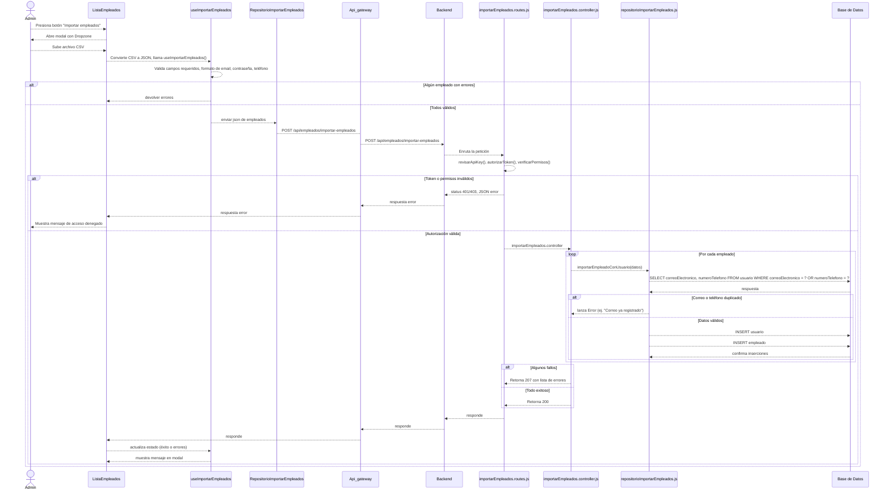
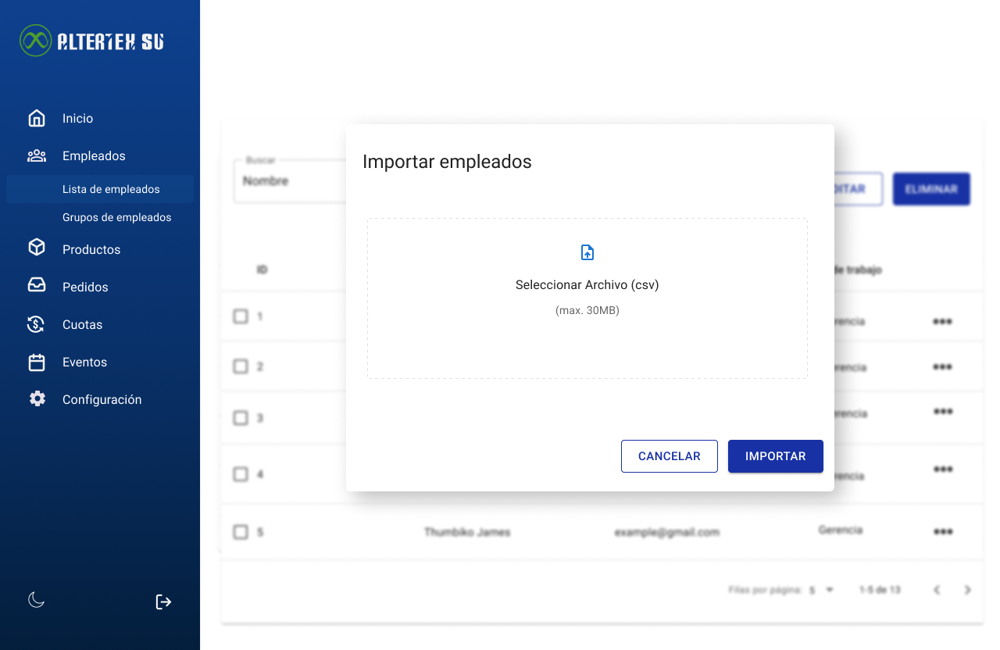

# RF57: Super Administrador Importa Empleados

Estado de la US: `Ready`

---

## Historia de Usuario

Como administrador, quiero poder importar una lista de empleados desde un archivo para agilizar su registro y asignación en el sistema.

## **Criterios de Aceptación:**

1. El Super Administrador debe poder importar empleados mediante un archivo CSV.
2. El archivo debe contener la información necesaria para crear empleados, incluyendo:
   - nombreCompleto
   - correoElectronico
   - contrasena
   - numeroTelefono
   - direccion
   - fechaNacimiento
   - genero
   - estatus	
   - idRol
   - idCliente
   - numeroEmergencia
   - areaTrabajo	
   - posicion	
   - cantidadPuntos	
   - antiguedad
   
3. El sistema debe validar el formato del archivo antes de realizar la importación.
4. Si la importación es exitosa, los empleados deben aparecer en la lista de empleados.
5. Si hay errores en el archivo, el sistema debe indicar qué empleados no pudieron ser importados.

---

## **Diagrama de Secuencia**

> _Descripción_: El diagrama de secuencia muestra el proceso mediante el cual el Super Administrador importa empleados, y cómo el sistema valida y procesa la información del archivo.

---

## **Mockup**

> _Descripción_: El mockup muestra la interfaz donde el Super Administrador puede cargar el archivo para importar empleados.

> 

## **Pruebas**
_<u>[Enlace a pruebas RF2 Consultar Lista de Usuarios.](https://docs.google.com/spreadsheets/d/1NLGwGrGA5PVOEzLaqxa8Ts1D_Ng3QzzqNKWJYUzxD-M/edit?gid=2147222753#gid=2147222753)</u>_

---

| **Tipo de Versión** | **Descripción**                               | **Fecha** | **Colaborador**                 |
| ------------------- | --------------------------------------------- | --------- | ------------------------------- |
| **1.0**             | Creación del requisito   | 6/3/2025  | Angélica Rios |
| **1.1**             | Actualización: diagrama y mockup | 7/5/2025  | Nicolas Hood   |