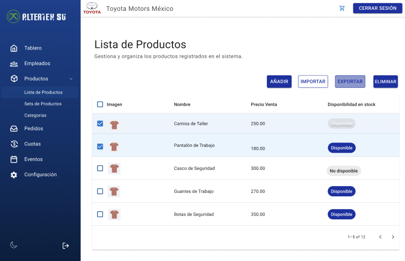

# RF58: Super Administrador Exporta Productos

**Última actualización:** 06 de marzo de 2025

---

## Historia de Usuario

Como administrador, quiero exportar el listado de productos, para poder respaldarlo, compartirlo o analizarlo. 

## **Criterios de Aceptación:**

1. El Super Administrador debe poder hacer clic en el botón "EXPORTAR" dentro del apartado de Lista de Productos.
2. Después de seleccionar productos, al hacer clic en "EXPORTAR", el Super Administrador debe poder descargar un archivo en formato .xlsx que contenga los productos, incluyendo los siguientes campos en cada hoja:
   - Información de producto
      - ID Producto
      - ID Proveedor
      - Nombre producto
      - Nombre comercial
      - Descripción 
      - Tipo de producto
      - Marca
      - Modelo
      - Costo
      - Precio venta
      - Precio cliente
      - Precio puntos
      - Impuestos
      - Descuento
      - Estado
      - Envio
   - Variantes
      - ID Producto
      - Nombre producto
      - Nombre variante
      - Descripción variante
   - Opciones
      - ID Producto
      - Nombre producto
      - Nombre variante
      - Valor opción
      - SKU Comercial
      - SKU Automatico
      - Cantidad
3. En caso de que no haya productos registrados o no se haya seleecionado ninguno, al hacer clic en "EXPORTAR", se debe mostrar un mensaje indicando que no hay datos para exportar.
4. Cuando se abra el archivo en un editor como Excel, los datos deben estar organizados en columnas correctamente formateadas, correspondientes a los campos indicados.
   - Se debe contar con las siguientes tres hojas: 
      - Información producto
      - Variantes
      - Opciones
5.  En caso de que ocurra un error al exportar empleados, se debe mostrar una alerta con un mensaje que especifique el tipo de error ocurrido.

---

## **Diagrama de Secuencia**

> _Descripción_: El diagrama de secuencia muestra el proceso mediante el cual el Super Administrador exporta productos y cómo el si

:::warning Importante
Debido a la dificultad baja del requisito, no se requiere diagrama de secuencia
:::

---

## **Mockup**

> _Descripción_: El mockup muestra la interfaz donde el Super Administrador puede exportar la lista de productos.
> 

## **Pruebas Unitarias**

_<u>[Enlace a pruebas RF58 Exportar productos](https://docs.google.com/spreadsheets/d/1NLGwGrGA5PVOEzLaqxa8Ts1D_Ng3QzzqNKWJYUzxD-M/edit?usp=sharing)</u>_

## **Código**

_<u>[Pull Request Front-End](https://github.com/CodeAnd-Co/Frontend-Text-Lines/pull/164)</u>_

_<u>[Pull Request Back-End](https://github.com/CodeAnd-Co/Backend-textiles/pull/122)</u>_

### Historial de cambios

| **Tipo de Versión** | **Descripción**                                  | **Fecha**  | **Colaborador**            |
| ------------------- | ------------------------------------------------ | ---------- | -------------------------- |
| **1.0**             | Actualización de la documentación del requisito. | 05/06/2025  | Paola María Garrido Montes |
