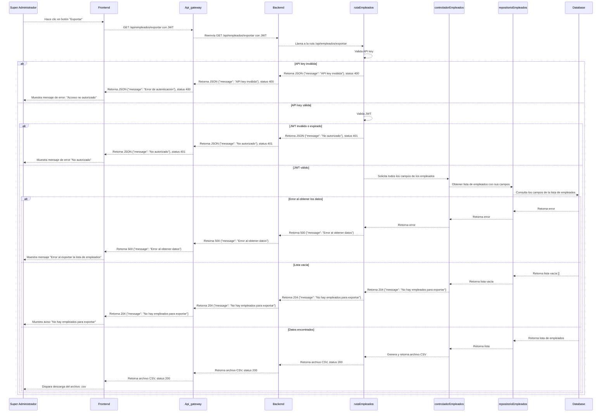
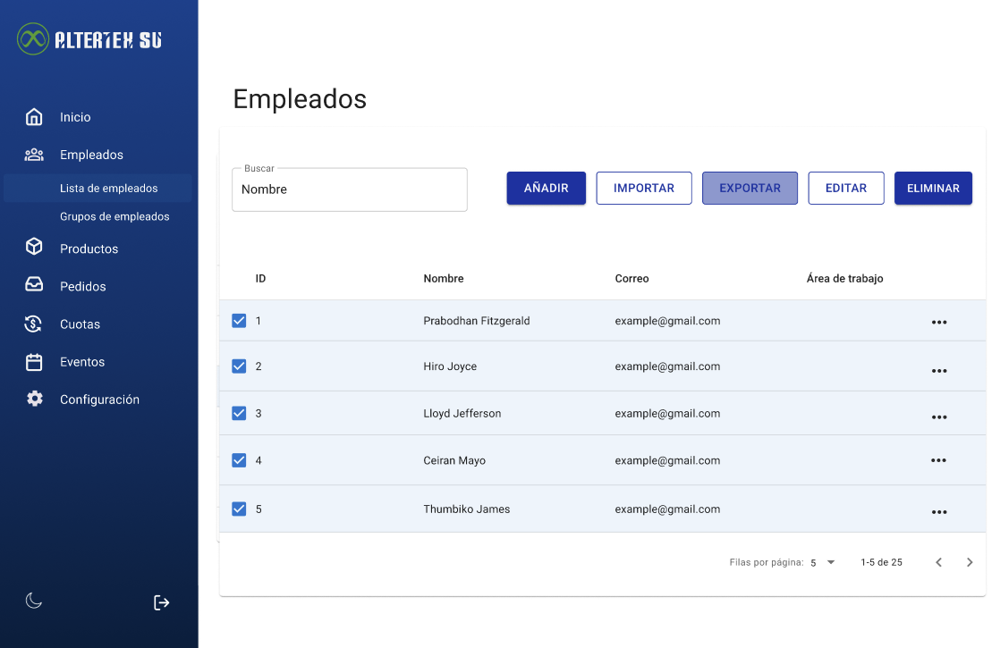

# RF59: Super Administrador Exporta Empleados

---

## Historia de Usuario

Como administrador, quiero exportar mi listado de empleados, para poder respaldarlo, compartirlo o analizarlo. 

## **Criterios de Aceptación:**

1. El Super Administrador debe poder hacer clic en el botón "EXPORTAR" dentro del apartado de Lista de Empleados.
2. Al hacer clic en "EXPORTAR", el Super Administrador debe poder descargar un archivo en formato .csv que contenga todos los empleados visibles, incluyendo los siguientes campos:
   - Nombre completo
   - Correo electrónico
   - Número de teléfono
   - Dirección 
   - Fecha de nacimiento
   - Género
   - Estatus
   - Número de emergencia
   - Área de trabajo
   - Posición
   - Puntos
   - Antigüedad
3. En caso de que no haya empleados registrados, al hacer clic en "EXPORTAR", se debe mostrar un mensaje indicando que no hay datos para exportar.
4. Cuando se abra el archivo .csv en un editor como Excel, los datos deben estar organizados en columnas correctamente formateadas, correspondientes a los campos indicados.
---

## **Diagrama de Secuencia**

> _Descripción_: El diagrama de secuencia muestra el proceso mediante el cual el Super Administrador exporta empleados y cómo el sistema genera el archivo para la descarga.

---

## **Mockup**

> _Descripción_: El mockup muestra la interfaz donde el Super Administrador puede exportar la lista de empleados.

> 

## **Pruebas Unitarias**

_<u>[Enlace a pruebas RF59 Lee Usuario](https://docs.google.com/spreadsheets/d/1NLGwGrGA5PVOEzLaqxa8Ts1D_Ng3QzzqNKWJYUzxD-M/edit?usp=sharing)</u>_

## **Código**

_<u>[Pull Request Front-End](www.pull.com)</u>_

_<u>[Pull Request Back-End](www.pull.com)</u>_

### Historial de cambios

| **Tipo de Versión** | **Descripción**                                  | **Fecha**  | **Colaborador**            |
| ------------------- | ------------------------------------------------ | ---------- | -------------------------- |
| **1.0**             | Actualización de la documentación del requisito. | 27/05/2025  | Paola María Garrido Montes |