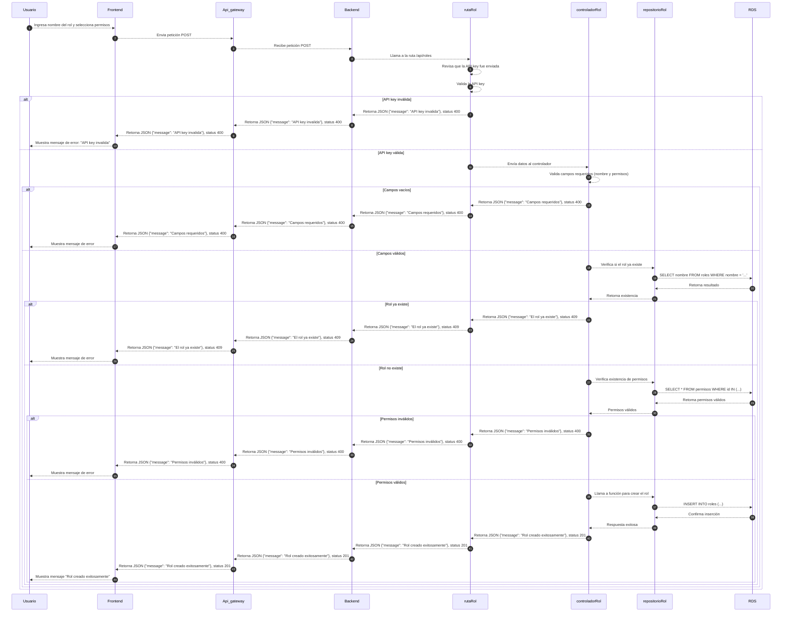

# RF6: Super Administrador Crea Rol

**Última actualización:** 06 de marzo de 2025

---

## Historia de Usuario

Como administrador, quiero poder crear nuevos roles personalizados con permisos específicos para asignarlos a los usuarios del sistema y gestionar su acceso de manera estructurada.

## **Criterios de Aceptación:**

1. El Super Administrador debe poder acceder a la opción **"Crear Rol"** dentro de la vista de roles.
2. Debe permitir ingresar un nombre para el rol, una descripción y definir los permisos asociados.
3. Al guardar, el sistema debe validar que el nombre del rol no esté duplicado.
4. Si la creación es exitosa, el nuevo rol debe aparecer en la lista de roles disponibles.
5. Si hay un error, el sistema debe mostrar un mensaje indicando el problema.

---

## **Diagrama de Secuencia**

> _Descripción_: El diagrama de secuencia representa el proceso mediante el cual el Super Administrador crea un nuevo rol, especificando sus permisos y confirmando la acción.

---

## **Mockup**

> _Descripción_: El mockup muestra la interfaz donde el Super Administrador puede ingresar el nombre del rol y seleccionar los permisos antes de crearlo.

## **Código**

_<u>[Pull Request Front-End](https://github.com/CodeAnd-Co/Frontend-Text-Lines/pull/43)</u>_

_<u>[Pull Request Back-End](https://github.com/CodeAnd-Co/Backend-textiles/pull/44)</u>_

---

### Historial de cambios

| **Tipo de Versión** | **Descripción**             | **Fecha**  | **Colaborador**          |
| ------------------- | --------------------------- | ---------- | ------------------------ |
| **1.0**             | Se actualizó documentación. | 22/05/2025 | Arturo Sánchez Rodríguez |
| **1.1**             | Agregar links de PR         | 26/05/2025 | Max Toscano              |
