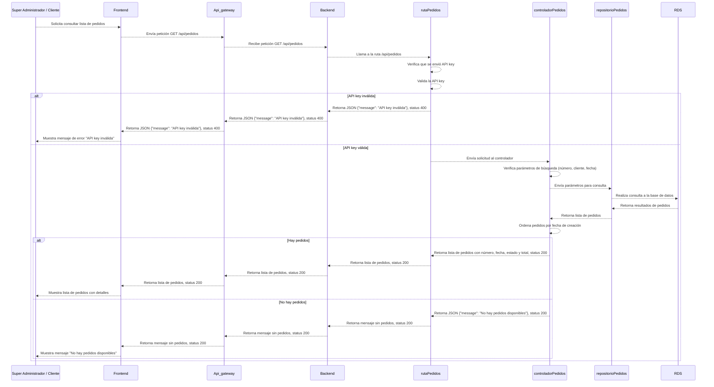
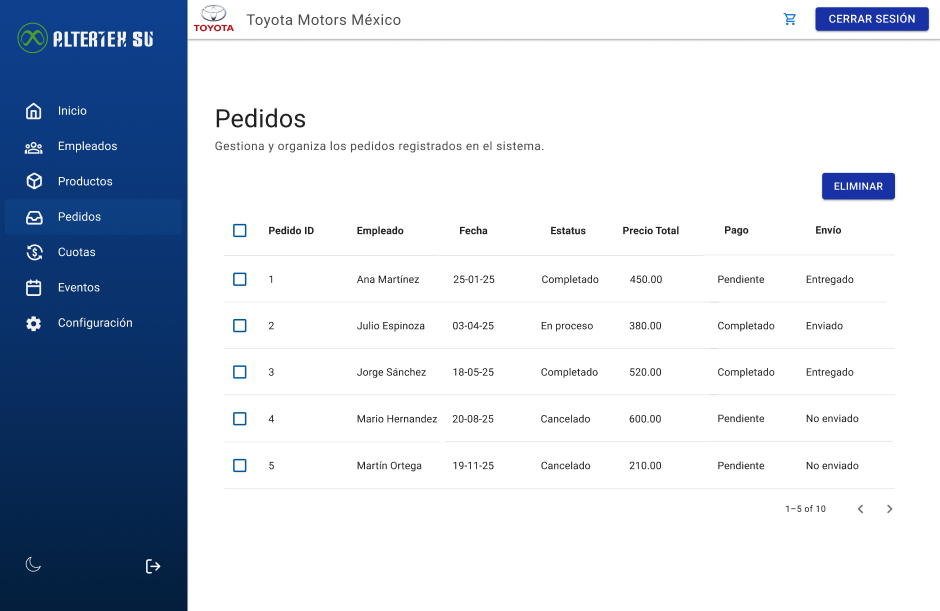

# RF60: Super Administrador, Cliente Consulta Lista de Pedidos

---

## Historia de Usuario

Como administrador, deseo ver una lista de todos los pedidos realizados para revisar su estado.

## **Criterios de Aceptación:**

1. El Super Administrador y el Cliente deben poder consultar la lista de todos los pedidos realizados.
2. Los pedidos deben mostrarse con los siguientes detalles:
   - ID del pedido
   - Empleado
   - Fecha de pedido
   - Estado del pedido
   - Total del pedido
   - Pago
   - Envio
3. El sistema debe permitir la búsqueda de pedidos por número, cliente o fecha.
4. La lista debe estar ordenada por la fecha de creación de los pedidos.
5. Si no existen pedidos, el sistema debe mostrar un mensaje indicando que no hay pedidos disponibles.

---

## **Diagrama de Secuencia**

> _Descripción_: El diagrama de secuencia muestra cómo el Super Administrador o el Cliente consulta la lista de pedidos y cómo el sistema procesa esta solicitud.

---

## **Mockup**

> _Descripción_: El mockup muestra la interfaz donde el Super Administrador o el Cliente pueden ver la lista de pedidos.

## 

## Pruebas

## **Código**

_<u>[Pull Request Front-End](https://github.com/CodeAnd-Co/Frontend-Text-Lines/pull/38)</u>_

---

| **Tipo de Versión** | **Descripción**             | **Fecha**  | **Colaborador**          |
| ------------------- | --------------------------- | ---------- | ------------------------ |
| **1.0**             | Creación de RF60            |            |                          |
| **1.0**             | Agregar mockup              | 2/05/2025  | Diego Alfaro             |
| **1.1**             | Eliminar done               | 6/05/2025  | Diego Alfaro             |
| **1.2**             | Eliminar done               | 22/05/2025 | Rodrigo Benítez          |
| **1.3**             | Se actualizó documentación. | 22/05/2025 | Arturo Sánchez Rodríguez |
| **1.4**             | Agregar links de PR         | 26/05/2025 | Max Toscano              |
