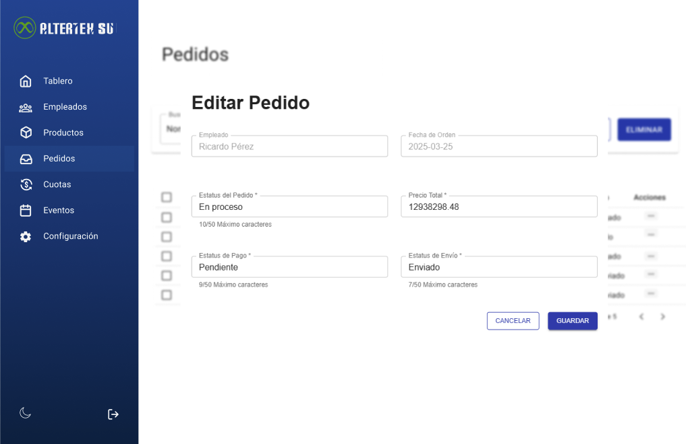

# RF62: Super Administrador, Cliente Actualiza Pedido

**Última actualización:** 06 de marzo de 2025

---

## Historia de Usuario

Como administrador, necesito modificar la información de un pedido existente para corregir errores o ajustar detalles según las necesidades operativas y garantizar la precisión de los registros.

## **Criterios de Aceptación:**

1. El Super Administrador y el Cliente deben poder actualizar el estado de un pedido existente.
2. Los campos editables deben incluir:
   - Estatus del pedido
   - Estatus de Pago
   - Estatus de Envio
   - Precio Total
3. Si el pedido se actualiza correctamente, debe reflejarse de inmediato en la lista de pedidos.
4. Si ocurre un error, el sistema debe mostrar un mensaje de error.
5. No deberá dejar actualizar un producto si no tiene alguno de los campos siguientes:
   - Estatus del pedido
   - Estatus de Pago
   - Estatus de Envio
   - Precio Total
6. No se deberá poder editar los campos de empleado y fecha de orden.

---

## **Diagrama de Secuencia**

> _Descripción_: El diagrama de secuencia muestra el proceso mediante el cual el Super Administrador o Cliente actualizan los detalles de un pedido y cómo el sistema valida y guarda los cambios.

:::warning Importante
Debido a la dificultad baja del requisito, no se quiere diagrama de secuencia
:::

---

## **Mockup**

> _Descripción_: El mockup muestra la interfaz donde el Super Administrador puede actualizar los estatus de un pedido.

> 

## **Pruebas**

_<u>[Enlace a pruebas RF62 Actualiza Pedido.](https://docs.google.com/spreadsheets/d/1NLGwGrGA5PVOEzLaqxa8Ts1D_Ng3QzzqNKWJYUzxD-M/edit?gid=1467235008#gid=1467235008)</u>_

## **Código**

_<u>[Pull Request Front-End](https://github.com/CodeAnd-Co/Frontend-Text-Lines/pull/172)</u>_

_<u>[Pull Request Back-End](https://github.com/CodeAnd-Co/Backend-textiles/pull/130)</u>_

---

| **Tipo de Versión** | **Descripción**           | **Fecha**  | **Colaborador** |
| ------------------- | ------------------------- | ---------- | --------------- |
| **1.0**             | Creación de documentación | 06/04/2025 | Angélica Ríos   |
| **1.1**             | Actualizar documentación  | 06/06/2025 | Angélica Ríos   |
