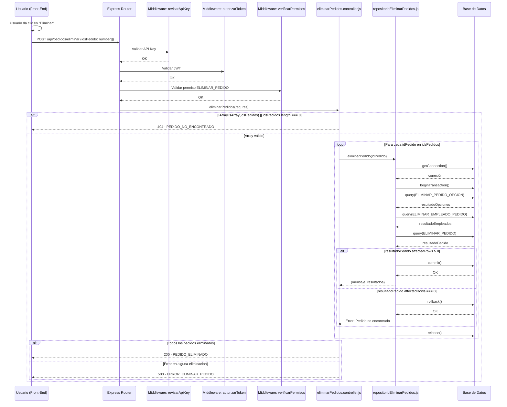
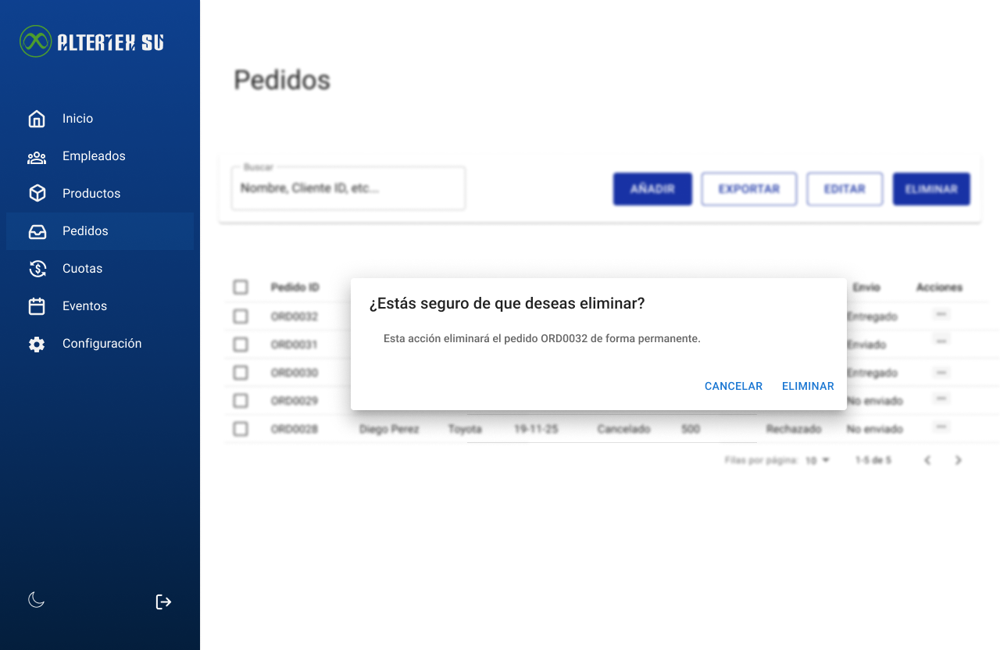

# RF63: Super Administrador Elimina Pedido

---

## Historia de Usuario

Como administrador, deseo eliminar un pedido que es inválido o fue creado por error, para mantener la integridad y exactitud de la base de datos de pedidos.​

## **Criterios de Aceptación:**

1. El Super Administrador debe poder eliminar un pedido existente.
2. El sistema debe solicitar confirmación antes de proceder con la eliminación del pedido.
3. Si la eliminación es exitosa, el pedido debe desaparecer de la lista de pedidos.
4. Si ocurre algún error, el sistema debe mostrar un mensaje de error.

---

## **Diagrama de Secuencia**

> _Descripción_: El diagrama de secuencia muestra el proceso mediante el cual el Super Administrador elimina un pedido, y cómo el sistema valida y ejecuta la acción.

---

## **Mockup**

> _Descripción_: El mockup muestra la interfaz donde el Super Administrador puede eliminar un pedido, con una confirmación antes de proceder.

> 

## **Pruebas**

_<u>[Enlace a pruebas RF63 Elimina Pedido.](https://docs.google.com/spreadsheets/d/1NLGwGrGA5PVOEzLaqxa8Ts1D_Ng3QzzqNKWJYUzxD-M/edit?gid=701264535#gid=701264535)</u>_

| **Tipo de Versión** | **Descripción**                  | **Fecha**  | **Colaborador** |
| ------------------- | -------------------------------- | ---------- | --------------- |
| **1.0**             | Creación de documentación        | 06/04/2025 | Angélica Ríos   |
| **1.1**             | Modificar diagramas de secuencia | 05/05/2025 | Angélica Ríos   |
| **1.2**             | Modificar diagrama de secuencia  | 22/05/2025 | Angélica Ríos   |
