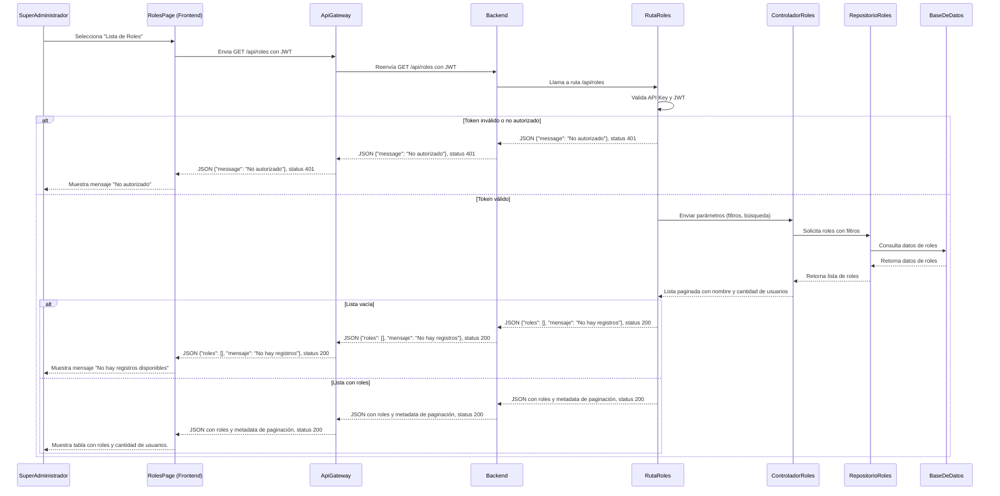

# RF7: Super Administrador Consulta Lista de Roles

**Última actualización:** 07 de abril de 2025

---

## Historia de Usuario

Como administrador, quiero poder ver un listado de roles con filtros y opciones de búsqueda para gestionar el acceso de los usuarios de manera eficiente.

## **Criterios de Aceptación:**

1. El Super Administrador debe poder acceder a la opción **"Lista de Roles"** dentro del panel de administración.
2. La lista debe mostrar los siguientes datos de cada rol:
   - Nombre del rol
   - Cantidad de usuarios asignados a ese rol
3. Debe permitir filtrar roles por nombre.
4. Si no hay roles registrados, se debe mostrar un mensaje indicando que no hay registros disponibles.

---

## **Diagrama de Secuencia**

> _Descripción_: El diagrama de secuencia muestra la interacción entre el Super Administrador y el sistema para consultar la lista de roles, incluyendo la solicitud de datos y su visualización.

---

## **Mockup**

> _Descripción_: El mockup muestra la interfaz donde el Super Administrador puede ver la lista de roles disponibles, con opciones de búsqueda y filtrado.

> 