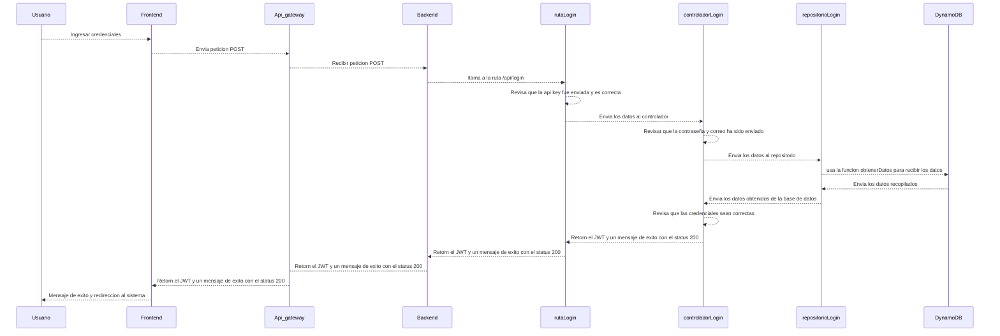

# RF78: Usuario incia sesion

**Última actualización:** 31 de marzo de 2025

---

## Historia de Usuario

Como **usuario** **(cliente, superadmin o empleado)**, quiero iniciar sesión ingresando mis credenciales en la vista de login, las cuales se envían al backend junto con la API key para validar en la base de datos; si las credenciales son correctas, accederé al sistema de backoffice o tienda, y si no lo son, seré redirigido nuevamente a la vista de login.

### **Criterios de Aceptación:**

1. El usuario debe poder acceder al sistema luego de ingresar las credenciales correctas
2. Si los datos ingresados son correctos, se debe mostrar un mensaje de exito
3. Se debe mostrar una interfaz con los campos de contraseña y correo
4. Si los datos ingresados son invalidos, se debe mostrar un mensaje de error al usuario
5. Si algún campo obligatorio está vacío o con formato incorrecto, se debe mostrar un mensaje de error indicando qué corregir.

---

## **Diagrama de Secuencia**

---

## **Mockup**

> _Descripción_: El mockup muestra la interfaz para que el usuario ingrese las credenciales e ingrese al sistema

---
