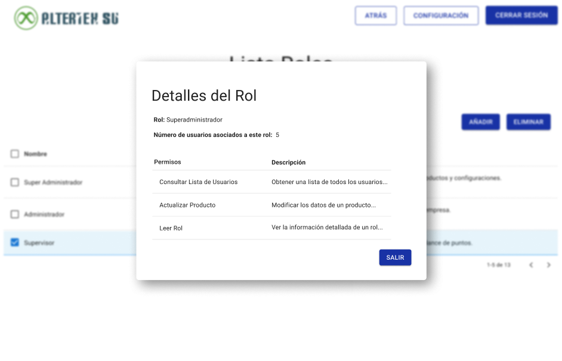

# RF8: Super Administrador Lee Rol

**Última actualización:** 06 de junio de 2025

---

## Historia de Usuario

Como administrador, quiero poder visualizar la información de un rol para consultar sus permisos y los usuarios asignados.

## **Criterios de Aceptación:**

1. El Super Administrador debe poder visualizar la información detallada de un rol.
2. Los datos mostrados deben incluir:
   - Nombre del rol
   - Lista de permisos asignados
   - Número de usuarios asociados al rol
3. La vista debe permitir solo la consulta, sin opciones de edición directa.

---

## **Diagrama de Secuencia**

> _Descripción_: El diagrama de secuencia representa el flujo de interacción del Super Administrador con el sistema para visualizar los detalles de un rol.

:::warning Importante
Debido a la dificultad baja del requisito, no se quiere diagrama de secuencia
:::

## **Mockup**

> _Descripción_: El mockup muestra la interfaz donde el Super Administrador puede visualizar la información detallada de un rol sin opciones de edición.

## **Pruebas Unitarias**

_<u>[Enlace a pruebas RF8 Leer Rol](https://docs.google.com/spreadsheets/d/1NLGwGrGA5PVOEzLaqxa8Ts1D_Ng3QzzqNKWJYUzxD-M/edit?usp=sharing)</u>_
