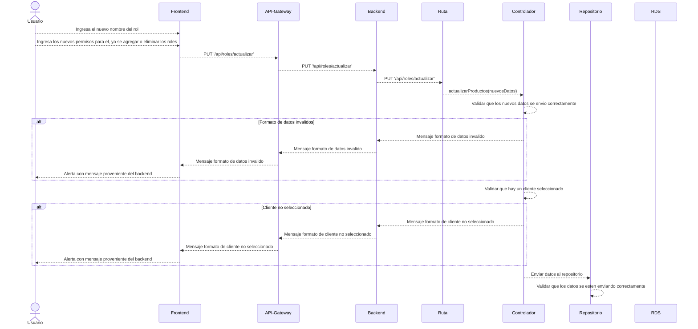

# RF9: Super Administrador Actualiza Rol

**Última actualización:** 06 de marzo de 2025

---

## Historia de Usuario

Como administrador, quiero poder modificar los permisos y el nombre de un rol para mantener el sistema actualizado y seguro.

## **Criterios de Aceptación:**

1. El Super Administrador debe poder modificar la información de un rol existente.
2. Se debe permitir cambiar el nombre y los permisos asignados.
3. El sistema debe validar que el nuevo nombre no esté duplicado.
4. Si la actualización es exitosa, los cambios deben reflejarse de inmediato en la vista con la información del rol.
5. Si hay un error, el sistema debe mostrar un mensaje indicando el problema.

---

## **Diagrama de Secuencia**

> _Descripción_: El diagrama de secuencia muestra el proceso mediante el cual el Super Administrador actualiza un rol, validando los datos y aplicando los cambios.

---

## **Mockup**

> _Descripción_: El mockup representa la interfaz donde el Super Administrador puede modificar la información de un rol y guardar los cambios.
