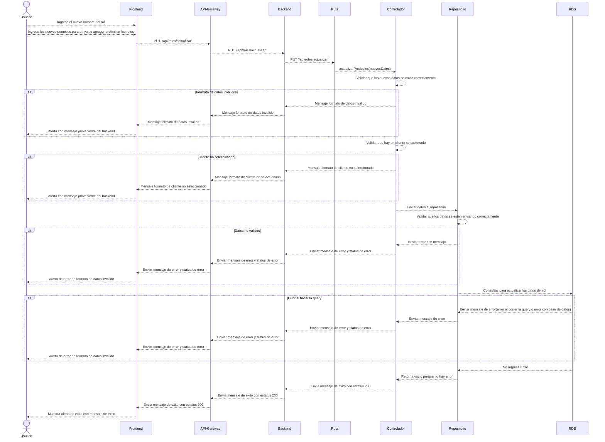

# RF9: Super Administrador Actualiza Rol

**Última actualización:** 06 de marzo de 2025

---

## Historia de Usuario

Como administrador, quiero poder modificar los permisos y el nombre de un rol para mantener el sistema actualizado y seguro.

## **Criterios de Aceptación:**

1. El Superadministrador debe poder modificar la información de un rol existente.
2. El rol de Superadministrador no puede ser cambiado bajo ninguna circunstancia.
3. Se debe permitir cambiar el nombre, descripcion y los permisos asignados.
4. El nombre debe ser obligatorio.
5. El sistema debe validar que el nuevo nombre no esté duplicado.
6. El sistema debe validar que el nuevo nombre no pase de 50 caracteres.
7. El sistema debe validar que la descripcion no pase de los 250 caracteres.
8. Si la actualización es exitosa, los cambios deben reflejarse de inmediato en la vista con la información del rol.
9. Si hay un error, el sistema debe mostrar un mensaje indicando el problema.
10. No se puede aceptar inyecciones SQL.

---

## **Diagrama de Secuencia**

> _Descripción_: El diagrama de secuencia muestra el proceso mediante el cual el Super Administrador actualiza un rol, validando los datos y aplicando los cambios.

---

## **Mockup**

> _Descripción_: El mockup representa la interfaz donde el Superadministrador puede modificar la información de un rol y guardar los cambios.
