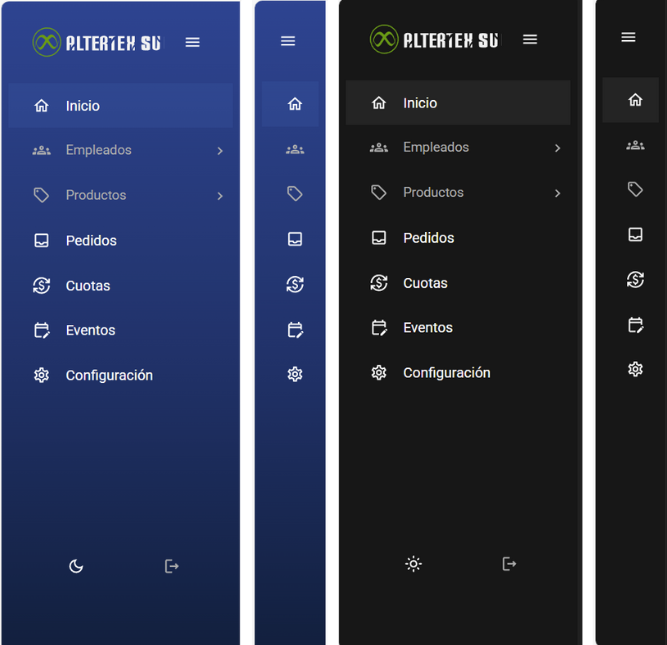

# Requisitos

**Última actualización:** 28 de abril de 2025

### **Proveedores de Requisitos**

- **Internos**: Personas dentro de Code & Co.
- **Externos**: Cliente.

### **Lista de Proveedores de Requisitos**

| Proveedor                          | Rol     | Autoridad | Tipo de Requisitos             | Método de Comunicación                           |
| ---------------------------------- | ------- | --------- | ------------------------------ | ------------------------------------------------ |
| Product Owner                      | Interno | Alta      | Funcionales y de negocio       | Reuniones diarias en equipo, Whatsapp y Discord. |
| Juan Pablo García (Socio Formador) | Externo | Alta      | Funcionales, de negocio y UX   | Reuniones 2 veces por semana, Whatsapp y Correo  |
| Architecture Owner                 | Interno | Alta      | No funcionales, de información | Reuniones diarias en equipo, Whatsapp y Discord. |
| UX/UI                              | Interno | Alta      | de Interfaz                    | Reuniones diarias en equipo, Whatsapp y Discord. |
| Team Members                       | Interno | Media     | Funcionales y No funcionales   | Reuniones diarias en equipo, Whatsapp y Discord. |

## Requisitos Funcionales

### Descripción General

Los requisitos funcionales del sistema describen una variedad de acciones que los usuarios, administradores y empleados pueden realizar dentro del sistema, como la creación, lectura, actualización y eliminación de clientes, productos, pedidos y otros elementos clave. Además, incluyen el manejo de roles, grupos, cuotas y pagos, así como la capacidad del sistema para gestionar solicitudes. Estos requisitos funcionales también contemplan la administración de seguridad, roles y permisos para garantizar que cada usuario pueda realizar únicamente las acciones que le corresponden.

---

### Requisitos Específicos MVP

- [**RF1**](RF1.md): Super Administrador Crea Usuario - `Done`
- [**RF2**](RF2.md): Super Administrador Consulta Lista de Usuarios - `Done`
- [**RF3**](RF3.md): Super Administrador Lee Usuario - `Done`
- [**RF5**](RF5.md): Super Administrador Elimina Usuario - `Done`
- [**RF6**](RF6.md): Super Administrador Crea Rol - `Done`
- [**RF7**](RF7.md): Super Administrador Consulta Lista de Roles - `Done`
- [**RF10**](RF10.md): Super Administrador Elimina Rol - `Done`
- [**RF11**](RF11.md): Super Administrador Crea Cliente - `Done`
- [**RF12**](RF12.md): Super Administrador Consulta Lista de Clientes - `Done`
- [**RF13**](RF13.md): Super Administrador, Lee Cliente - `Done`
- [**RF14**](RF14.md): Super Administrador Actualiza Cliente - `Done`
- [**RF15**](RF15.md): Super Administrador Elimina Cliente `Done`
- [**RF17**](RF17.md): Super Administrador Consulta Lista de Empleados - `Done`
- [**RF18**](RF18.md): Super Administrador Lee Empleado - `Done`
- [**RF19**](RF19.md): Super Administrador Actualiza Empleado
- [**RF20**](RF20.md): Super Administrador Elimina Empleado - `Done`
- [**RF21**](RF21.md): Super Administrador Crea Grupo de Empleados - `Done`
- [**RF22**](RF22.md): Super Administrador Consulta Lista de Grupos de Empleados - `Done`
- [**RF23**](RF23.md): Super Administrador Lee Grupo de Empleados - `Done`
- [**RF25**](RF25.md): Super Administrador Elimina Grupo de Empleados. - `Done`
- [**RF26**](RF26.md): Super Administrador Crea Producto - `Done`
- [**RF27**](RF27.md): Super Administrador, Cliente Consulta Lista de Productos - `Done`
- [**RF30**](RF30.md): Super Administrador Elimina Producto - `Done`
- [**RF31**](RF31.md): Super Administrador Crea Set de Cuotas - `Done`
- [**RF32**](RF32.md): Super Administrador, Cliente Consulta Lista de Set de Cuotas - `Done`
- [**RF35**](RF35.md): Super Administrador Elimina Set de Cuotas - `Done`
- [**RF37**](RF37.md): Super Administrador, Cliente Consulta Lista de Eventos - `Done`
- [**RF38**](RF38.md): Super Administrador, Cliente Lee Evento - `Done`
- [**RF40**](RF40.md): Super Administrador, Cliente Elimina Evento - `Done`
- [**RF42**](RF42.md): Super Administrador, Cliente Consulta Lista de Sets de Productos - `Done`
- [**RF43**](RF43.md): Super Administrador, Cliente Lee Set de Productos - `Done`
- [**RF45**](RF45.md): Super Administrador Elimina Set de Productos -`Done`
- [**RF46**](RF46.md): Super Administrador Crea Categoria de Productos - `Done`
- [**RF47**](RF47.md): Super Administrador Consulta Lista de Categorias de Productos - `Done`
- [**RF50**](RF50.md): Elimina Categoria de Productos - `Done`
- [**RF52**](RF52.md): Super Administrador, Cliente Consulta Lista de Tipos de Pago - `Done`
- [**RF54**](RF54.md): Super Administrador Actualiza Tipo de Pago - `Done`
- [**RF57**](RF57.md): Super Administrador Importa Empleados - `Done`
- [**RF60**](RF60.md): Super Administrador, Cliente Consulta Lista de Pedidos - `Done`
- [**RF63**](RF63.md): Super Administrador Elimina Pedido - `Done`
- [**RF78**](RF78.md): Iniciar Sesión - `Done`

### Requisitos Específicos MBI (Parte 1)

- [**RF8**](RF8.md): Super Administrador Lee Rol
- [**RF9**](RF9.md): Super Administrador Actualiza Rol
- [**RF24**](RF24.md): Super Administrador Actualiza Grupo de Empleados
- [**RF28**](RF28.md): Super Administrador, Cliente Lee Producto
- [**RF33**](RF33.md): Super Administrador, Cliente Lee Set de Cuotas
- [**RF36**](RF36.md): Super Administrador Crea Evento
- [**RF48**](RF48.md): Super Administrador, Cliente Lee Categoria de Productos
- [**RF56**](RF56.md): Super Administrador Importa Productos - `Done`
- [**RF58**](RF58.md): Super Administrador Exportar Productos
- [**RF59**](RF59.md): Super Administrador Exportar Empleados - `Done`
- [**RF62**](RF62.md): Super Administrador, Cliente Actualiza Pedido

### Requisitos Específicos MBI (Parte 2)

- [**RF4**](RF4.md): Super Administrador Actualiza Usuario
- [**RF16**](RF16.md): Super Administrador Crea Empleado
- [**RF29**](RF29.md): Super Administrador Actualizar Producto
- [**RF34**](RF34.md): Super Administrador Actualiza Set de Cuotas
- [**RF41**](RF41.md): Super Administrador Crea Set de Productos
- [**RF44**](RF44.md): Super Administrador Actualiza Set de Productos - `Done`
- [**RF49**](RF49.md): Super Administrador Actualiza Categoria de Productos
- [**RF58**](RF58.md): Super Administrador Exportar Productos
- [**RF62**](RF62.md): Super Administrador, Cliente Actualiza Pedido

---

## Matriz de dependencias

[Enlace a Matriz de dependencias](https://docs.google.com/spreadsheets/d/1ToxcYLMjoZ0dPXlb2eTesLf_YXg8q86tE7bredXapYk/edit?gid=2006473852#gid=2006473852)

## Requisitos No Funcionales

#### Descripción General

Los requisitos no funcionales establecen las expectativas en términos de tiempo de respuesta, capacidad de carga, compatibilidad con diferentes plataformas, accesibilidad para los usuarios, disponibilidad, entre otros aspectos. También incluyen criterios de seguridad, como el cifrado de datos y la protección contra ataques, así como la facilidad de mantenimiento y escalabilidad del sistema, asegurando que pueda adaptarse a nuevas necesidades y crecimiento sin comprometer la estabilidad del sistema.

---

### Requisitos Específicos

**Rendimiento**

- El tiempo de respuesta tiene que ser menor a **5 segundos**.
- El sistema debe soportar al menos **5,000 usuarios concurrentes**.

**Usabilidad**

- El administrador se debe de tardar **6 horas** en aprender a utilizar el sistema de backoffice.
- El sistema debe ser compatible con estos navegadores:
  - **Chrome** versión **133.0.6943.126**
  - **Firefox** versión **135.0.1**
- Un empleado debe de tardar **1 hora** en aprender a utilizar el sistema de e-commerce.

**Disponibilidad**

- El sistema debe de contar con **redundancia de datos** y **sistemas de respaldo**.

**Portabilidad y compatibilidad**

- El sistema debe contar con **estándares abiertos** para facilitar la integración con otros sistemas.

- El sistema debe ser compatible en cualquier computadora con Windows 11 y macOS 15.4.1 o superiores.

**Mantenibilidad**

- El sistema debe contar con una **documentación clara y actualizada**.
- Un desarrollador debe poder encontrar la documentación en **15 minutos**.

**Escalabilidad**

- El sistema debe soportar al menos **5,000 - 10,000 usuarios registrados**.
- El sistema debe permitir la **carga masiva de datos** y facilitar la incorporación de **nuevas funciones sin afectar las existentes**.

**Seguridad**

- Los **datos sensibles** guardados en la base de datos (ej. contraseñas) deben estar **cifrados usando bcrypt**.
- Una computadora debe tardar **más de 3 años** en descifrar una contraseña.
- El sistema debe contar con protección contra:
  - **Ataques CSRF**
  - **Ataques por inyección NoSQL**
- El sistema debe contar con un **sistema de autorización y autenticación**.
- El sistema **cierra la sesión** de los usuarios después de **8 horas** desde que iniciaron sesión.

---

## Requisitos de información

[Diagrama MER](/docs/proyectos/textiles/documentacion/diagrama-mer/)

import Tabs from '@theme/Tabs';
import TabItem from '@theme/TabItem';

<Tabs>
<TabItem value="usuarios" label="Usuarios y Roles" default>

## Usuario

- Nombre Completo
- Dirección de Correo Electrónico
- Contraseña
- Número de Teléfono
- Dirección
- Fecha de Nacimiento
- Género
- Estatus

## Grupo de Empleados

- Nombre del Grupo
- Descripción

## Rol

- Nombre del Rol
- Descripción

## Permiso

- Nombre del Permiso
- Descripción

</TabItem>
<TabItem value="clientes" label="Clientes y Empleados">

## Cliente

- URL de la Imagen
- Nombre Comercial
- Nombre Fiscal
- Empleado
- Número de Emergencia
- Área de Trabajo
- Posición en la Empresa
- Número de Puntos

</TabItem>
<TabItem value="productos" label="Productos y Variantes">

## Producto

- Nombre Común
- Nombre Comercial
- Descripción
- Marca
- Modelo
- Tipo de Producto
- Precio en Puntos
- Costo
- Impuestos
- Descuento
- Estatus (Agotado/Disponible)
- Envío (Verdadero/Falso)

## Categoría

- Nombre de la Categoría
- Descripción

## Datos de Envío

- Peso
- Largo
- Ancho
- Alto
- Volumen
- Tipo de Paquete

## Variante

- Nombre de la Variante
- Descripción

## Opción

- Cantidad
- Valor de la Opción
- SKU Automático
- SKU Comercial
- Costo Adicional
- Descuento
- Estatus (Agotado/Disponible)

## Imagen

- URL de la Imagen
- Tipo de Imagen
- Texto Alternativo

</TabItem>
<TabItem value="proveedores" label="Proveedores">

## Proveedor

- Nombre
- Nombre de la Compañía
- Teléfono de Contacto
- Email de Contacto
- Dirección
- Código Postal
- País
- Estatus (Activo/Inactivo)

</TabItem>
<TabItem value="sets" label="Sets y Relaciones">

## Set de Producto

- Nombre del Set
- Descripción

## Relación con los Productos

- Nombre
- Nombre de Visualización
- Descripción
- Estado (Activo/Inactivo)

## Set de Cuotas

- Nombre del Set
- Nombre de Visualización
- Periodo de Renovación
- Renovación Activa (Verdadero/Falso)

## Relación con los Productos

- Límite de Productos por Empleado

## Grupo de Set de Cuotas

- Nombre del Grupo
- Nombre de Visualización
- Regla de Inicio
- Roll Over

</TabItem>
<TabItem value="pedidos" label="Pedidos y Carrito">

## Pedido

- Fecha de Orden
- Estatus (En Proceso/Enviado/Recibido)
- Precio Total

## Carrito

- Estatus
- Productos
- Cantidad

</TabItem>
<TabItem value="envios" label="Envío y Pago">

## Envío

- Dirección
- Ciudad
- Estado
- Código Postal
- País
- Costo de Envío
- Estatus

## Pago

- Estatus
- Cantidad
- Tipo de Pago
- Método de Pago

</TabItem>
<TabItem value="puntos" label="Puntos y Eventos">

## Punto

- Cantidad
- Descripción

## Evento

- Nombre del Evento
- Descripción
- Puntos a Asignar
- Periodicidad
- Roll Over

</TabItem>
</Tabs>

---

## MER + Diccionario de datos

<u>[Enlace a MER + Diccionario de datos](docs\proyectos\textiles\documentacion\diagrama-mer.md)</u>

## Diagrama de paquetes

<u>[Enlace a diagramas de paquetes de frontend y backend](/docs/proyectos/textiles/documentacion/estrategia-tecnica-textiles/#patrones-de-diseño-y-diagrama-de-paquetes)</u>

## Reglas de negocio

#### Descripción General

Las reglas de negocio son un conjunto de condiciones, restricciones y procedimientos que definen cómo debe operar un sistema de acuerdo con los objetivos y necesidades de una organización. Estas reglas dictan el comportamiento del software en aspectos como validaciones, cálculos, flujos de trabajo y permisos de usuario. Su correcta implementación garantiza que el sistema refleje con precisión los procesos y políticas del negocio, asegurando coherencia y cumplimiento con los requisitos establecidos.

---

- Solo el administrador puede registrar, modificar o eliminar clientes y empleados.
- Un cliente debe tener al menos un empleado asociado para poder realizar compras.
- No se pueden registrar empleados sin asignarlos a un cliente específico.
- Cada cliente puede tener un catálogo de productos personalizados.
- Solo los administradores pueden asignar y modificar roles.
- Los permisos de los usuarios están definidos por su rol (administrador, cliente, empleado).
- Un usuario no puede modificar su propio rol ni asignarse más.
- Se debe validar el inventario antes de confirmar una orden.
- Los pagos pueden realizarse en MXN, USD o puntos acumulados.
- Los empleados solo pueden comprar productos autorizados por su empresa.
- Se debe verificar el saldo disponible o puntos antes de autorizar una compra.

## Requisitos de Interfaz

### Descripción General

La interfaz de usuario de la aplicación está diseñada para ser **intuitiva, atractiva y fácil de usar**. Se prioriza una **experiencia fluida y accesible**, con una navegación clara que facilite el uso tanto para nuevos usuarios como para los actuales.

- **RI-1:** Incorporación de una barra lateral que permitirá una navegación eficiente dentro del sistema.

#### Pruebas

_<u>[Enlace a pruebas RI1 Barra Lateral.](https://docs.google.com/spreadsheets/d/1NLGwGrGA5PVOEzLaqxa8Ts1D_Ng3QzzqNKWJYUzxD-M/edit?gid=470694613#gid=470694613)</u>_

Para garantizar coherencia visual y funcional, la interfaz estará construida con **componentes reutilizables**, lo que permitirá mantener una estética uniforme y una estructura lógica. Esto contribuirá a **reducir la curva de aprendizaje** y a **optimizar la interacción** del usuario con el sistema.

Los **mockups** de la interfaz están disponibles en el siguiente enlace:  
[Figma – Intrefaz ALTERTEX](https://www.figma.com/design/Mxut7xu6u7bxGbO68K6SQ0/INTERFAZ-ALTERTEX?node-id=8604-22210&t=GNn8LoDEtX2et6kq-1)
