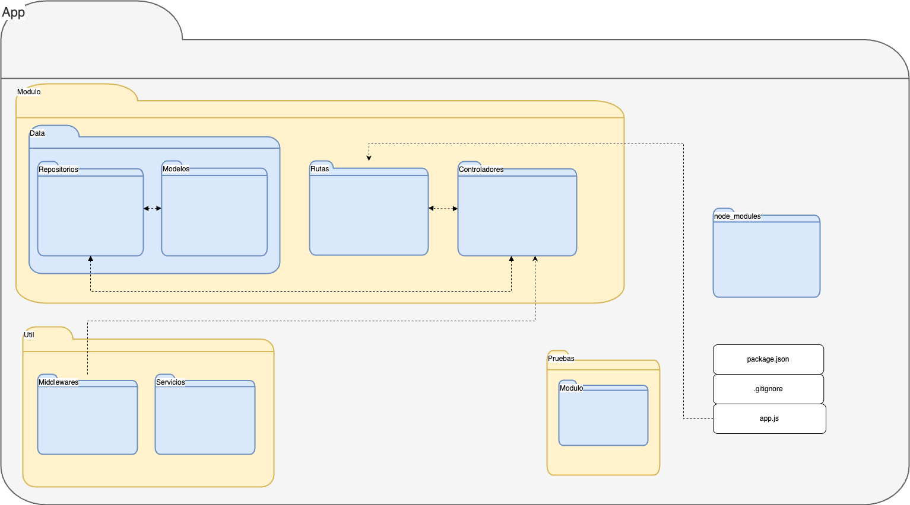
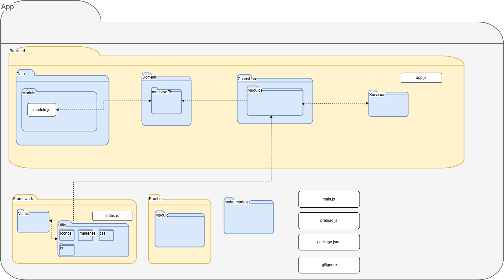

# Plantilla Estrategia tecnica

## Objetivo

Establecer lineamientos claros para el desarrollo, asegurando calidad y consistencia.

---

## Repositorios

Utilizaremos 3 repositorios separados que manejarán:

- **Backend local**: El backend que estará acoplado a electron en cada uno de los equipos del cliente y donde se hará el procesamiento de los datos de los reportes, así como la creación de y modificación de los mismos. Se empaquetará en la app de electron mediante una estrategia de empaquetado de submódulo.
- **Backend desplegado**: Este será el alojado en la instancia del EC2, donde se manejará el guardado de los datos como el control de acceso basado en roles y las plantillas creadas.
- **Frontend**: El frontend estará hosteado localmente en la aplicación de Electron.

De esta manera nuestro sistema puede ser modular y las responsabilidades se dividen eficientemente.

## Estrategia de Ramas

Utilizaremos 3 ramas principales:

- **Master**: Contiene el código que será desplegado en producción y sobre el que se maneja el versionamiento de la aplicación.
  - El código no debe tener problemas de integración o ejecución.
  - El código debe haber sido probado.
- **Staging**: Rama pre-productiva usada para preparar el release de las versiones y realizar pruebas de aceptación.
- **Develop**: Rama de desarrollo donde se mantiene la integración de todos los desarrollos del equipo.
- **Feature**: Ramas temporales destinadas para el código de uno o varios developers que trabajan en una característica.

---

## Gestión de Requerimientos

### Objetivo

Alinear las decisiones técnicas con los objetivos de negocio.

### Priorización basada en valor y riesgos

La priorización de requerimientos se puede encontrar aquí:

[Priorización de requerimientos](https://docs.google.com/spreadsheets/d/14zEYm84Y-QQ2gP_btGMyOinaKZQsw_wrYQQwqiqdSLY/edit?gid=1792238005#gid=1792238005)

La especificación de historias de usuario se llevarán a cabo teniendo en cuenta la definición de [**Done**](/docs/intro/definicion-de-done/) y [**Ready**](/docs/intro/definicion-de-ready/) que se encuentran en este archivo:

---

## Gestión de Calidad y Pruebas

### Objetivo

Garantizar un software confiable a través de buenas prácticas de aseguramiento de calidad.

---

### Estrategia de Pruebas

La estrategia que se seguirá para las pruebas será la siguiente:

- **STP**: [Llenar la plantilla con el plan de pruebas de su proyecto]

---

## Documentación del código

### Objetivo

Documentar claramente las funcionalidades y código del sistema para lectura en caso de confusiones.

- Se agregaron espacios alrededor de operadores y comas.
- Se agregan punto y coma al final de definiciones simples.
- Para documentar el código utilizaremos el estándar de documentación JS docs.
- El detalle del estándar de codificación se podrá ver en el siguiente documento: [**Estandar de codificación**](../../../standards/general).

---

## Patrones de diseño y diagrama de paquetes

### Backend desacoplado

Este diagrama de paquetes representa la organización del backend alojado en la instancia del EC2. Se divide en varias secciones principales:

### 1. Módulos

Cada módulo contiene:

- **Data**: Gestión de la base de datos, incluyendo modelos y repositorios.
  - **Repositorios**: Abstracción de acceso de datos para separar la implementación de la lógica de negocio.
  - **Modelos**: Definen las estructuras de datos de la aplicación (esquemas, clases).
- **Rutas**: Definición de rutas.
- **Controladores**: Implementación de la lógica de negocio.

### 2. Util

- **Middlewares**: Funciones intermedias para procesar solicitudes.
- **Servicios**: Lógica reutilizable independiente de los controladores.

### 4. Pruebas Unitarias

Cada módulo puede incluir pruebas unitarias para garantizar su correcto funcionamiento.

### 5. Archivos Principales

- app.js: Punto de entrada del servidor.
- node_modules: Dependencias del proyecto.

### Aplicación local de electron

Este diagrama de paquetes representa la organización de la app local de electron. Se divide en varias secciones principales:

### 1. Backend

Esta carpeta sigue una arquitectura basada en CLEAN.

- **Data**: Se encarga de la persistencia y recuperación de los datos. Cada módulo del proyecto tendrá su propia carpeta dentro de `Data`, que contendrá:

  - **Modelos**: Definen las estructuras de datos de la aplicación (esquemas, clases).

- **Domain**: Contiene la lógica de negocio pura de la aplicación.

  - **ModuloAPI**: Que encapsula el consumo de las APIs

- **CasosUso**: Que encapsulará la lógica y procesamiento de los diversos casos de uso. Dentro de la carpeta, cada módulo del proyecto tendrá su propia carpeta, que contendrá:

  - **CasoUso.js**: Que manejará la lógica de un caso de uso relacionado a su módulo.

- **Servicios**: Que contendrán scripts y clases reutilizables a lo largo del proyecto

- **Archivo principal**:

  - **app.js**: Punto de entrada principal del backend. Su función es inicializar y configurar el servidor local de la aplicación.

### 2. Framework

Esta carpeta se encarga de la interfaz de usuario y la interacción con el usuario.

- **Vistas**: Son las interfaces que el usuario ve y con las que interactúa.
- **Utils**: Funciones auxiliares para el comportamiento de las vistas.
- **Archivo principal**:
  - **index.js**: Punto de entrada de Electron.

### 3. Pruebas Unitarias

Cada módulo puede incluir pruebas unitarias para garantizar su correcto funcionamiento.

### 4. Electron

Se encarga de la integración de la aplicación con ElectronJS

- **main.js**: Archivo principal de Electron. Crea la ventana, gestiona eventos del sistema. Inicia Electron y conecta frontend con backend local.
- **preload.js**: Script que se ejecuta antes de la carga de la página de electron, permitiendo la comunicación entre el frontend y el backend de manera segura.

---

## Historial de cambios

| **Tipo de versión** | **Descripción**                    | **Fecha** | **Colaborador**        |
|---------------------|------------------------------------| --------- | ---------------------- |
| **1.0**             | Primera versión de la estratégia técnica        | 06/03/2025 | Daniel Contreras Chávez      |
| **2.0**             | Se hizo el cambio del diagrama de paquetes de la aplicación local en electron | 25/03/2025   | Ian Julián Estrada Castro |
| **2.1**             | Se quitó ViewModels del diagrama de paquetes. Se actualizó diagrama de backend desacoplado. Se cambió a español | 27/03/2025 | Ian Julián Estrada Castro |
| **2.2** | Se actualizó el diagrama de paquetes de electron y su explicación | 25/04/2025 | Daniel Contreras |