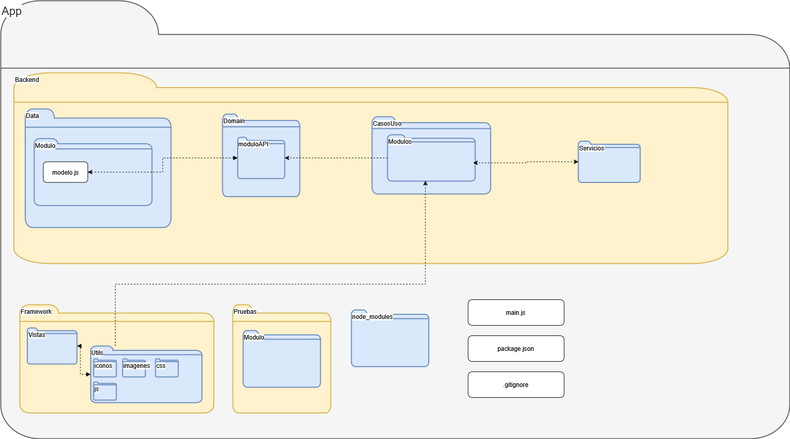

# Manual Técnico Harvester

## Índice

1. [Introducción](#1-introducción)
2. [Requisitos Previos](#2-requisitos-previos)
3. [Preparación del Proyecto](#3-preparación-del-proyecto)
4. [Estructura de Carpetas](#4-estructura-de-carpetas)
5. [Configuración del Entorno](#5-configuración-del-entorno)
6. [Ejecución del Proyecto](#6-ejecución-del-proyecto)
7. [Pruebas del Sistema](#7-pruebas-del-sistema)
8. [Despliegue](#8-despliegue)
9. [Documentación](#9-documentación)
10. [Referencias](#10-referencias)
11. [Historial de Cambios](#11-historial-de-cambios)

---

## 1. Introducción

Este manual técnico describe paso a paso cómo preparar, ejecutar, probar y mantener el sistema Harvester. Está diseñado para que cualquier desarrollador o auditor técnico pueda replicar la instalación desde cero, sin requerir conocimientos previos del proyecto.

### 1.1 ¿Qué es Harvester?

Harvester es una aplicación de escritorio para el analísis de datos recabados por tractores de CNH, donde sus empleados podrán crear reportes de manera más eficiente. Su arquitectura está compuesta por:

* Una **aplicación de escritorio** desarrollada en HTML, CSS y JS, usando la libreria de ElectronJS.
* Un **backend desacoplado** basado en Node.js alojado en una instancia EC2.
* Una **base de datos MySQL**.

---

## 2. Requisitos previos

### 2.1 Herramientas necesarias

Instala las siguientes herramientas en tu equipo local:

1. **Node.js:** Ejecuta el backend del sistema Harvester. [Descargar](https://nodejs.org/)
2. **Git:** Permite clonar el código fuente desde GitHub. [Descargar](https://git-scm.com/)
3. **MySQL Workbench:** Interfaz visual para administrar la base de datos. [Descargar](https://dev.mysql.com/downloads/workbench/)
4. **Postman:** Herramienta para probar las APIs del backend. [Descargar](https://www.postman.com/)

> **NOTA:** Para conectarte en MySQL Workbench:
>
> 1. Abre Workbench.
> 2. Da clic en el símbolo "+" para crear una nueva conexión.
> 3. En "Hostname" coloca el endpoint de RDS.
> 4. En "Username" coloca `root`.
> 5. Da clic en "Store in Vault" para guardar tu contraseña.
> 6. Prueba la conexión y guarda.

## 3. Preparación del Proyecto

Después de instalar las herramientas para trabahar, clonaremos los repositorios y prepararemos el entorno de desarrollo local.

### 3.1 Clonar los Repositorios:

#### 3.1.1 Backend desacoplado:

```bash
cd ~
git clone https://github.com/CodeAnd-Co/Backend-Desacoplado-TracTech.git
cd Backend-Desacoplado-TracTech
npm install
```

#### 3.1.2 App local:

```bash
cd ~
git clone https://github.com/CodeAnd-Co/App-Local-TracTech.git
cd harvester-app
npm install
```

### 3.3 Crear base de datos Harvester

**MySQL Workbench:**

1. Abrir Workbench
2. Crear nueva conexión con el host, puerto, usuario y contraseña
3. Crear base:

```sql
CREATE DATABASE harvester;
```

4. Cargar y ejecutar el script `HARVESTER.sql`


#### Links de referencia

1. [HARVESTER.SQL](https://drive.google.com/file/d/1-jHoUr-9iyutlgRoevjk-BiEbZiOBhkS/view?usp=sharing)
---

## 4. Estructura de Carpetas

Una vez clonado el código fuente, es importante conocer su estructura para facilitar navegación, desarrollo y pruebas.





---

## 5. Configuración del Entorno

### 5.1 Crear archivo .env en el servidor

En la consola de comandos de la instancia EC2:

```bash
nano .env
```

1. Escribe las variables necesarias
2. Presiona `Ctrl + O` para guardar
3. Presiona `Enter`
4. Presiona `Ctrl + X` para salir

### 5.2 Variables del Backend

```env
PUERTO =
ANFITRION_BD=
USUARIO_BD=
CONTRASENA_BD=
NOMBRE_BD=
SECRETO_JWT=
DURACION_JWT=
SU='SUPER ADMIN'
```

---

## 6. Ejecución del Proyecto

### 6.1 Ejecutar Backend Local

```bash
cd Staging-Backend-Desacoplado-TracTech
npm start
```

### 6.2 Ejecutar Aplicación

```bash
cd App-Local-TracTech/harvester-app
npm start
```

### 6.3 Backend en EC2

Consulta el [Manual de Despliegue](./manual-despliegue-tractores.md)

---

## 7. Pruebas del Sistema

### 7.1 Pruebas Manuales

* **SuperAdmin:** superadmin@cnhmx.com / Pruebas
* **Administrador:** juanpablo@cnhmx.com / Pruebas
* **Empleado:** galo@cnhmx.com / Pruebas

---

## 8. Despliegue

Ver [Manual de Despliegue](./manual-despliegue-tractores.md)

---

## 9. Documentación

### Swagger

```
IMPLEMENTACIÓN PENDIENTE
http://localhost:4000/api-docs
```

---

## 10. Referencias

* [Manual de Despliegue](./manual-despliegue-tractores.md)
* [Estrategia Técnica](./estrategia.md)
* [Manual de Prueba de Arquitectura](./manualDePruebaArquitectura.md)

---

## 11. Historial de Cambios

| Versión | Descripción                                        | Fecha      | Colaborador      |
| ------- | -------------------------------------------------- | ---------- | --------------   |
| 1.0     | Implementación inicial del Manual Técnico          | 19/05/2025 | Daniel Queijeiro |
