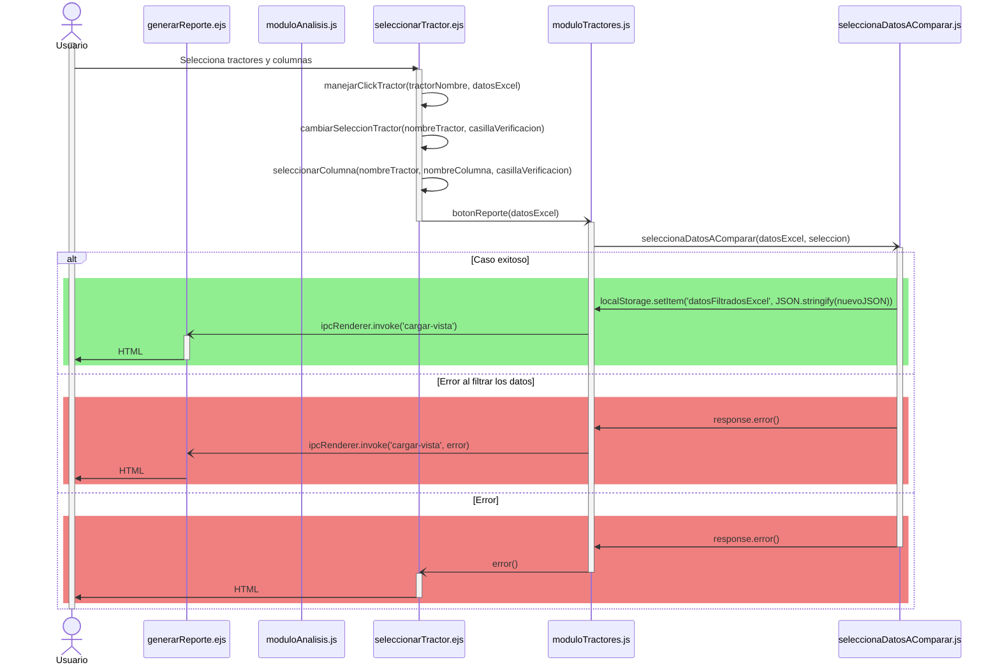
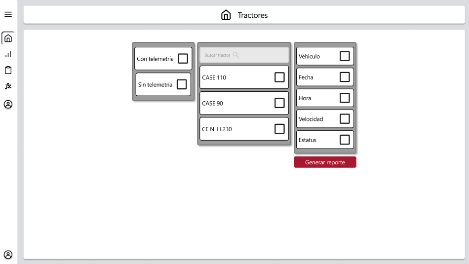

# HU26: Usuario selecciona datos a comparar.

### Historia de Usuario

Yo como usuario quiero seleccionar datos especificos de los tractores para compararlos y evaluar su rendimiento:

  **Precondiciones**
  - Tener cargado un Exel

  **Criterios de Aceptación:**
  - El sistema debe de permitir seleccionar los tractores visibles en la interfaz.
  - El sistema debe de permitir seleccionar información individual de los tractores visibles en la interfaz.
  - El sistema debe filtrar la información y crear un objeto con los datos del excel filtrados.
  - El sistema redirije al módulo de análisis una vez completada la operación.
  - El sistema devuelve una alerta en caso de error.

---

### Diagrama de Secuencia

![Diagrama de Secuencia] 

> *Descripción*: El diagrama de secuencia muestra cómo el usuario selecciona los datos disponibles para su comparación.

---

### Mockup

> *Descripción*: El mockup representa la interfaz del sistema donde se pueden comparar los datos.

---

### Pruebas Unitarias 
| ID Prueba | Descripción | Resultado Esperado |
|-----------|-------------|--------------------|
|PU-RF14-01|Seleccionar datos de diferentes tractores.|Se muestra la comparación de datos correctamente.|
|PU-RF14-02|Cambiar la selección de datos.|La tabla o gráfico con el que se haga la comparación de datos se actualiza de manera automatica.|
|PU-RF14-03|Comparar datos con diferentes formatos.|Se puede alternar entre tabla y gráfico sin perder la información.|

- [Pruebas TracTech HU26](https://docs.google.com/spreadsheets/d/1W-JW32dTsfI22-Yl5LydMhiu-oXHH_xo3hWvK6FHeLw/edit?gid=871428003#gid=871428003)

---

### Pull Request
[https://github.com/CodeAnd-Co/App-Local-TracTech/pull/121](https://github.com/CodeAnd-Co/App-Local-TracTech/pull/121)