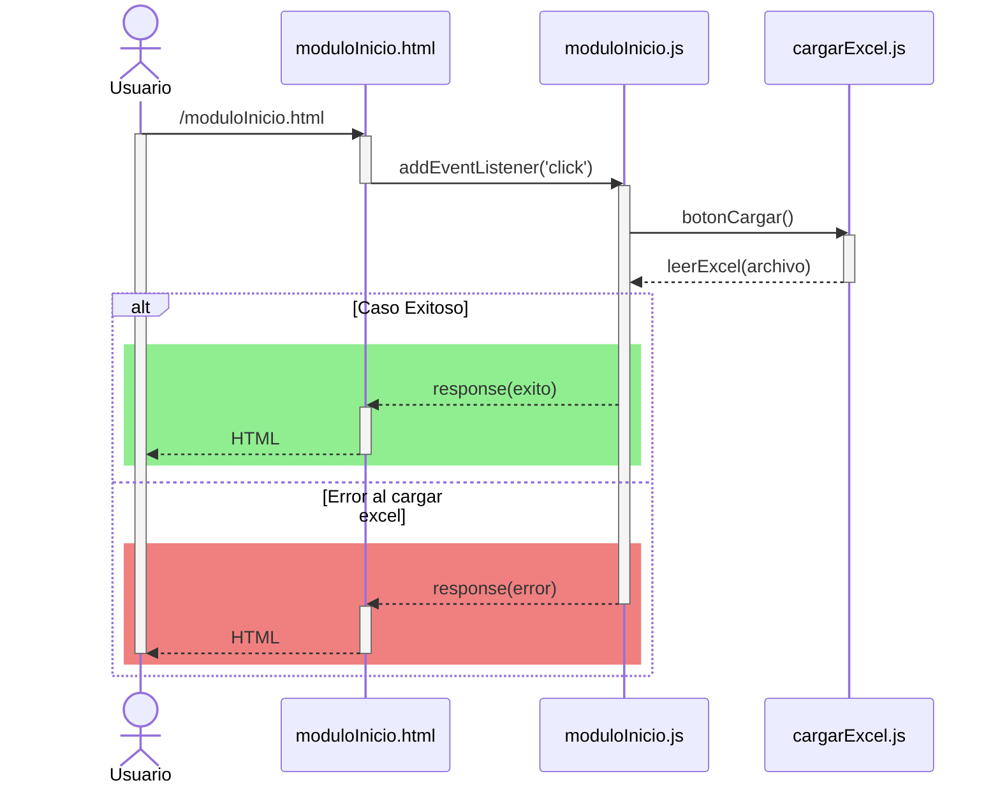

# HU6: Usuario carga Excel a la plataforma.

### Historia de Usuario

Yo como usuario quiero cargar archivos Excel a la plataforma para importar y analizar los datos para realizar reportes.

  **Precondiciones:**
  - El sistema debe tener acceso a los archivos.

  **Criterios de Aceptación:**
  - El sistema debe aceptar archivos en formato .csv y .xls.
  - El sistema muestra una alerta si el archivo supera los 10 Mb.
  - El sistema muestra el nombre del archivo cargado.

---

### Diagrama de Secuencia

---

### Mockup

![Mockup]

> *Descripción*: El mockup representa la interfaz del sistema donde el usuario puede cerrar sesión. Muestra los campos requeridos y los botones de acción disponibles.

---
### Pruebas Unitarias 
| ID Prueba | Descripción | Resultado Esperado |
|-----------|-------------|--------------------|
|PU-HU6-01|Cargar archivo Excel válido|Los datos del archivo son cargados y procesados correctamente|

---

### Pull Request
[https://github.com/CodeAnd-Co/App-Local-TracTech/pull/11](https://github.com/CodeAnd-Co/App-Local-TracTech/pull/11)
