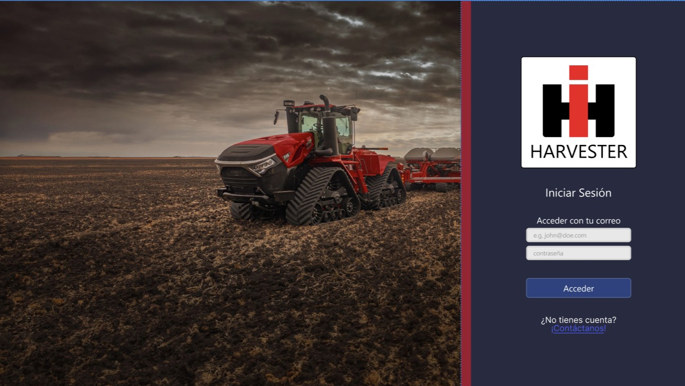

# RF1: Usuario consulta página de inicio de sesión.

**Última actualización:** 30 de mayo de 2025

### Historia de Usuario

Yo como usuario quiero consultar la página de inicio de sesión de la aplicación de escritorio de Harvester para tener conocimiento de la aplicación a la que estoy entrando. 

  **Criterios de Aceptación:**

  - El sistema debe de permitir a cualquier usuario que tenga instalada la aplicación de escritorio poder consultar la página de inicio de sesión
  - La página de inicio de sesión debe de mostrar el nombre de la aplicación.
  - La página de inicio de sesión debe de mostrar el icono y logo de la aplicación
  - La página de inicio de sesión debe de contener campo para ingresar correo electrónico. 
  - La página de inicio de sesión debe de contener un campo para ingresar contraseña.
  - La página de inicio de sesión debe de contar con un botón de "Acceder" para entrar a la aplicación.
  - La página de inicio de sesión debe de contar con una leyenda que diga "¿No tienes una cuenta?".
  - La página de inicio de sesión debe de contar con un botón que se llame contáctanos, que muestra los datos de contacto de CNH Mx.
  - La página de inicio de sesión debe de validar los campos de correo electrónico y contraseña dando retroalimentación en forma de alerta.

---

### Diagrama de Secuencia

- No aplica según nuestra [definición de Ready](../../definicion-ready-tractores.md).

---

### Mockup

> *Descripción*: El mockup representa la interfaz del sistema donde el usuario puede consultar la página de inicio de sesión. 

---

### Pruebas Unitarias 

#### [Pruebas de la RF](https://docs.google.com/spreadsheets/d/1W-JW32dTsfI22-Yl5LydMhiu-oXHH_xo3hWvK6FHeLw/edit?gid=1905076093#gid=1905076093)

---

### Pull Request
[https://github.com/CodeAnd-Co/App-Local-TracTech/pull/1](https://github.com/CodeAnd-Co/App-Local-TracTech/pull/1)
