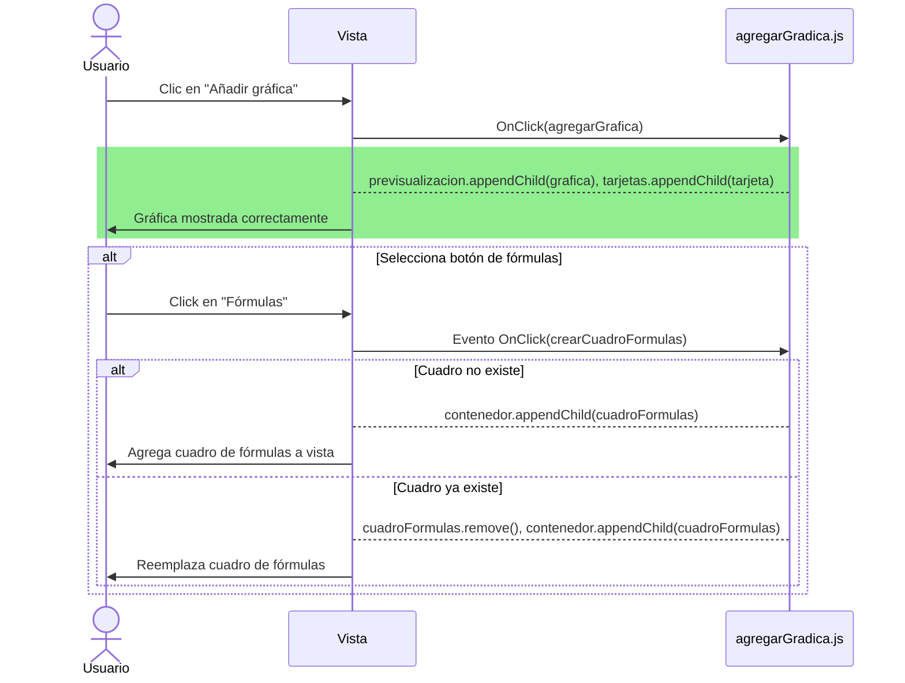

# RF10: Usuario añade gráfica a reporte.

### Historia de Usuario

Yo como usuario quiero añadir una gráfica al reporte para poder visualizar los datos que estoy manipulando.

**Criterios de Aceptación:**
- El usuario debe de poder crear múltiples gráficas en el reporte.
- El sistema debe permitir crear diferentes tipos de gráficas.
- Las gráficas deben poder redimensionarse y reposicionarse dentro del reporte.

---

### Diagrama de Secuencia: Añadir gráfica al reporte

### Mockup

--- 

### Pruebas Unitarias 
[Pruebas](https://docs.google.com/spreadsheets/d/1W-JW32dTsfI22-Yl5LydMhiu-oXHH_xo3hWvK6FHeLw/edit?gid=188694510#gid=188694510)

---

### Pull Request
[https://github.com/CodeAnd-Co/App-Local-TracTech/pull/27](https://github.com/CodeAnd-Co/App-Local-TracTech/pull/27)
