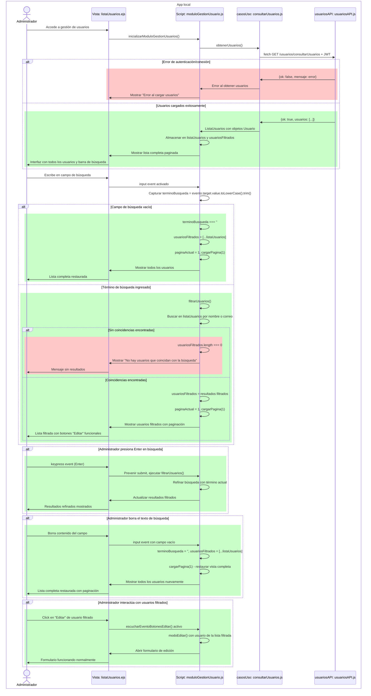
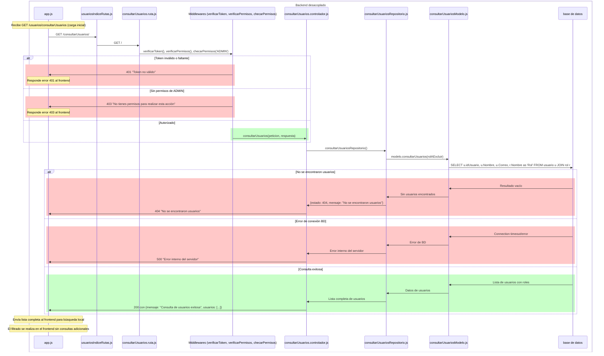

# RF13: Administrador busca usuario.

### Historia de Usuario

Yo como administrador quiero poder buscar un usuario específico utilizando la barra de búsqueda para encontrar rápidamente su información y poder realizar acciones sobre él.

 **Criterios de Aceptación:**
 - El administrador debe poder escribir en la barra de búsqueda para filtrar usuarios.
 - La búsqueda debe funcionar por nombre del usuario.
 - La búsqueda debe ser en tiempo real mientras el administrador escribe.
 - El sistema debe mostrar resultados que coincidan parcialmente con el texto ingresado.
 - Si no se encuentran coincidencias, se debe mostrar un mensaje indicando que no hay resultados.
 - La búsqueda no debe ser sensible a mayúsculas y minúsculas.
 - El administrador debe poder limpiar la búsqueda borrando el texto.
 - Los resultados filtrados deben mantener la paginación si hay muchos usuarios.
 - La búsqueda debe ignorar espacios al inicio y final del texto.
 - El sistema debe mostrar todos los usuarios cuando la barra de búsqueda esté vacía.
 - Los botones "Editar" y "Eliminar" deben seguir funcionando en los resultados filtrados.

---

### Diagrama de Secuencia - App Local

> *Descripción*: El diagrama de secuencia muestra cómo el administrador utiliza la barra de búsqueda para filtrar usuarios en tiempo real y obtener resultados específicos.

### Diagrama de Secuencia - Backend Desacoplado

> *Descripción*: El diagrama de secuencia muestra cómo el administrador interactúa con el sistema para buscar un usuario.

---

### Mockup

> *Descripción*: El mockup representa la interfaz del sistema donde el administador puede buscar a un usuario.

---

### Pruebas Unitarias 

###
[Pruebas](https://docs.google.com/spreadsheets/d/1W-JW32dTsfI22-Yl5LydMhiu-oXHH_xo3hWvK6FHeLw/edit?gid=1804527035#gid=1804527035)

---

### Pull Request
[https://github.com/CodeAnd-Co/App-Local-TracTech/pull/42](https://github.com/CodeAnd-Co/App-Local-TracTech/pull/42)

### Historial de cambios

| **Tipo de Versión** | **Descripción**                            | **Fecha** | **Colaborador**         |
| ------------------- | ------------------------------------------ | --------- | ----------------------- |
| **1.0**             |  Añadir requisitos de tractores            | 5/3/2025  | Antonio Landeros           |
| **1.1**             |  Agregar precondicion en RF13 | 1/5/2025  | Ian Julian Estrada|
| **1.2**             |  Ordenar todas las RFs y actualizar los datos | 1/6/2025  | Mauricio Anguiano|
| **1.3**             |  Correcion de diagrama de secuencia | 2/6/2025  | Mauricio Anguiano|
| **1.4**             |  Correccion criterios de aceptacion | 2/6/2025  | Mauricio Anguiano|