# RF14: Administrador crea usuario.

### Historia de Usuario

Yo como administrador quiero crear un usuario para permitirle el acceso al sistema y asignarle los permisos correspondientes.

  **Criterios de Aceptación:**
  - El administrador debe poder crear usuarios proporcionando los datos necesarios.
  - El correo eléctronico del usuario debe ser único en el sistema.
  - El correo electrónico del usuario debe tener un formato válido, es decir, debe contener un nombre de usuario, el símbolo "@", un dominio y una extensión (por ejemplo: usuario@dominio.com).
  - No se permiten espacios ni caracteres especiales fuera de los permitidos (letras, números, puntos, guiones y guiones bajos antes de la "@").
  - La contraseña debe cumplir con los siguientes requisitos:
    - Mínimo 8 caracteres
    - Al menos una mayúscula
    - Al menos un número
    - Al menos un carácter especial
  - Los campos deben de mostrar los errores de formato debajo de los mismos (Por ejemplo, si la contraseña no tiene los caracteres suficientes, se debe de mostrar debajo un mensaje con la longitud que debería de tener la contraseña).
  - Si se intenta crear un usuario sin llenar todos los campos, se debe de mostrar una alerta.
  - Si se intenta crear un usuario con un formato de correo inválido, se debe de mostrar una alerta.

---

### Diagrama de Secuencia

> *Descripción*: El diagrama de secuencia muestra todo el flujo sobre cómo el administrador crea usuarios, obtiene retroalimentación sobre los campos y las acciones que hace y cómo se crea el usuario.

```mermaid
sequenceDiagram

  % App local
  box App local
  actor Administrador as Administrador
  participant vistaUsuarios as Vista: listaUsuarios.ejs
  participant gestionUsuarios as Script: moduloGestionUsuario.js
  participant crearUsuario as casosUso: crearUsuario.js
  participant crearUsuarioAPI as usuariosAPI: usuariosAPI.js
  end

  % Backend desacoplado
  box Backend desacoplado
  participant app as app.js
  participant indiceUsuarios as usuariosIndiceRutas.js
  participant crearUsuarioRuta as crearUsuario.ruta.js
  participant middlewares as Middlewares (verificarToken, verficarPermisos, checarPermisos)
  participant controlador as crearUsuario.controlador.js
  participant repositorio as crearUsuarioRepositorio.js
  participant modelo as crearUsuarioModelo.js
  participant bd as base de datos
  end

  Administrador ->> vistaUsuarios: Da click en "Agregar"
  vistaUsuarios ->> gestionUsuarios: Activa un evento
  gestionUsuarios ->> vistaUsuarios: Muestra el modal
  Administrador ->> vistaUsuarios: Llena los campos
  
  % Validación en tiempo real del frontend
  vistaUsuarios ->> gestionUsuarios: Valida el formato de los campos
  alt Campos con formato inválido
    rect rgb(255, 200, 200)
    gestionUsuarios ->> vistaUsuarios: Muestra mensajes de error en tiempo real<br/>(campo vacío, formato inválido, etc.)
    end
  end

  Administrador ->> vistaUsuarios: Click en "Guardar"
  
  % Validaciones previas en frontend
  alt Hay errores visibles en el formulario
    rect rgb(255, 200, 200)
    gestionUsuarios ->> Administrador: Muestra Swal "Formulario con errores"
    end
  else Contraseñas no coinciden
    rect rgb(255, 200, 200)
    gestionUsuarios ->> Administrador: Muestra Swal "Contraseñas no coinciden"
    end
  else Campos obligatorios vacíos
    rect rgb(255, 200, 200)
    gestionUsuarios ->> Administrador: Muestra Swal "Datos incompletos"
    end
  else Correo ya existe (verificación local)
    rect rgb(255, 200, 200)
    gestionUsuarios ->> Administrador: Muestra Swal "Correo ya registrado"
    end
  else Validaciones de longitud excedida
    rect rgb(255, 200, 200)
    gestionUsuarios ->> Administrador: Muestra Swal con error específico<br/>(nombre/correo/contraseña demasiado largo)
    end
  else Contraseña muy corta (< 8 caracteres)
    rect rgb(255, 200, 200)
    gestionUsuarios ->> Administrador: Muestra Swal "Contraseña demasiado corta"
    end
  else Datos válidos en frontend
    rect rgb(200, 255, 200)
    gestionUsuarios ->> crearUsuario: crearUsuarioCU(nombre, correo, contraseña, idRolFK)
    end
  end

  % Validaciones en caso de uso
  alt Campos obligatorios faltantes
    rect rgb(255, 200, 200)
    crearUsuario ->> gestionUsuarios: {ok: false, mensaje: "Todos los campos son obligatorios"}
    gestionUsuarios ->> Administrador: Muestra Swal de error
    end
  else Correo con formato inválido
    rect rgb(255, 200, 200)
    crearUsuario ->> gestionUsuarios: {ok: false, mensaje: "Correo electrónico no válido"}
    gestionUsuarios ->> Administrador: Muestra Swal de error
    end
  else Validaciones pasadas
    rect rgb(200, 255, 200)
    crearUsuario ->> crearUsuarioAPI: crearUsuarioAPI(ObjetoUsuario)
    end
  end

  % Comunicación con backend
  crearUsuarioAPI ->> app: POST /usuarios/crearUsuario/
  app ->> indiceUsuarios: POST /crearUsuario/
  indiceUsuarios ->> crearUsuarioRuta: POST /
  crearUsuarioRuta ->> middlewares: verificarToken(), verificarPermisos(), checarPermisos('ADMIN')
  
  % Validaciones de middlewares
  alt Token inválido o faltante
    rect rgb(255, 200, 200)
    middlewares ->> app: 401 "Token no válido"
    app ->> crearUsuarioAPI: 401 Error de autenticación
    crearUsuarioAPI ->> crearUsuario: {ok: false, mensaje: error}
    crearUsuario ->> gestionUsuarios: Error de autenticación
    gestionUsuarios ->> Administrador: Muestra Swal "Error de conexión"
    end
  else Sin permisos de ADMIN
    rect rgb(255, 200, 200)
    middlewares ->> app: 403 "No tienes permisos para realizar esta acción"
    app ->> crearUsuarioAPI: 403 Error de permisos
    crearUsuarioAPI ->> crearUsuario: {ok: false, mensaje: error}
    crearUsuario ->> gestionUsuarios: Error de permisos
    gestionUsuarios ->> Administrador: Muestra Swal de error
    end
  else Autorizado
    rect rgb(200, 255, 200)
    middlewares ->> controlador: crearUsuarioControlador(peticion, respuesta)
    end
  end

  % Validaciones en controlador
  alt Campos requeridos vacíos
    rect rgb(255, 200, 200)
    controlador ->> app: 400 "Un campo requerido está vacío"
    app ->> crearUsuarioAPI: Código de error 400
    crearUsuarioAPI ->> crearUsuario: Código de error 400
    crearUsuario ->> gestionUsuarios: Código de error 400
    gestionUsuarios ->> Administrador: Muestra Swal de error
    end
  else Contraseña excede longitud máxima
    rect rgb(255, 200, 200)
    controlador ->> app: 400 "La contraseña no puede exceder los X caracteres"
    app ->> crearUsuarioAPI: Código de error 400
    crearUsuarioAPI ->> crearUsuario: Código de error 400
    crearUsuario ->> gestionUsuarios: Código de error 400
    gestionUsuarios ->> Administrador: Muestra Swal de error
    end
  else Validaciones pasadas
    rect rgb(200, 255, 200)
    controlador ->> controlador: Hash contraseña con bcrypt
    controlador ->> repositorio: crearUsuarioRepositorio(nombre, correo, contraseniaCifrada, idRolFK)
    end
  end

  % Validaciones en repositorio
  alt Campos vacíos (segunda verificación)
    rect rgb(255, 200, 200)
    repositorio ->> controlador: {estado: 400, mensaje: "Un campo requerido está vacío"}
    controlador ->> app: 400 "Un campo requerido está vacío"
    app ->> crearUsuarioAPI: Código de error 400
    crearUsuarioAPI ->> crearUsuario: Código de error 400
    crearUsuario ->> gestionUsuarios: Código de error 400
    gestionUsuarios ->> Administrador: Muestra Swal de error
    end
  else idRol no es número
    rect rgb(255, 200, 200)
    repositorio ->> controlador: {estado: 400, mensaje: "El idRol no es un número"}
    controlador ->> app: 400 "Un campo requerido está vacío"
    app ->> crearUsuarioAPI: Código de error 400
    crearUsuarioAPI ->> crearUsuario: Código de error 400
    crearUsuario ->> gestionUsuarios: Código de error 400
    gestionUsuarios ->> Administrador: Muestra Swal de error
    end
  else idRol fuera de rango (1-3)
    rect rgb(255, 200, 200)
    repositorio ->> controlador: {estado: 400, mensaje: "El idRol no es válido"}
    controlador ->> app: 400 "Un campo requerido está vacío"
    app ->> crearUsuarioAPI: Código de error 400
    crearUsuarioAPI ->> crearUsuario: Código de error 400
    crearUsuario ->> gestionUsuarios: Código de error 400
    gestionUsuarios ->> Administrador: Muestra Swal de error
    end
  else Nombre excede longitud máxima
    rect rgb(255, 200, 200)
    repositorio ->> controlador: {estado: 400, mensaje: "El nombre no puede exceder los X caracteres"}
    controlador ->> app: 400 "Un campo requerido está vacío"
    app ->> crearUsuarioAPI: Código de error 400
    crearUsuarioAPI ->> crearUsuario: Código de error 400
    crearUsuario ->> gestionUsuarios: Código de error 400
    gestionUsuarios ->> Administrador: Muestra Swal de error
    end
  else Correo excede longitud máxima
    rect rgb(255, 200, 200)
    repositorio ->> controlador: {estado: 400, mensaje: "El correo no puede exceder los X caracteres"}
    controlador ->> app: 400 "Un campo requerido está vacío"
    app ->> crearUsuarioAPI: Código de error 400
    crearUsuarioAPI ->> crearUsuario: Código de error 400
    crearUsuario ->> gestionUsuarios: Código de error 400
    gestionUsuarios ->> Administrador: Muestra Swal de error
    end
  else Validaciones pasadas
    rect rgb(200, 255, 200)
    repositorio ->> modelo: modelo.crearUsuario(nombre, correo, contrasenia, idRol)
    end
  end

  % Interacción con BD
  modelo ->> bd: INSERT INTO usuario (Nombre, Correo, Contrasenia, idRol_FK) VALUES (?, ?, ?, ?)
  
  alt Error de BD (ej: correo duplicado, constraint violation)
    rect rgb(255, 200, 200)
    bd ->> modelo: Error
    modelo ->> repositorio: rechazar(error)
    repositorio ->> controlador: {estado: 400/500, mensaje: error}
    controlador ->> app: Status error con mensaje
    end
  else Inserción exitosa
    rect rgb(200, 255, 200)
    bd ->> modelo: insertId
    modelo ->> repositorio: resolver(insertId)
    repositorio ->> controlador: {estado: 201, mensaje: "Usuario creado con éxito", idUsuario}
    controlador ->> app: 201 con mensaje e idUsuario
    end
  end

  % Respuesta final al frontend
  app ->> crearUsuarioAPI: Respuesta (éxito o error)
  
  alt Error de red o timeout
    rect rgb(255, 200, 200)
    crearUsuarioAPI ->> crearUsuario: {ok: false, mensaje: "Error de red"}
    crearUsuario ->> gestionUsuarios: Error de red
    gestionUsuarios ->> Administrador: Muestra Swal "Error de red"
    end
  else Respuesta recibida
    crearUsuarioAPI ->> crearUsuario: {ok: boolean, mensaje: string, id?: number}
    crearUsuario ->> gestionUsuarios: Resultado de la operación
    
    alt Operación exitosa
      rect rgb(200, 255, 200)
      gestionUsuarios ->> Administrador: Muestra Swal "Usuario creado"
      gestionUsuarios ->> vistaUsuarios: Oculta modal
      gestionUsuarios ->> gestionUsuarios: inicializarModuloGestionUsuarios() tras 500ms
      vistaUsuarios ->> Administrador: Muestra vista actualizada
      end
    else Operación fallida
      rect rgb(255, 200, 200)
      gestionUsuarios ->> Administrador: Muestra Swal con mensaje de error específico
      end
    end
  end

```

---

### Mockup

> *Descripción*: El mockup representa la interfaz del sistema donde el administrador puede crear usuarios nuevos, con los campos que se deben llenar y los botones para guardar y cancelar.

---
### Pruebas Unitarias 

#### [Pruebas de la HU](https://docs.google.com/spreadsheets/d/1W-JW32dTsfI22-Yl5LydMhiu-oXHH_xo3hWvK6FHeLw/edit?gid=852740934#gid=852740934)

---

### Pull Request

_<u>[Pull request app local](https://github.com/CodeAnd-Co/App-Local-TracTech/pull/63)</u>_

_<u>[Pull request backend desacoplado](https://github.com/CodeAnd-Co/Backend-Desacoplado-TracTech/pull/23)</u>_
