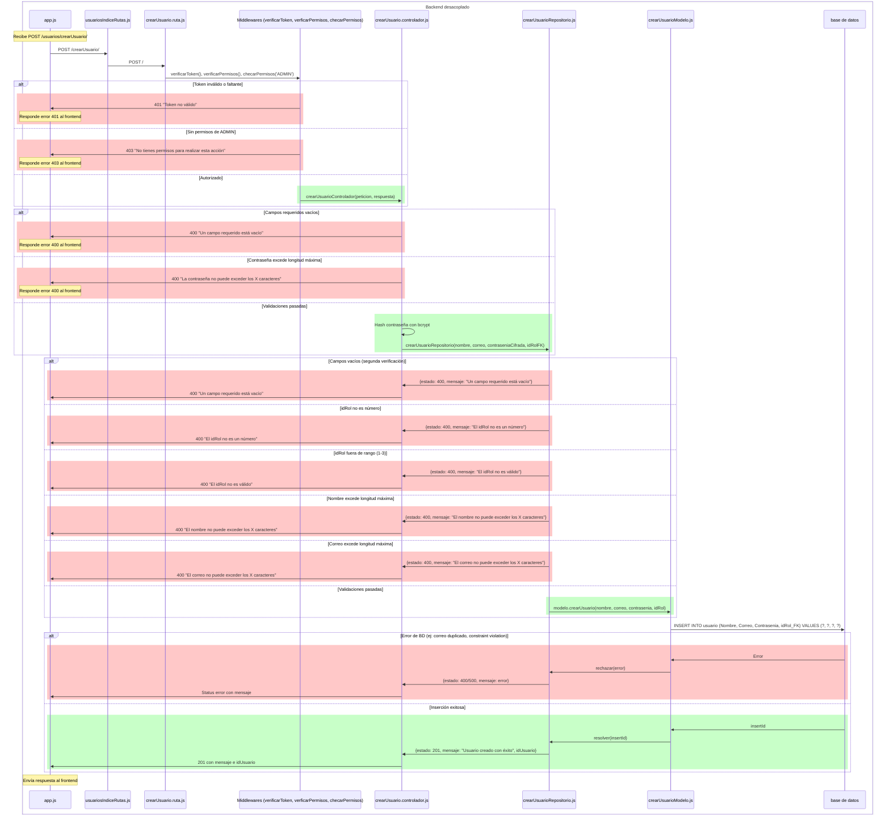
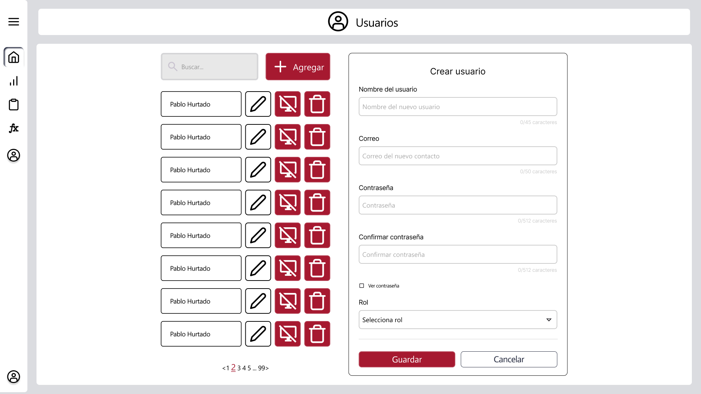

# RF14: Administrador crea usuario.

### Historia de Usuario

Yo como administrador quiero crear un usuario para permitirle el acceso al sistema y asignarle los permisos correspondientes.

  **Criterios de Aceptación:**
  - El administrador debe poder crear usuarios proporcionando los datos necesarios.
  - El correo eléctronico del usuario debe ser único en el sistema.
  - El correo electrónico del usuario debe tener un formato válido, es decir, debe contener un nombre de usuario, el símbolo "@", un dominio y una extensión (por ejemplo: usuario@dominio.com).
  - No se permiten espacios ni caracteres especiales fuera de los permitidos (letras, números, puntos, guiones y guiones bajos antes de la "@").
  - No se permiten entradas mayores a la máxima longitud de caracteres de cada campo.
  - La contraseña debe cumplir con los siguientes requisitos:
    - Mínimo 8 caracteres
    - Al menos una mayúscula
    - Al menos un número
    - Al menos un carácter especial
  - Los campos deben de mostrar los errores de formato debajo de los mismos (Por ejemplo, si la contraseña no tiene los caracteres suficientes, se debe de mostrar debajo un mensaje con la longitud que debería de tener la contraseña).
  - Si se intenta crear un usuario sin llenar todos los campos, se debe de mostrar una alerta.
  - Si se intenta crear un usuario con un formato de correo inválido, se debe de mostrar una alerta.
  - Si se intenta crear un usuaro con contraseñas que no coinciden, se debe de mostrar una alerta.
  - Si se intenta crear un usuario con un correo existente dentro del sistema, se debe de mostrar una alerta.
  - Si se intenta crear un usuario con un nombre con una longitud de caracteres del mayor a 45, se debe mostrar una alerta.
  - Si se intenta crear un usuario con un correo con una longitud de caracteres mayor a 50, se debe mostrar una alerta.
  - Si se intenta crear un usuario con una contraseña con una longitud de caracteres menor a 8 o mayor a 512, se debe mostrar una alerta.
  
---

### Diagrama de Secuencia

> *Descripción*: El diagrama de secuencia muestra todo el flujo sobre cómo el administrador crea usuarios, obtiene retroalimentación sobre los campos y las acciones que hace y cómo se crea el usuario.

```mermaid
sequenceDiagram
  %% DIAGRAMA 1: APP LOCAL
  
  box App local
  actor Administrador as Administrador
  participant vistaUsuarios as Vista: listaUsuarios.ejs
  participant gestionUsuarios as Script: moduloGestionUsuario.js
  participant crearUsuario as casosUso: crearUsuario.js
  participant crearUsuarioAPI as usuariosAPI: usuariosAPI.js
  end

  Administrador ->> vistaUsuarios: Da click en "Agregar"
  vistaUsuarios ->> gestionUsuarios: Activa un evento
  gestionUsuarios ->> vistaUsuarios: Muestra el modal
  Administrador ->> vistaUsuarios: Llena los campos
  
  % Validación en tiempo real del frontend
  vistaUsuarios ->> gestionUsuarios: Valida el formato de los campos
  alt Campos con formato inválido
    rect rgb(255, 200, 200)
    gestionUsuarios ->> vistaUsuarios: Muestra mensajes de error en tiempo real<br/>(campo vacío, formato inválido, etc.)
    end
  end

  Administrador ->> vistaUsuarios: Click en "Guardar"
  
  % Validaciones previas en frontend
  alt Hay errores visibles en el formulario
    rect rgb(255, 200, 200)
    gestionUsuarios ->> Administrador: Muestra Swal "Formulario con errores"
    end
  else Contraseñas no coinciden
    rect rgb(255, 200, 200)
    gestionUsuarios ->> Administrador: Muestra Swal "Contraseñas no coinciden"
    end
  else Campos obligatorios vacíos
    rect rgb(255, 200, 200)
    gestionUsuarios ->> Administrador: Muestra Swal "Datos incompletos"
    end
  else Correo ya existe (verificación local)
    rect rgb(255, 200, 200)
    gestionUsuarios ->> Administrador: Muestra Swal "Correo ya registrado"
    end
  else Validaciones de longitud excedida
    rect rgb(255, 200, 200)
    gestionUsuarios ->> Administrador: Muestra Swal con error específico<br/>(nombre/correo/contraseña demasiado largo)
    end
  else Contraseña muy corta (< 8 caracteres)
    rect rgb(255, 200, 200)
    gestionUsuarios ->> Administrador: Muestra Swal "Contraseña demasiado corta"
    end
  else Datos válidos en frontend
    rect rgb(200, 255, 200)
    gestionUsuarios ->> crearUsuario: crearUsuarioCU(nombre, correo, contraseña, idRolFK)
    end
  end

  % Validaciones en caso de uso
  alt Campos obligatorios faltantes
    rect rgb(255, 200, 200)
    crearUsuario ->> gestionUsuarios: {ok: false, mensaje: "Todos los campos son obligatorios"}
    gestionUsuarios ->> Administrador: Muestra Swal de error
    end
  else Correo con formato inválido
    rect rgb(255, 200, 200)
    crearUsuario ->> gestionUsuarios: {ok: false, mensaje: "Correo electrónico no válido"}
    gestionUsuarios ->> Administrador: Muestra Swal de error
    end
  else Validaciones pasadas
    rect rgb(200, 255, 200)
    crearUsuario ->> crearUsuarioAPI: crearUsuarioAPI(ObjetoUsuario)
    crearUsuarioAPI -->> crearUsuarioAPI: POST /usuarios/crearUsuario/
    Note over crearUsuarioAPI: Enviando al Backend...
    
    % RESPUESTAS DEL BACKEND
    alt Error de red o timeout
      rect rgb(255, 200, 200)
      crearUsuarioAPI -->> crearUsuario: {ok: false, mensaje: "Error de red"}
      crearUsuario ->> gestionUsuarios: Error de red
      gestionUsuarios ->> Administrador: Muestra Swal "Error de red"
      end
    else Error 401 - Token inválido
      rect rgb(255, 200, 200)
      Note over crearUsuarioAPI: Backend responde: 401 "Token no válido"
      crearUsuarioAPI ->> crearUsuario: {ok: false, mensaje: error}
      crearUsuario ->> gestionUsuarios: Error de autenticación
      gestionUsuarios ->> Administrador: Muestra Swal "Error de conexión"
      end
    else Error 403 - Sin permisos
      rect rgb(255, 200, 200)
      Note over crearUsuarioAPI: Backend responde: 403 "No tienes permisos"
      crearUsuarioAPI ->> crearUsuario: {ok: false, mensaje: error}
      crearUsuario ->> gestionUsuarios: Error de permisos
      gestionUsuarios ->> Administrador: Muestra Swal de error
      end
    else Error 400 - Validación fallida
      rect rgb(255, 200, 200)
      Note over crearUsuarioAPI: Backend responde: 400 con mensaje específico
      crearUsuarioAPI ->> crearUsuario: {ok: false, mensaje: error}
      crearUsuario ->> gestionUsuarios: Código de error 400
      gestionUsuarios ->> Administrador: Muestra Swal con mensaje de error específico
      end
    else Error 500 - Error del servidor
      rect rgb(255, 200, 200)
      Note over crearUsuarioAPI: Backend responde: 500 "Error del servidor"
      crearUsuarioAPI ->> crearUsuario: {ok: false, mensaje: error}
      crearUsuario ->> gestionUsuarios: Error del servidor
      gestionUsuarios ->> Administrador: Muestra Swal "Error del servidor"
      end
    else Éxito 201 - Usuario creado
      rect rgb(200, 255, 200)
      Note over crearUsuarioAPI: Backend responde: 201 {mensaje: "Usuario creado con éxito", idUsuario}
      crearUsuarioAPI ->> crearUsuario: {ok: true, mensaje: "Usuario creado con éxito", id: number}
      crearUsuario ->> gestionUsuarios: Resultado exitoso
      gestionUsuarios ->> Administrador: Muestra Swal "Usuario creado"
      gestionUsuarios ->> vistaUsuarios: Oculta modal
      gestionUsuarios ->> gestionUsuarios: inicializarModuloGestionUsuarios() tras 500ms
      vistaUsuarios ->> Administrador: Muestra vista actualizada
      end
    end
    end
  end

```

---

### Mockup

> *Descripción*: El mockup representa la interfaz del sistema donde el administrador puede crear usuarios nuevos, con los campos que se deben llenar y los botones para guardar y cancelar.

---
### Pruebas Unitarias 

#### [Pruebas de la HU](https://docs.google.com/spreadsheets/d/1W-JW32dTsfI22-Yl5LydMhiu-oXHH_xo3hWvK6FHeLw/edit?gid=852740934#gid=852740934)

---

### Pull Request

[https://github.com/CodeAnd-Co/App-Local-TracTech/pull/63](https://github.com/CodeAnd-Co/App-Local-TracTech/pull/63)

[https://github.com/CodeAnd-Co/Backend-Desacoplado-TracTech/pull/35](https://github.com/CodeAnd-Co/Backend-Desacoplado-TracTech/pull/35)

### Historial de cambios

| **Tipo de Versión** | **Descripción**                            | **Fecha** | **Colaborador**         |
| ------------------- | ------------------------------------------ | --------- | ----------------------- |
| **1.0**             |  Añadir requisitos de tractores            | 5/3/2025  | Antonio Landeros           |
| **1.1**             |  Agregar Diagrama de secuencia | 28/3/2025  | Galo del Rio|
| **1.2**             |  Modificar gráfica | 8/4/2025  | Galo del Rio|
| **1.3**             |  Corregir diagrama de secuencia por nuevo diseño | 7/5/2025  | Ian Julian Estrada|
| **1.4**             |  Ordenar todas las RFs y actualizar los datos | 1/6/2025  | Mauricio Anguiano|
| **1.5**             |  Agregar criterios de aceptacion | 2/6/2025  | Mauricio Anguiano|
| **1.6**             |  Agregar pull requests de backend desacoplado | 5/6/2025  | Sofía Osorio|
