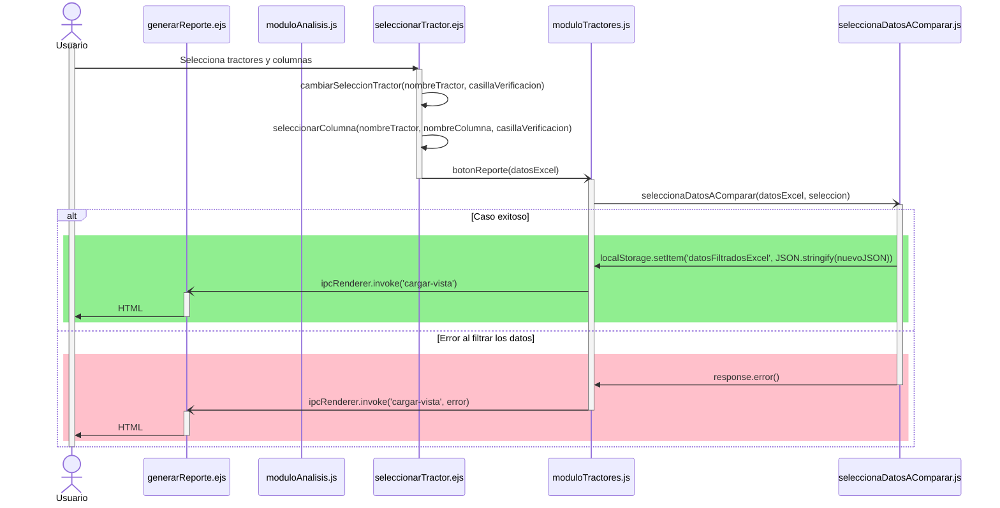

# RF14: Usuario selecciona datos a comparar.

### Historia de Usuario

Yo como usuario quiero seleccionar datos especificos de los tractores para compararlos y evaluar su rendimiento:

  **Precondiciones**
  - Tener cargado un Exel

  **Criterios de Aceptación:**
  - El sistema debe de permitir visualizar la comparación en tablas o gráficos seleccionados por el usuario
  - El usuario debe de poder seleccionar varios datos para su comparación.

---

### Diagrama de Secuencia

![Diagrama de Secuencia] 

> *Descripción*: El diagrama de secuencia muestra cómo el usuario selecciona los datos disponibles para su comparación.

---

### Mockup

![Mockup]

> *Descripción*: El mockup representa la interfaz del sistema donde se pueden comparar los datos.

---

### Pruebas Unitarias 
| ID Prueba | Descripción | Resultado Esperado |
|-----------|-------------|--------------------|
|PU-RF14-01|Seleccionar datos de diferentes tractores.|Se muestra la comparación de datos correctamente.|
|PU-RF14-02|Cambiar la selección de datos.|La tabla o gráfico con el que se haga la comparación de datos se actualiza de manera automatica.|
|PU-RF14-03|Comparar datos con diferentes formatos.|Se puede alternar entre tabla y gráfico sin perder la información.|