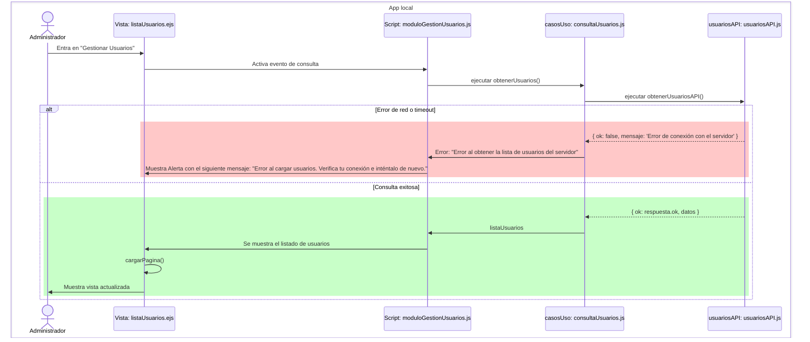
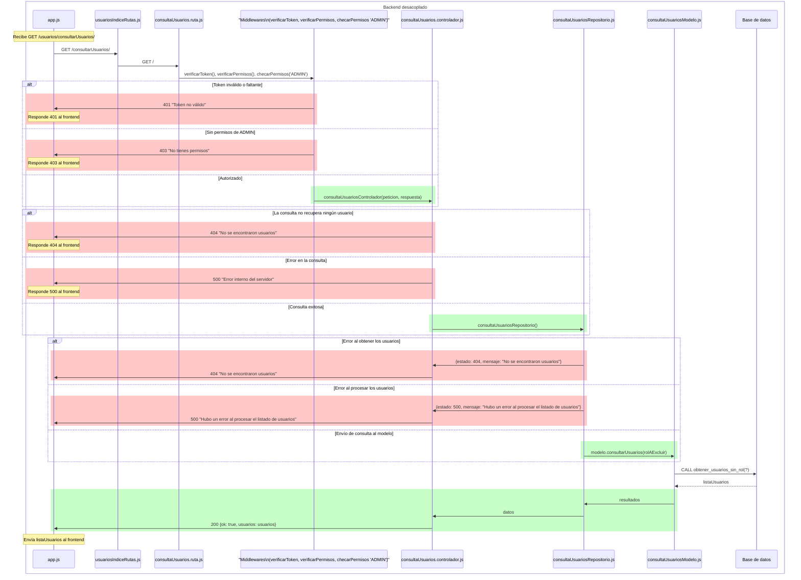

# RF15: Administrador consulta usuarios

### Historia de Usuario

Yo como administrador / super-administrador quiero poder consultar un listado de los usuarios registrados en el sistema para ser consciente de las personas que tienen acceso.

  **Criterios de Aceptación:**
  - Únicamente los administradores y super-administradores deben ser capaces de entrar al módulo de gestión de usuarios.
  - Se debe poder consultar un listado de los usuarios registrados en el sistema hasta el momento de la consulta.
  - En el listado de usuarios no deben aparecer aquellos que tengan un rol de "Super Admin".
  - En el listado de usuarios no debe aparecer el usuario que realiza la consulta.
  - En caso de que haya un fallo en la consulta o no hayan usuarios registrados en el sistema, la aplicación mostrará una alerta con el siguiente mensaje "Error al cargar usuarios. Verifica tu conexión e inténtalo de nuevo.", y quedará el siguiente texto "No hay usuarios disponibles." en el espacio donde se mostrarían los usuarios.

---

### Diagrama de Secuencia

> *Descripción*: Al hacer clic en “Gestionar Usuarios”, la interfaz solicita al servidor la lista de usuarios; el servidor valida permisos, consulta la base de datos excluyendo superadmins y al propio solicitante, y devuelve los resultados al cliente, que muestra la tabla con paginación o una alerta en caso de error o ausencia de usuarios.

---

### Mockup

> *Descripción*: Muestra una lista paginada de usuarios (sin superadmins ni el propio administrador), con paginación, y el acceso a las funcionalidades para crear, modificar y eliminar usuarios.

---

### Pruebas Unitarias 

#### [Pruebas del RF](https://docs.google.com/spreadsheets/d/1W-JW32dTsfI22-Yl5LydMhiu-oXHH_xo3hWvK6FHeLw/edit?gid=2107712581#gid=2107712581)

---

### Pull Request

[https://github.com/CodeAnd-Co/App-Local-TracTech/pull/30](https://github.com/CodeAnd-Co/App-Local-TracTech/pull/30)

[https://github.com/CodeAnd-Co/Backend-Desacoplado-TracTech/pull/18](https://github.com/CodeAnd-Co/Backend-Desacoplado-TracTech/pull/18)

### Historial de cambios

| **Tipo de Versión** | **Descripción**                            | **Fecha** | **Colaborador**         |
| ------------------- | ------------------------------------------ | --------- | ----------------------- |
| **1.0**             |  Añadir requisitos de tractores            | 5/3/2025  | Antonio Landeros           |
| **2.0**             |  Ordenar todas las RFs y actualizar los datos | 1/6/2025  | Mauricio Anguiano|
| **2.1**             |  Añadir el análisis y diseño del RF15 a la documentación | 2/6/2025  | Rommel Toledo|
| **2.2**             |  Agregar pull requests de RF back | 5/6/2025  | Sofía Osorio|