# RF16: Administrador modifica usuario.

### Historia de Usuario

Yo como administrador de la aplicación de escritorio Harvester quiero modificar los datos de los usuarios existentes para mantener actualizada la información del personal y corregir errores en los datos registrados.

 **Criterios de Aceptación:**
 - El administrador debe poder acceder a la lista de usuarios registrados en el sistema.
 - El administrador debe poder seleccionar un usuario específico para editar haciendo clic en el botón "Editar".
 - El sistema debe precargar los datos actuales del usuario en el formulario de edición.
 - El administrador debe poder modificar el nombre, correo electrónico, contraseña y rol del usuario.
 - El administrador debe poder modificar solo los campos que desee cambiar, no es obligatorio cambiar todos.
 - El sistema debe mostrar mensajes de error si los datos ingresados no son válidos.
 - Las contraseñas deben coincidir si se están modificando.
 - El correo electrónico no debe repetirse entre usuarios.
 - Los cambios deben guardarse en el servidor y actualizarse en la interfaz inmediatamente.
 - El sistema debe mostrar un mensaje de confirmación cuando la modificación sea exitosa.
 - Solo usuarios con rol de administrador pueden realizar esta acción.

---

### Diagrama de Secuencia - App Local 

```mermaid
sequenceDiagram
   participant A as Administrador
   participant V as Vista (listaUsuarios.ejs)
   participant MG as moduloGestionUsuario.js
   participant CU as consultarUsuarios.js
   participant CR as consultarRoles.js
   participant MU as modificarUsuario.js
   participant API as usuariosAPI.js
   participant VT as verificarToken.js
   participant VP as verificarPermisos.js
   participant VU as validacionesUsuario.js

   Note over A,VU: Frontend Local - Administrador modifica usuario

   rect rgb(220, 255, 220)
       A->>V: Acceder a página gestión de usuarios
       V->>MG: inicializarModuloGestionUsuarios()
       MG->>VT: verificarToken(localStorage.getItem('token'))
       
       alt Token válido
           VT-->>MG: Token verificado
           MG->>VP: verificarPermisos(token)
           VP-->>MG: Permisos de administrador confirmados
           MG->>CU: obtenerUsuarios()
           CU->>API: fetch GET /usuarios/consultarUsuarios + JWT
           
           alt Respuesta exitosa del servidor
               API-->>CU: {ok: true, usuarios: [...]}
               CU->>CU: Crear objetos Usuario y ListaUsuarios
               CU-->>MG: ListaUsuarios con usuarios procesados
               MG->>MG: Filtrar usuario actual de la lista
               MG->>MG: cargarPagina(1) - Paginación
               MG-->>V: Renderizar lista usuarios con botones editar
               V-->>A: Interfaz con usuarios paginados
           else Error del servidor
               rect rgb(255, 220, 220)
                   API-->>CU: {ok: false, mensaje: error}
                   CU-->>MG: Error al obtener usuarios
                   MG->>V: Mostrar mensaje error en lista
                   V-->>A: "Error al cargar usuarios"
               end
           end
       else Token inválido
           rect rgb(255, 220, 220)
               VT-->>MG: Token no válido
               MG->>V: Redirigir a página de login
               V-->>A: Pantalla de inicio de sesión
           end
       end
   end

   Note over A,VU: Administrador selecciona usuario a editar

   rect rgb(220, 255, 220)
       A->>V: Hacer clic en botón "Editar" de usuario específico
       V->>MG: click event en .boton-editar[data-id="X"]
       MG->>MG: modoEditar(idUsuario)
       MG->>MG: Buscar usuario en listaUsuarios por ID
       
       alt Usuario encontrado
           MG->>MG: Cambiar modoActual = EDITAR
           MG->>MG: usuarioAEditar = usuario seleccionado
           MG->>CR: consultarRoles()
           CR->>API: fetch GET /usuarios/consultarRolesUsuarios + JWT
           
           alt Roles obtenidos exitosamente
               API-->>CR: {ok: true, roles: [...]}
               CR-->>MG: Lista de roles disponibles
               MG->>V: Precargar datos en formulario
               V->>V: Llenar campos: nombre, correo, rol seleccionado
               V->>V: Limpiar campos contraseña
               V->>V: Cambiar título a "Modificar usuario"
               V->>V: Cambiar botón a "Modificar"
               V-->>A: Formulario visible con datos precargados
           else Error al obtener roles
               rect rgb(255, 220, 220)
                   API-->>CR: {ok: false, mensaje: error}
                   CR-->>MG: Error al cargar roles
                   MG->>V: Mostrar SweetAlert error
                   V-->>A: "Error al cargar roles disponibles"
               end
           end
       else Usuario no encontrado
           rect rgb(255, 220, 220)
               MG->>V: console.error('Usuario no encontrado')
               V-->>A: Sin cambios en interfaz
           end
       end
   end

   Note over A,VU: Administrador modifica datos con validaciones en tiempo real

   rect rgb(220, 255, 220)
       A->>V: Escribir en campo nombre
       V->>MG: input event en #username
       MG->>VU: validarNombreCampo(valorIngresado)
       
       alt Nombre válido
           VU-->>MG: Sin errores
           MG->>V: Remover clase inputError, limpiar mensaje
           V-->>A: Campo sin indicadores de error
       else Nombre inválido
           rect rgb(255, 255, 220)
               VU-->>MG: Mensaje de error específico
               MG->>V: Agregar clase inputError, mostrar mensaje
               V-->>A: Campo marcado en rojo con mensaje error
           end
       end

       A->>V: Escribir en campo correo
       V->>MG: input event en #email
       MG->>VU: validarCorreoCampo(correoIngresado)
       
       alt Correo válido
           VU-->>MG: Sin errores
           MG->>V: Remover indicadores de error
           V-->>A: Campo correo válido
       else Correo inválido
           rect rgb(255, 255, 220)
               VU-->>MG: Error de formato o longitud
               MG->>V: Mostrar error específico
               V-->>A: "El correo debe tener un formato válido"
           end
       end

       A->>V: Escribir contraseña y confirmación
       V->>MG: input events en #password y #passwordConfirmar
       MG->>VU: validarContraseniaCampo(contrasenia)
       MG->>MG: validarCoincidenciaContrasenas()
       
       alt Contraseñas válidas y coinciden
           VU-->>MG: Validación exitosa
           MG->>V: Sin errores en campos contraseña
           V-->>A: Campos contraseña válidos
       else Contraseñas no válidas o no coinciden
           rect rgb(255, 255, 220)
               VU-->>MG: Error de validación
               MG->>V: Mostrar errores específicos
               V-->>A: "Las contraseñas no coinciden"
           end
       end

       A->>V: Seleccionar nuevo rol
       V->>MG: change event en #rol
       MG->>VU: validarRolCampo(idRolSeleccionado)
       VU-->>MG: Validación de rol
       MG-->>V: Actualizar campo rol
   end

   Note over A,API: Administrador envía modificaciones

   rect rgb(220, 255, 220)
       A->>V: Hacer clic en botón "Modificar"
       V->>MG: click event en .btn-guardar (modoActual === EDITAR)
       MG->>MG: editarUsuario()
       MG->>MG: Verificar mensajes de error visibles
       
       alt Sin errores de validación
           MG->>MG: Capturar datos del formulario
           MG->>MG: validarYLimpiarUsuario(datos)
           MG->>MG: Verificar que haya al menos un campo modificado
           
           alt Hay campos modificados
               MG->>MU: modificarUsuario(idUsuario, nombre, correo, contrasenia, idRol)
               MU->>API: fetch PUT /usuarios/modificarUsuario + datos + JWT
               
               Note over API: Comunicación con Backend Desacoplado
               
               alt Respuesta exitosa del backend
                   API-->>MU: {ok: true, mensaje: "Usuario modificado exitosamente"}
                   MU-->>MG: Resultado exitoso
                   MG->>V: SweetAlert éxito + limpiar formulario
                   V-->>A: "Usuario modificado exitosamente"
                   MG->>MG: setTimeout(inicializarModuloGestionUsuarios, 500)
                   MG->>V: Ocultar formulario + recargar lista
                   V-->>A: Lista actualizada sin formulario
               else Error del backend
                   rect rgb(255, 220, 220)
                       API-->>MU: {ok: false, mensaje: error específico}
                       MU-->>MG: Error detallado
                       MG->>V: SweetAlert con mensaje de error
                       V-->>A: Mensaje error específico del servidor
                   end
               end
           else Sin campos modificados
               rect rgb(255, 255, 220)
                   MG->>V: SweetAlert warning
                   V-->>A: "Debes modificar al menos un campo del usuario"
               end
           end
       else Hay errores de validación
           rect rgb(255, 255, 220)
               MG->>V: SweetAlert warning
               V-->>A: "Corrige los errores señalados en el formulario"
           end
       end
   end

   Note over A,V: Flujos alternativos adicionales

   alt Administrador cancela edición
       rect rgb(255, 255, 220)
           A->>V: Hacer clic en botón "Cancelar"
           V->>MG: click event en .btn-cancelar
           MG->>V: Ocultar formulario sin guardar
           V-->>A: Regreso a lista sin cambios
       end
   end

   alt Error de conexión de red
       rect rgb(255, 220, 220)
           API->>API: fetch() falla por red
           API-->>MU: {ok: false, mensaje: "Error de conexión"}
           MU-->>MG: Error de conectividad
           MG->>V: SweetAlert error de red
           V-->>A: "Hubo un problema al conectar con el servidor"
       end
   end

   alt Token expira durante la sesión
       rect rgb(255, 220, 220)
           API->>API: Respuesta 401 Unauthorized
           API-->>MU: {ok: false, mensaje: "Token expirado"}
           MU-->>MG: Token inválido
           MG->>V: Redirigir a login
           V-->>A: Pantalla de inicio de sesión
       end
   end
```

### Diagrama de Secuencia - Backend Desacoplado

```mermaid 
sequenceDiagram
    participant API as usuariosAPI.js (Frontend)
    participant RT as Rutas Express
    participant MA as middlewareAutenticacion
    participant MP as middlewarePermisos
    participant MC as modificarUsuario.controlador
    participant VU as validarUsuario.js
    participant BC as bcrypt
    participant MR as modificarUsuarioRepositorio
    participant MM as modificarUsuarioModelo
    participant BD as Base de Datos MySQL

    Note over API,BD: Backend Desacoplado - Procesar modificación de usuario

    rect rgb(220, 255, 220)
        API->>RT: PUT /usuarios/modificarUsuario
        Note over API,RT: Headers: Authorization: Bearer {JWT}<br/>Body: {idUsuario, nombre, correo, contrasenia, idRol}
        
        RT->>MA: verificarToken(req, res, next)
        MA->>MA: Extraer token del header Authorization
        
        alt Token presente y válido
            MA->>MA: jwt.verify(token, JWT_SECRET)
            MA->>MA: Agregar req.usuario = decodedToken
            MA->>RT: next() - continuar middleware chain
            
            RT->>MP: verificarPermisos(req, res, next)
            MP->>MP: Verificar req.usuario existe
            MP->>RT: next() - continuar
            
            RT->>MP: checarPermisos('ADMIN')(req, res, next)
            MP->>MP: Verificar req.usuario.rol === 'ADMIN'
            
            alt Usuario es administrador
                MP->>RT: next() - autorizado
                RT->>MC: modificarUsuario(peticion, respuesta)
                
                MC->>MC: Verificar peticion.body existe
                
                alt Body presente
                    MC->>VU: validarYLimpiarUsuario(peticion.body)
                    VU->>VU: Validar idUsuario requerido
                    VU->>VU: Validar formato de campos modificados
                    VU->>VU: Sanitizar datos con validator.escape()
                    
                    alt Validación exitosa
                        VU-->>MC: {error: null, datosSanitizados: {...}}
                        MC->>MC: Extraer campos: {idUsuario, nombre, correo, contrasenia, idRol}
                        MC->>MC: Construir objeto cambios = {}
                        
                        alt Contraseña fue modificada
                            MC->>BC: bcrypt.hash(contrasenia, 12)
                            BC-->>MC: contraseniaHasheada
                            MC->>MC: cambios.contrasenia = contraseniaHasheada
                        end
                        
                        MC->>MC: if(nombre) cambios.nombre = nombre
                        MC->>MC: if(correo) cambios.correo = correo  
                        MC->>MC: if(idRol) cambios.idRol = idRol
                        
                        MC->>MR: modificarUsuario(idUsuario, cambios)
                        MR->>MR: Validar idUsuario > 0 y numérico
                        MR->>MR: Construir arrays sets[] y valores[]
                        MR->>MR: sets.push('Nombre = ?') si hay nombre
                        MR->>MR: sets.push('Correo = ?') si hay correo
                        MR->>MR: sets.push('Contrasenia = ?') si hay contraseña
                        MR->>MR: sets.push('idRol_FK = ?') si hay rol
                        
                        alt Hay campos para actualizar
                            MR->>MM: modificarUsuario(idUsuario, sets.join(', '), valores)
                            MM->>BD: UPDATE usuario SET {sets} WHERE idUsuario = ?
                            
                            alt Usuario existe y actualización exitosa
                                BD-->>MM: affectedRows: 1, changedRows: 1
                                MM-->>MR: resultado con affectedRows
                                MR-->>MC: {estado: 200, mensaje: 'Usuario modificado exitosamente'}
                                MC-->>RT: res.status(200).json({mensaje: 'Usuario modificado exitosamente'})
                                RT-->>API: HTTP 200 + JSON response
                            else Usuario no existe
                                rect rgb(255, 220, 220)
                                    BD-->>MM: affectedRows: 0
                                    MM-->>MR: Sin filas afectadas
                                    MR-->>MC: {estado: 404, mensaje: 'El usuario no existe'}
                                    MC-->>RT: res.status(404).json({mensaje: 'El usuario no existe'})
                                    RT-->>API: HTTP 404 + error
                                end
                            end
                            
                            alt Violación de constraint (correo duplicado)
                                rect rgb(255, 220, 220)
                                    BD-->>MM: Error: ER_DUP_ENTRY for 'correo'
                                    MM-->>MR: MySQL constraint error
                                    MR-->>MC: Catch error.code === 'ER_DUP_ENTRY'
                                    MC-->>RT: res.status(400).json({mensaje: 'El correo ya está en uso'})
                                    RT-->>API: HTTP 400 + error específico
                                end
                            end
                            
                            alt Error de conexión de base de datos
                                rect rgb(255, 220, 220)
                                    BD-->>MM: Connection timeout/error
                                    MM-->>MR: Database connection error
                                    MR-->>MC: Error interno
                                    MC-->>RT: res.status(500).json({mensaje: 'Error interno del servidor'})
                                    RT-->>API: HTTP 500 + error genérico
                                end
                            end
                        else Sin campos para actualizar
                            rect rgb(255, 255, 220)
                                MR-->>MC: Error: 'No se proporcionaron campos para actualizar'
                                MC-->>RT: res.status(400).json({mensaje: error})
                                RT-->>API: HTTP 400 + mensaje
                            end
                        end
                    else Error de validación
                        rect rgb(255, 255, 220)
                            VU-->>MC: {error: 'Mensaje específico', datosSanitizados: null}
                            MC-->>RT: res.status(400).json({mensaje: error})
                            RT-->>API: HTTP 400 + error validación
                        end
                    end
                else Body faltante
                    rect rgb(255, 220, 220)
                        MC-->>RT: res.status(400).json({mensaje: 'No se recibieron datos'})
                        RT-->>API: HTTP 400 + error
                    end
                end
            else Usuario no es administrador
                rect rgb(255, 220, 220)
                    MP-->>RT: res.status(403).json({mensaje: 'Permisos insuficientes'})
                    RT-->>API: HTTP 403 Forbidden
                end
            end
        else Token inválido o faltante
            rect rgb(255, 220, 220)
                MA-->>RT: res.status(401).json({mensaje: 'Token no válido'})
                RT-->>API: HTTP 401 Unauthorized
            end
        end
    end

    Note over API,BD: Flujos alternativos del backend

    alt Servidor de base de datos no disponible
        rect rgb(255, 220, 220)
            MM->>BD: Intento de conexión
            BD-->>MM: ECONNREFUSED / Timeout
            MM-->>MR: Error de conexión
            MR-->>MC: Database unavailable
            MC-->>RT: res.status(503).json({mensaje: 'Servicio temporalmente no disponible'})
            RT-->>API: HTTP 503 Service Unavailable
        end
    end

    alt Carga alta del servidor
        rect rgb(255, 255, 220)
            RT->>RT: Request timeout por alta carga
            RT-->>API: HTTP 408 Request Timeout
        end
    end

    alt Error interno no controlado
        rect rgb(255, 220, 220)
            MC->>MC: Excepción no capturada
            MC-->>RT: res.status(500).json({mensaje: 'Error interno del servidor'})
            RT-->>API: HTTP 500 Internal Server Error
        end
    end
```

> *Descripción*: El diagrama de secuencia muestra cómo el usuario interactúa con el sistema para cerrar sesión, detallando los pasos de solicitud de datos, validación y confirmación.

---

### Mockup

> *Descripción*: El mockup representa la interfaz del sistema donde el usuario puede cerrar sesión. Muestra los campos requeridos y los botones de acción disponibles.

---

### Pruebas Unitarias 

#### [Pruebas de la RF](https://docs.google.com/spreadsheets/d/1W-JW32dTsfI22-Yl5LydMhiu-oXHH_xo3hWvK6FHeLw/edit?gid=1133353405#gid=1133353405)

---

### Pull Request
[https://github.com/CodeAnd-Co/App-Local-TracTech/pull/86](https://github.com/CodeAnd-Co/App-Local-TracTech/pull/86)
