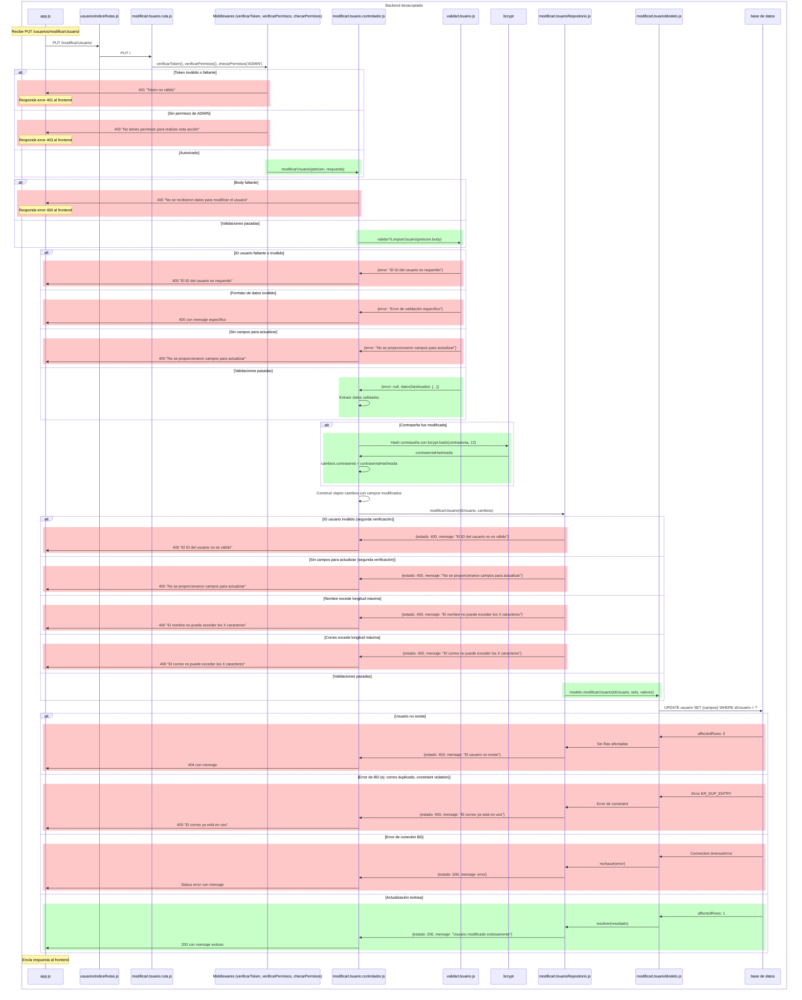
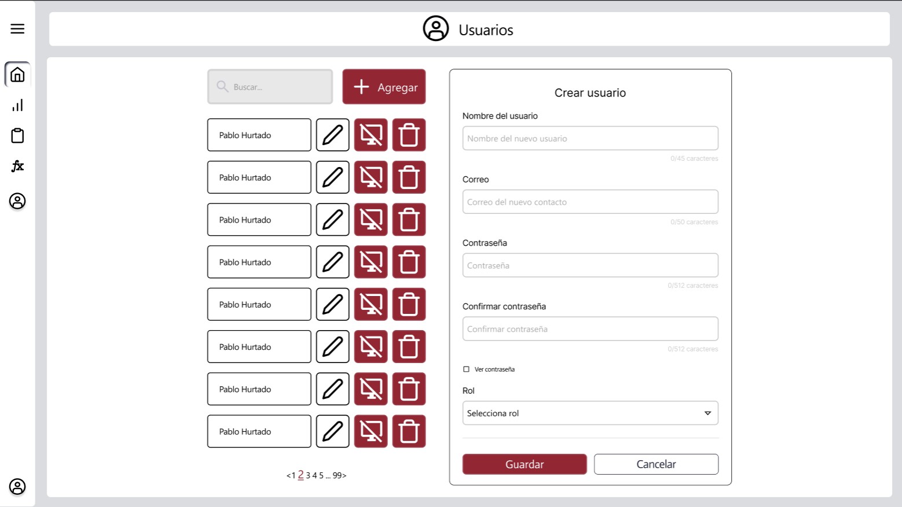

# RF16: Administrador modifica usuario.

### Historia de Usuario

Yo como administrador del sistema quiero modificar los datos de los usuarios existentes para mantener actualizada la información del personal y corregir errores en los datos registrados.

 **Criterios de Aceptación:**
 - El administrador debe poder acceder a la lista de usuarios registrados en el sistema.
 - El administrador debe poder seleccionar un usuario específico para editar haciendo clic en el botón "Editar".
 - El sistema debe precargar los datos actuales del usuario en el formulario de edición.
 - El administrador debe poder modificar el nombre, correo electrónico, contraseña y rol del usuario.
 - El sistema debe validar los datos en tiempo real mientras el administrador escribe.
 - El administrador debe poder modificar solo los campos que desee cambiar, no es obligatorio cambiar todos.
 - El correo electrónico del usuario debe ser único en el sistema.
 - El correo electrónico del usuario debe tener un formato válido, es decir, debe contener un nombre de usuario, el símbolo "@", un dominio y una extensión (por ejemplo: usuario@dominio.com).
 - No se permiten espacios ni caracteres especiales fuera de los permitidos (letras, números, puntos, guiones y guiones bajos antes de la "@").
 - No se permiten entradas mayores a la máxima longitud de caracteres de cada campo.
 - La contraseña debe cumplir con los siguientes requisitos:
   - Mínimo 8 caracteres
   - Al menos una mayúscula
   - Al menos un número
   - Al menos un carácter especial
 - Los campos deben mostrar los errores de formato debajo de los mismos (Por ejemplo, si la contraseña no tiene los caracteres suficientes, se debe mostrar debajo un mensaje con la longitud que debería tener la contraseña).
 - Las contraseñas deben coincidir si se están modificando.
 - El correo electrónico no debe repetirse entre usuarios.
 - Si se intenta modificar un usuario sin llenar todos los campos obligatorios, se debe mostrar una alerta.
 - Si se intenta modificar un usuario con un formato de correo inválido, se debe mostrar una alerta.
 - Los cambios deben guardarse en el servidor y actualizarse en la interfaz inmediatamente.
 - El sistema debe mostrar un mensaje de confirmación cuando la modificación sea exitosa.
 - Solo usuarios con rol de administrador pueden realizar esta acción.

---

### Diagrama de Secuencia - App Local

> *Descripción*: El diagrama de secuencia muestra todo el flujo sobre cómo el administrador modifica usuarios, obtiene retroalimentación sobre los campos y las acciones que hace y cómo se actualiza el usuario.

```mermaid
sequenceDiagram
  %% App Local
  
  box App local
    actor Administrador as Administrador
    participant vistaUsuarios as Vista: listaUsuarios.ejs
    participant gestionUsuarios as Script: moduloGestionUsuario.js
    participant modificarUsuario as casosUso: modificarUsuario.js
    participant modificarUsuarioAPI as usuariosAPI: usuariosAPI.js
  end

  Administrador ->> vistaUsuarios: Da click en "Modificar"
  vistaUsuarios ->> gestionUsuarios: Activa un evento
  gestionUsuarios ->> vistaUsuarios: Muestra el modal con datos del usuario
  Administrador ->> vistaUsuarios: Actualiza los campos
  
  %% Validación en tiempo real del frontend
  vistaUsuarios ->> gestionUsuarios: Valida el formato de los campos
  alt Campos con formato inválido
    rect rgb(255,200,200)
      gestionUsuarios ->> vistaUsuarios: Muestra mensajes de error en tiempo real<br/>(campo vacío, formato inválido, etc.)
    end
  end

  Administrador ->> vistaUsuarios: Click en "Guardar"
  
  %% Validaciones previas en frontend
  alt Hay errores visibles en el formulario
    rect rgb(255,200,200)
      gestionUsuarios ->> Administrador: Muestra Swal "Formulario con errores"
    end
  else Contraseñas no coinciden
    rect rgb(255,200,200)
      gestionUsuarios ->> Administrador: Muestra Swal "Contraseñas no coinciden"
    end
  else Campos obligatorios vacíos
    rect rgb(255,200,200)
      gestionUsuarios ->> Administrador: Muestra Swal "Datos incompletos"
    end
  else Correo ya existe (verificación local)
    rect rgb(255,200,200)
      gestionUsuarios ->> Administrador: Muestra Swal "Correo ya registrado"
    end
  else Validaciones de longitud excedida
    rect rgb(255,200,200)
      gestionUsuarios ->> Administrador: Muestra Swal con error específico<br/>(nombre/correo/contraseña demasiado largo)
    end
  else Contraseña muy corta (< 8 caracteres)
    rect rgb(255,200,200)
      gestionUsuarios ->> Administrador: Muestra Swal "Contraseña demasiado corta"
    end
  else Datos válidos en frontend
    rect rgb(200,255,200)
      gestionUsuarios ->> modificarUsuario: modificarUsuarioCU(idUsuario, nombre, correo, contraseña, idRolFK)
    end
  end

  %% Validaciones en caso de uso
  alt Campos obligatorios faltantes
    rect rgb(255,200,200)
      modificarUsuario ->> gestionUsuarios: {ok: false, mensaje: "Todos los campos son obligatorios"}
      gestionUsuarios ->> Administrador: Muestra Swal de error
    end
  else Correo con formato inválido
    rect rgb(255,200,200)
      modificarUsuario ->> gestionUsuarios: {ok: false, mensaje: "Correo electrónico no válido"}
      gestionUsuarios ->> Administrador: Muestra Swal de error
    end
  else Validaciones pasadas
    rect rgb(200,255,200)
      modificarUsuario ->> modificarUsuarioAPI: modificarUsuarioAPI(ObjetoUsuarioActualizado)
      modificarUsuarioAPI -->> modificarUsuarioAPI: PUT /usuarios/modificarUsuario/
      Note over modificarUsuarioAPI: Enviando al Backend...
      
      %% RESPUESTAS DEL BACKEND
      alt Error de red o timeout
        rect rgb(255,200,200)
          modificarUsuarioAPI -->> modificarUsuario: {ok: false, mensaje: "Error de red"}
          modificarUsuario ->> gestionUsuarios: Error de red
          gestionUsuarios ->> Administrador: Muestra Swal "Error de red"
        end
      else Error 401 - Token inválido
        rect rgb(255,200,200)
          Note over modificarUsuarioAPI: Backend responde: 401 "Token no válido"
          modificarUsuarioAPI ->> modificarUsuario: {ok: false, mensaje: error}
          modificarUsuario ->> gestionUsuarios: Error de autenticación
          gestionUsuarios ->> Administrador: Muestra Swal "Error de conexión"
        end
      else Error 403 - Sin permisos
        rect rgb(255,200,200)
          Note over modificarUsuarioAPI: Backend responde: 403 "No tienes permisos"
          modificarUsuarioAPI ->> modificarUsuario: {ok: false, mensaje: error}
          modificarUsuario ->> gestionUsuarios: Error de permisos
          gestionUsuarios ->> Administrador: Muestra Swal de error
        end
      else Error 400 - Validación fallida
        rect rgb(255,200,200)
          Note over modificarUsuarioAPI: Backend responde: 400 con mensaje específico
          modificarUsuarioAPI ->> modificarUsuario: {ok: false, mensaje: error}
          modificarUsuario ->> gestionUsuarios: Código de error 400
          gestionUsuarios ->> Administrador: Muestra Swal con mensaje de error específico
        end
      else Error 500 - Error del servidor
        rect rgb(255,200,200)
          Note over modificarUsuarioAPI: Backend responde: 500 "Error del servidor"
          modificarUsuarioAPI ->> modificarUsuario: {ok: false, mensaje: error}
          modificarUsuario ->> gestionUsuarios: Error del servidor
          gestionUsuarios ->> Administrador: Muestra Swal "Error del servidor"
        end
      else Éxito 200 - Usuario modificado
        rect rgb(200,255,200)
          Note over modificarUsuarioAPI: Backend responde: 200 {mensaje: "Usuario modificado con éxito", idUsuario}
          modificarUsuarioAPI ->> modificarUsuario: {ok: true, mensaje: "Usuario modificado con éxito", id: number}
          modificarUsuario ->> gestionUsuarios: Resultado exitoso
          gestionUsuarios ->> Administrador: Muestra Swal "Usuario modificado con éxito"
          gestionUsuarios ->> vistaUsuarios: Oculta modal
          gestionUsuarios ->> gestionUsuarios: inicializarModuloGestionUsuarios() tras 500 ms
          vistaUsuarios ->> Administrador: Muestra vista actualizada
        end
      end
    end
  end
```

### Diagrama de Secuencia - Backend Desacoplado

---

### Mockup

> *Descripción*: El mockup representa la interfaz del sistema donde el usuario puede cerrar sesión. Muestra los campos requeridos y los botones de acción disponibles.

---

### Pruebas Unitarias 

#### [Pruebas de la RF](https://docs.google.com/spreadsheets/d/1W-JW32dTsfI22-Yl5LydMhiu-oXHH_xo3hWvK6FHeLw/edit?gid=1133353405#gid=1133353405)

---

### Pull Request
[https://github.com/CodeAnd-Co/App-Local-TracTech/pull/86](https://github.com/CodeAnd-Co/App-Local-TracTech/pull/86)
