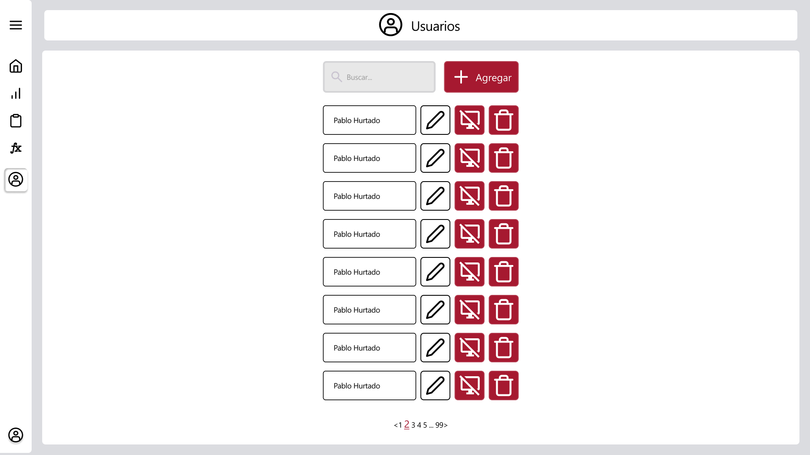

# RF16: Administrador modifica usuario.

### Historia de Usuario

Yo como administrador de la aplicación de escritorio Harvester quiero modificar los datos de los usuarios existentes para mantener actualizada la información del personal y corregir errores en los datos registrados.

 **Criterios de Aceptación:**
 - El administrador debe poder acceder a la lista de usuarios registrados en el sistema.
 - El administrador debe poder seleccionar un usuario específico para editar haciendo clic en el botón "Editar".
 - El sistema debe precargar los datos actuales del usuario en el formulario de edición.
 - El administrador debe poder modificar el nombre, correo electrónico, contraseña y rol del usuario.
 - El administrador debe poder modificar solo los campos que desee cambiar, no es obligatorio cambiar todos.
 - El sistema debe mostrar mensajes de error si los datos ingresados no son válidos.
 - Las contraseñas deben coincidir si se están modificando.
 - El correo electrónico no debe repetirse entre usuarios.
 - Los cambios deben guardarse en el servidor y actualizarse en la interfaz inmediatamente.
 - El sistema debe mostrar un mensaje de confirmación cuando la modificación sea exitosa.
 - Solo usuarios con rol de administrador pueden realizar esta acción.

---

### Diagrama de Secuencia - App Local 

```mermaid
sequenceDiagram
  % App local
  box App local
  actor Administrador as Administrador
  participant vistaUsuarios as Vista: listaUsuarios.ejs
  participant gestionUsuarios as Script: moduloGestionUsuario.js
  participant consultarUsuarios as casosUso: consultarUsuarios.js
  participant consultarRoles as casosUso: consultarRoles.js
  participant modificarUsuario as casosUso: modificarUsuario.js
  participant validacionesUsuario as validacionesUsuario.js
  participant modificarUsuarioAPI as usuariosAPI: usuariosAPI.js
  end

  % Carga inicial y selección de usuario
  Administrador ->> vistaUsuarios: Accede a gestión de usuarios
  vistaUsuarios ->> gestionUsuarios: inicializarModuloGestionUsuarios()
  gestionUsuarios ->> consultarUsuarios: obtenerUsuarios()
  consultarUsuarios ->> modificarUsuarioAPI: fetch GET /usuarios/consultarUsuarios + JWT
  
  alt Error de autenticación/conexión
    rect rgb(255, 200, 200)
    modificarUsuarioAPI ->> consultarUsuarios: {ok: false, mensaje: error}
    consultarUsuarios ->> gestionUsuarios: Error al obtener usuarios
    gestionUsuarios ->> vistaUsuarios: Mostrar "Error al cargar usuarios"
    end
  else Usuarios cargados exitosamente
    rect rgb(200, 255, 200)
    modificarUsuarioAPI ->> consultarUsuarios: {ok: true, usuarios: [...]}
    consultarUsuarios ->> gestionUsuarios: ListaUsuarios con objetos Usuario
    gestionUsuarios ->> vistaUsuarios: Mostrar lista paginada con botones "Editar"
    vistaUsuarios ->> Administrador: Interfaz con usuarios disponibles
    end
  end

  Administrador ->> vistaUsuarios: Click en botón "Editar" de usuario
  vistaUsuarios ->> gestionUsuarios: Activa evento modoEditar()
  gestionUsuarios ->> gestionUsuarios: Buscar usuario por ID en listaUsuarios
  
  alt Usuario no encontrado
    rect rgb(255, 200, 200)
    gestionUsuarios ->> vistaUsuarios: console.error('Usuario no encontrado')
    end
  else Usuario encontrado
    rect rgb(200, 255, 200)
    gestionUsuarios ->> consultarRoles: consultarRoles()
    consultarRoles ->> modificarUsuarioAPI: fetch GET /usuarios/consultarRolesUsuarios + JWT
    
    alt Error al cargar roles
      rect rgb(255, 200, 200)
      modificarUsuarioAPI ->> consultarRoles: {ok: false, mensaje: error}
      consultarRoles ->> gestionUsuarios: Error al cargar roles
      gestionUsuarios ->> Administrador: Muestra Swal "Error al cargar roles"
      end
    else Roles cargados exitosamente
      rect rgb(200, 255, 200)
      modificarUsuarioAPI ->> consultarRoles: {ok: true, roles: [...]}
      consultarRoles ->> gestionUsuarios: Lista de roles disponibles
      gestionUsuarios ->> vistaUsuarios: Precargar datos del usuario en formulario
      vistaUsuarios ->> Administrador: Mostrar formulario con datos actuales
      end
    end
  end

  Administrador ->> vistaUsuarios: Modifica los campos del formulario
  
  % Validación en tiempo real del frontend
  vistaUsuarios ->> gestionUsuarios: Valida el formato de los campos en tiempo real
  gestionUsuarios ->> validacionesUsuario: validarNombreCampo(), validarCorreoCampo(), validarContraseniaCampo()
  alt Campos con formato inválido
    rect rgb(255, 200, 200)
    validacionesUsuario ->> gestionUsuarios: Mensajes de error específicos
    gestionUsuarios ->> vistaUsuarios: Muestra mensajes de error en tiempo real<br/>(formato inválido, longitud excedida, etc.)
    end
  else Campos válidos
    rect rgb(200, 255, 200)
    validacionesUsuario ->> gestionUsuarios: Sin errores de validación
    gestionUsuarios ->> vistaUsuarios: Remover indicadores de error
    end
  end

  Administrador ->> vistaUsuarios: Click en "Modificar"
  
  % Validaciones previas en frontend
  alt Hay errores visibles en el formulario
    rect rgb(255, 200, 200)
    gestionUsuarios ->> Administrador: Muestra Swal "Formulario con errores"
    end
  else Contraseñas no coinciden
    rect rgb(255, 200, 200)
    gestionUsuarios ->> Administrador: Muestra Swal "Contraseñas no coinciden"
    end
  else Sin campos modificados
    rect rgb(255, 200, 200)
    gestionUsuarios ->> gestionUsuarios: validarYLimpiarUsuario() - verificar cambios
    gestionUsuarios ->> Administrador: Muestra Swal "Debes modificar al menos un campo del usuario"
    end
  else Correo ya existe en lista local
    rect rgb(255, 200, 200)
    gestionUsuarios ->> gestionUsuarios: Verificar correo en listaUsuarios
    gestionUsuarios ->> Administrador: Muestra Swal "No se puede repetir el correo entre usuarios"
    end
  else Datos válidos en frontend
    rect rgb(200, 255, 200)
    gestionUsuarios ->> modificarUsuario: modificarUsuario(idUsuario, nombre, correo, contrasenia, idRol)
    end
  end
  
  % Validaciones en caso de uso
  alt Error de validación en caso de uso
    rect rgb(255, 200, 200)
    modificarUsuario ->> gestionUsuarios: {ok: false, mensaje: "Error específico de validación"}
    gestionUsuarios ->> Administrador: Muestra Swal de error
    end
  else Validaciones pasadas
    rect rgb(200, 255, 200)
    modificarUsuario ->> modificarUsuarioAPI: modificarUsuarioAPI(ObjetoUsuarioModificado)
    end
  end

  % Respuesta final del backend
  alt Error de red o timeout
    rect rgb(255, 200, 200)
    modificarUsuarioAPI ->> modificarUsuario: {ok: false, mensaje: "Error de red"}
    modificarUsuario ->> gestionUsuarios: Error de conectividad
    gestionUsuarios ->> Administrador: Muestra Swal "Error de red"
    end
  else Respuesta recibida
    modificarUsuarioAPI ->> modificarUsuario: {ok: boolean, mensaje: string}
    modificarUsuario ->> gestionUsuarios: Resultado de la operación
    
    alt Operación exitosa
      rect rgb(200, 255, 200)
      gestionUsuarios ->> Administrador: Muestra Swal "Usuario modificado exitosamente"
      gestionUsuarios ->> vistaUsuarios: Limpiar formulario y ocultar modal
      gestionUsuarios ->> gestionUsuarios: inicializarModuloGestionUsuarios() tras 500ms
      vistaUsuarios ->> Administrador: Muestra vista actualizada con cambios
      end
    else Operación fallida
      rect rgb(255, 200, 200)
      gestionUsuarios ->> Administrador: Muestra Swal con mensaje de error específico
      end
    end
  end
```

### Diagrama de Secuencia - Backend Desacoplado


> *Descripción*: El diagrama de secuencia muestra cómo el usuario interactúa con el sistema para cerrar sesión, detallando los pasos de solicitud de datos, validación y confirmación.

---

### Mockup




> *Descripción*: El mockup representa la interfaz del sistema donde el usuario puede cerrar sesión. Muestra los campos requeridos y los botones de acción disponibles.

---

### Pruebas Unitarias 

#### [Pruebas de la RF](https://docs.google.com/spreadsheets/d/1W-JW32dTsfI22-Yl5LydMhiu-oXHH_xo3hWvK6FHeLw/edit?gid=1133353405#gid=1133353405)

---

### Pull Request
[https://github.com/CodeAnd-Co/App-Local-TracTech/pull/86](https://github.com/CodeAnd-Co/App-Local-TracTech/pull/86)
