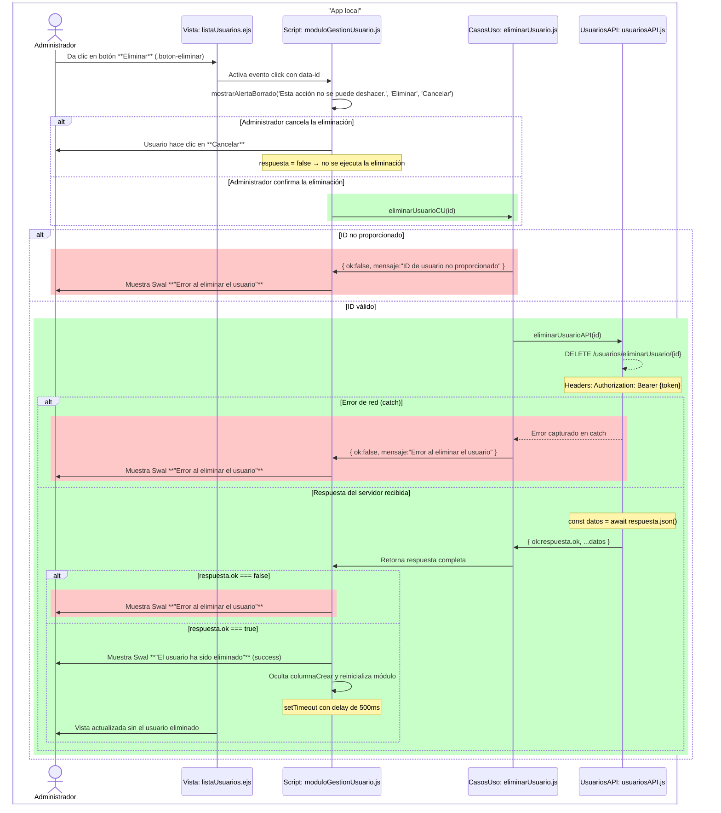
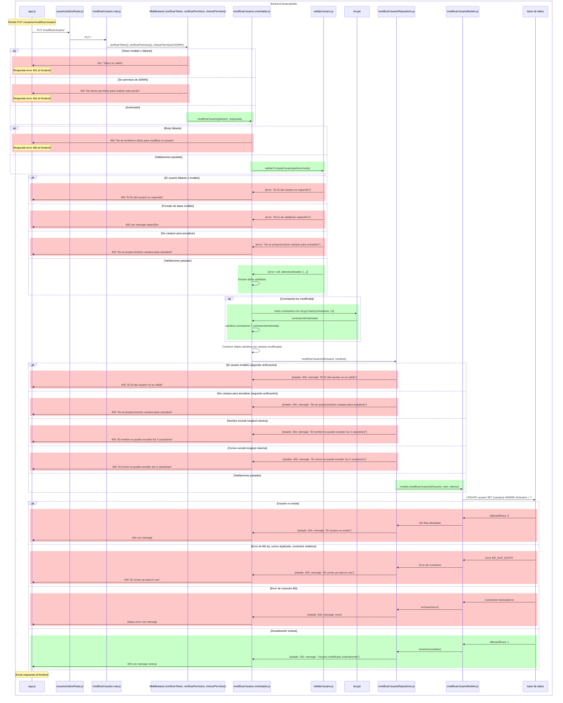

# RF16: Administrador elimina usuario.

### Historia de Usuario

Yo como administrador del sistema quiero eliminar usuarios existentes para mantener actualizada la base de datos del personal, remover usuarios inactivos y gestionar adecuadamente las cuentas que ya no son necesarias en el sistema.

 **Criterios de Aceptación:**
  - El administrador debe poder acceder a la lista de usuarios registrados en el sistema.
  - El administrador debe poder seleccionar un usuario específico para eliminar haciendo clic en el botón "Eliminar".
  - La alerta debe mostrar el mensaje "Esta acción no se puede deshacer." con botones "Eliminar" y "Cancelar".
  - El administrador debe confirmar explícitamente la eliminación haciendo clic en "Eliminar".
  - El administrador debe poder cancelar la operación haciendo clic en "Cancelar".
  - El sistema debe validar que el usuario existe antes de proceder con la eliminación.
  - Los cambios deben aplicarse en el servidor y actualizarse en la interfaz inmediatamente.
  - El sistema debe mostrar un mensaje de confirmación "El usuario ha sido eliminado." cuando la eliminación sea exitosa.
  - El sistema debe mostrar un mensaje "Error al eliminar el usuario." si la eliminación no puede completarse.
  - Solo usuarios con rol de administrador pueden realizar esta acción.
  - El usuario eliminado debe ser removido de la base de datos.
  - Todos los dispositivos vinculados al usuario eliminado deben ser liberados automáticamente.
  - La lista de usuarios debe actualizarse automáticamente después de una eliminación exitosa.
---

### Diagrama de Secuencia - App Local

> *Descripción*: El diagrama de secuencia muestra todo el flujo sobre cómo el administrador modifica usuarios, obtiene retroalimentación sobre los campos y las acciones que hace y cómo se actualiza el usuario.

### Diagrama de Secuencia - Backend Desacoplado

---

### Mockup

> *Descripción*: El mockup representa la interfaz del sistema donde el administrador puede crear y modificar a los usuarios registrados. Muestra los campos requeridos y los botones de acción disponibles.

---

### Pruebas Unitarias 

- [Pruebas de la RF](https://docs.google.com/spreadsheets/d/1W-JW32dTsfI22-Yl5LydMhiu-oXHH_xo3hWvK6FHeLw/edit?gid=1133353405#gid=1133353405)

---

### Pull Request
[https://github.com/CodeAnd-Co/App-Local-TracTech/pull/86](https://github.com/CodeAnd-Co/App-Local-TracTech/pull/86)
