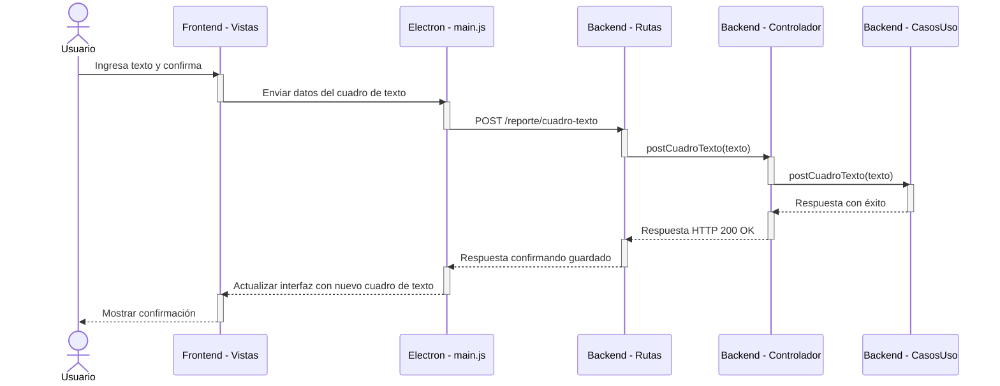

# RF17: Usuario añade cuadro de texto al reporte.

### Historia de Usuario

Yo cono usuario quiero añadir cuadros de texto dentro de mi reporte para así poder incluir comentarios, observaciones personalizadas o interpretar el reporte.

  **Criterios de Aceptación:**
  - El usuario puede añadir un cuadro de texto en cualquier sección del reporte
  - El contenido dentro del cuadro de texto debe de poder editarse.
  - El usuario debe de mantenerse al generar el reporte final

---

### Diagrama de Secuencia

> *Descripción*: El diagrama de secuencia muestra cómo el usuario agrega un cuadro de texto en el reporte.

---

### Mockup

![Mockup]

> *Descripción*: El mockup representa la interfaz del sistema donde el usuario tenga la opción de agregar un cuadro de texto al reporte.

---

### Pruebas Unitarias 
| ID Prueba | Descripción | Resultado Esperado |
|-----------|-------------|--------------------|
|PU-RF17-01|Agregar un cuadro de texto.|El cuadro de texto aparece en el reporte correctamente.|
|PU-RF17-02|Editar el contenido del cuadro de texto.|El usuario puede modificar el texto sin problema.|
|PU-RF17-03|Verificar persistencia.|El cuadro de texto permanece al guardar y generar el reporte|

## Historial de cambios

| **Tipo de Versión** | **Descripción**                               | **Fecha** | **Colaborador**                 |
| ------------------- | --------------------------------------------- | --------- | ------------------------------- |
| **1.0**             | Creación del diagrama de secuencia   | 07/04/2025  | Daniel Contreras |