# RF18: Usuario añade cuadro de texto al reporte.

### Historia de Usuario

Yo como usuario quiero añadir cuadros de texto dentro de mi reporte para así poder incluir comentarios, observaciones personalizadas o interpretar el reporte.

 **Criterios de Aceptación:**
 - El usuario puede añadir un cuadro de texto en cualquier sección del reporte.
 - El contenido dentro del cuadro de texto debe poder editarse.
 - El cuadro de texto debe mantenerse al generar el reporte final.
 - El usuario podrá escoger entre "Título", "Subtítulo" y "Contenido" dentro de la tarjeta de texto.
 - Si se escoge "Título" como opción de la tarjeta de texto este tendrá que ser más grande y en negritas.
 - Si se escoge "Subtítulo" como opción de la tarjeta de texto este tendrá que ser de un tamaño menor al título, pero igualmente en negritas.
 - Si se escoge "Contenido" como opción de la tarjeta de texto este tendrá que ser de un tamaño menor a los 2 anteriores y sin estar en negritas.
 - Para agregar una tarjeta de texto si se quiere en la parte superior se dará click en el círculo de la parte superior de la tarjeta.
 - Para agregar una tarjeta de texto si se quiere en la parte inferior se dará click en el círculo de la parte inferior de la tarjeta.
 - Para eliminar una tarjeta de texto se debe dar click en el botón de "Eliminar" que cuenta con un icono de basura a un lado.
 - Al momento de agregar un cuadro de texto la acción debe completarse en menos de 2 segundos.
 - El usuario debe poder cambiar el tipo de texto (Título/Subtítulo/Contenido) después de crear la tarjeta.

---

### Diagrama de Secuencia

```mermaid
sequenceDiagram
    participant U as Usuario
    participant VA as Vista Análisis
    participant BA as botonesAgregar.js
    participant AT as agregarTexto.js
    participant MA as moduloAnalisis.js
    participant SW as SweetAlert2
    participant EL as ElementoNuevo


    U->>VA: Hacer hover sobre tarjeta existente
    VA->>BA: mouseenter event
    BA->>BA: mostrarBotonesAgregar()
    BA->>BA: Crear botones flotantes "+" (antes/después)
    BA-->>VA: Mostrar círculos superior e inferior

    alt Agregar tarjeta en posición superior
        rect rgb(220, 255, 220)
            U->>BA: Hacer clic en círculo superior
            BA->>SW: abrirMenuAgregar() con posición 'antes'
            SW->>SW: Mostrar modal con opciones Texto/Gráfica
            SW-->>U: Modal con botones Texto y Gráfica
            
            U->>SW: Seleccionar opción "Texto"
            SW->>BA: resultado.isConfirmed = true
            BA->>BA: configurarTexto() con posición 'antes'
            BA->>AT: agregarTexto(contenedor, previsualizacion, tarjetaRef, 'antes')
            
            AT->>AT: Crear tarjetaTexto con HTML
            AT->>AT: Crear vistaPrevia con clase 'preview-titulo'
            AT->>EL: new ElementoNuevo(tarjetaTexto, vistaPrevia)
            AT->>AT: agregarEnPosicion() - insertar antes de tarjetaRef
            AT->>AT: Configurar event listeners (tipo, input, eliminar, alinear)
            AT-->>BA: Retornar tarjetaTexto creada
            
            BA->>BA: Agregar mouseenter/mouseleave a nueva tarjeta
            BA-->>U: Nueva tarjeta de texto visible arriba
        end
    else Agregar tarjeta en posición inferior
        rect rgb(220, 255, 220)
            U->>BA: Hacer clic en círculo inferior
            BA->>SW: abrirMenuAgregar() con posición 'después'
            SW->>SW: Mostrar modal con opciones Texto/Gráfica
            SW-->>U: Modal con botones Texto y Gráfica
            
            U->>SW: Seleccionar opción "Texto"
            SW->>BA: resultado.isConfirmed = true
            BA->>BA: configurarTexto() con posición 'después'
            BA->>AT: agregarTexto(contenedor, previsualizacion, tarjetaRef, 'después')
            
            AT->>AT: Crear tarjetaTexto con HTML
            AT->>AT: Crear vistaPrevia con clase 'preview-titulo'
            AT->>EL: new ElementoNuevo(tarjetaTexto, vistaPrevia)
            AT->>AT: agregarEnPosicion() - insertar después de tarjetaRef
            AT->>AT: Configurar event listeners (tipo, input, eliminar, alinear)
            AT-->>BA: Retornar tarjetaTexto creada
            
            BA->>BA: Agregar mouseenter/mouseleave a nueva tarjeta
            BA-->>U: Nueva tarjeta de texto visible abajo
        end
    end

    U->>VA: Quitar hover de tarjeta
    VA->>BA: mouseleave event
    BA->>BA: ocultarBotonesAgregar()
    BA-->>VA: Ocultar círculos flotantes

    rect rgb(220, 255, 220)
        U->>AT: Escribir en textarea.area-escritura
        AT->>AT: input event listener
        AT->>AT: actualizarTexto(vistaPrevia, areaEscritura)
        AT->>AT: actualizarCaracteres(tarjetaTexto, areaEscritura)
        AT-->>U: Mostrar cambios en tiempo real y contador
        
        U->>AT: Cambiar tipo en select.tipo-texto
        AT->>AT: change event listener
        AT->>AT: Remover clases preview anteriores
        AT->>AT: Agregar nueva clase preview-{tipo}
        AT-->>U: Texto con nuevo formato visible
        
        U->>AT: Hacer clic en botón alinear
        AT->>AT: click event listener
        AT->>AT: Cambiar alignIndex (left/center/right)
        AT->>AT: Aplicar textAlign y cambiar icono
        AT-->>U: Texto alineado según selección
    end

    alt Eliminar tarjeta de texto (con validación de límite)
        rect rgb(255, 220, 220)
            U->>AT: Hacer clic en botón eliminar
            AT->>AT: click event listener en .eliminar
            AT->>AT: configurarObservadorLimite() valida límites
            
            alt Más de 1 texto Y más de 1 gráfica
                AT->>AT: tarjetaTexto.remove()
                AT->>AT: vistaPrevia.remove()
                AT->>AT: MutationObserver actualiza botones
                AT-->>U: Tarjeta eliminada exitosamente
            else Solo queda 1 texto Y 1 gráfica
                rect rgb(255, 255, 220)
                    AT->>AT: Ocultar botones eliminar
                    AT-->>U: No se puede eliminar (mínimo requerido)
                end
            end
        end
    end

    rect rgb(220, 255, 220)
        U->>MA: Hacer clic en "Descargar PDF"
        MA->>MA: descargarPDF() event listener
        MA->>MA: Crear jsPDF document
        MA->>MA: Iterar contenedor-elementos-previsualizacion
        MA->>MA: Procesar .previsualizacion-texto con estilos
        MA->>MA: Aplicar preview-titulo/subtitulo/contenido
        MA->>MA: Agregar texto con formato correcto
        MA-->>U: PDF descargado con textos formateados
    end
```

> *Descripción*: El diagrama de secuencia muestra cómo el usuario agrega un cuadro de texto en el reporte.

---

### Mockup

> *Descripción*: El mockup representa la interfaz del sistema donde el usuario tenga la opción de agregar un cuadro de texto al reporte.

---

### Pruebas Unitarias 

#### [Pruebas de la RF](https://docs.google.com/spreadsheets/d/1W-JW32dTsfI22-Yl5LydMhiu-oXHH_xo3hWvK6FHeLw/edit?gid=1063166809#gid=1063166809)

[Pruebas](https://docs.google.com/spreadsheets/d/1W-JW32dTsfI22-Yl5LydMhiu-oXHH_xo3hWvK6FHeLw/edit?gid=1063166809#gid=1063166809)

---

### Pull Request
[https://github.com/CodeAnd-Co/App-Local-TracTech/pull/27](https://github.com/CodeAnd-Co/App-Local-TracTech/pull/27)
