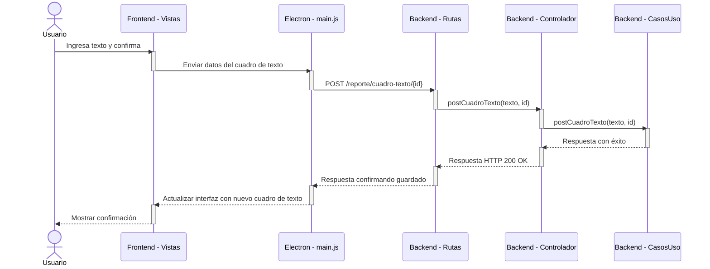

# RF18: Usuario modifica cuadro de texto del reporte.

### Historia de Usuario

Yo como usuario quiero modificar los cuadros de texto en mi reporte para poder actualizar la información o corregir algún error posible. 

  **Criterios de Aceptación:**
  - El usuario debe de poder modificar el contenido de cualquier cuadro de texto existente.
  - Los cambios realizados deben de reflejarse de inmediato.
  - El reporte debe de guardar las modificaciones realizadas.

---

### Diagrama de Secuencia

![Diagrama de Secuencia] 

> *Descripción*: El diagrama de secuencia muestra cómo el usuario edita un cuadro de texto que se encuentra dentro del reporte.

### Mockup

![Mockup]

> *Descripción*: El mockup representa la interfaz del sistema donde el usuario puede editar el cuadro de texto dentro del reporte.

---

### Pruebas Unitarias 
| ID Prueba | Descripción | Resultado Esperado |
|-----------|-------------|--------------------|
|PU-RF18-01|Editar un cuadro de texto existente.|El nuevo contenido se guarda y se muestra en el reporte|
|PU-RF18-02|Verificar actualización inmediata.|Los cambios aparecen reflejados sin necesidad de recargar la aplicación|
|PU-RF18-03|Guardar reporte con modificaciones.|El cuadro de texto modificado se mantiene al generar el reporte.|