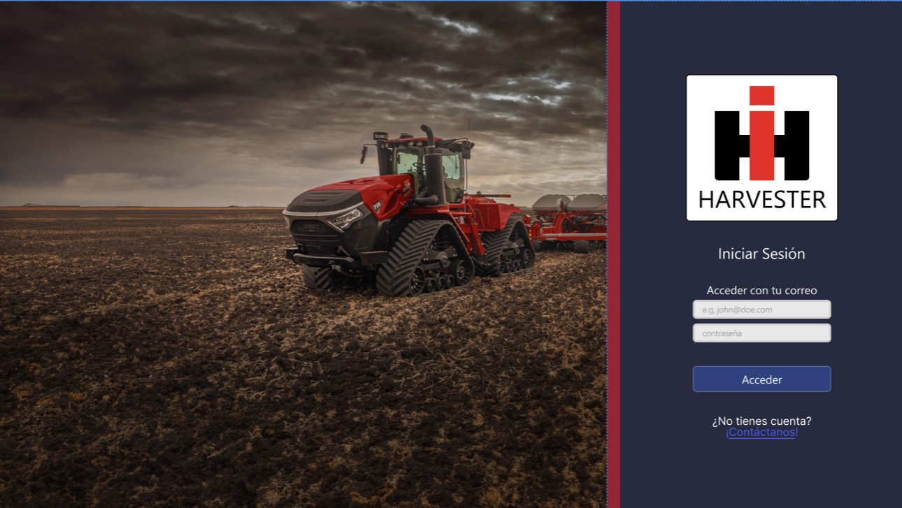

# RF2: Usuario registrado inicia sesión.

### Historia de Usuario

Yo como empleado de CNH y usuario de la aplicación harvester quiero ingresar con mis credenciales correspondientes a la aplicación de escritorio para poder acceder a las funcionalidades que hay dentro del sistema.

  **Criterios de Aceptación:**
  - El sistema debe permitir a lo usuarios registrados acceder a sus cuentas e ingresar al sistema.
  - Si las credenciales son incorrectas, el sistema debe de mostrar un mensaje claro de error.
  - Si el usuario ingresa correctamente, debe de ser reedirigido a la página principal.
  - La aplicación tendrá de contar con 2 campos a la hora de iniciar sesión, uno para correo electrónico, otro para contraseña del usuario.
  - La aplicación debe de validar y comparar las credenciales ingresadas por el usuario.
  - La aplicación arrojará una alerta en dado caso que el usuario no llene el campo de correo electrónico y se intenté acceder a la aplicación.
  - La aplicación arrojará una alerta en dado caso que el usuario no llene el campo de contraseña y se intenté acceder a la aplicación.
  - La aplicación arrojará una alerta en dado caso que la información ingresada dentro de los 2 campos correspondientes sea incorrecta.
  - Una vez iniciada la sesión y validados los datos del usuario, se mantendrá localmente almacenado un token el que hará que la sesión pueda mantenerse abierta durante 15 días, haciendo que no se tengan que validar los datos en cada apertura de la aplicación.

---

### Diagrama de Secuencia

- No aplica según nuestra [definición de Ready](../../definicion-ready-tractores.md).

---

### Mockup

> *Descripción*: El mockup representa la interfaz del sistema donde el usuario puede iniciar de sesión. Muestra los campos tanto de correo electrónico como de contraseña, además del botón de "Acceder" para poder entrar a la aplicación.

---
### Pruebas Unitarias 

#### [Pruebas de la RF](https://docs.google.com/spreadsheets/d/1W-JW32dTsfI22-Yl5LydMhiu-oXHH_xo3hWvK6FHeLw/edit?gid=710795973#gid=710795973)

---

### Pull Request
[https://github.com/CodeAnd-Co/App-Local-TracTech/pull/12](https://github.com/CodeAnd-Co/App-Local-TracTech/pull/12)

[https://github.com/CodeAnd-Co/Backend-Desacoplado-TracTech/pull/24](https://github.com/CodeAnd-Co/Backend-Desacoplado-TracTech/pull/24)