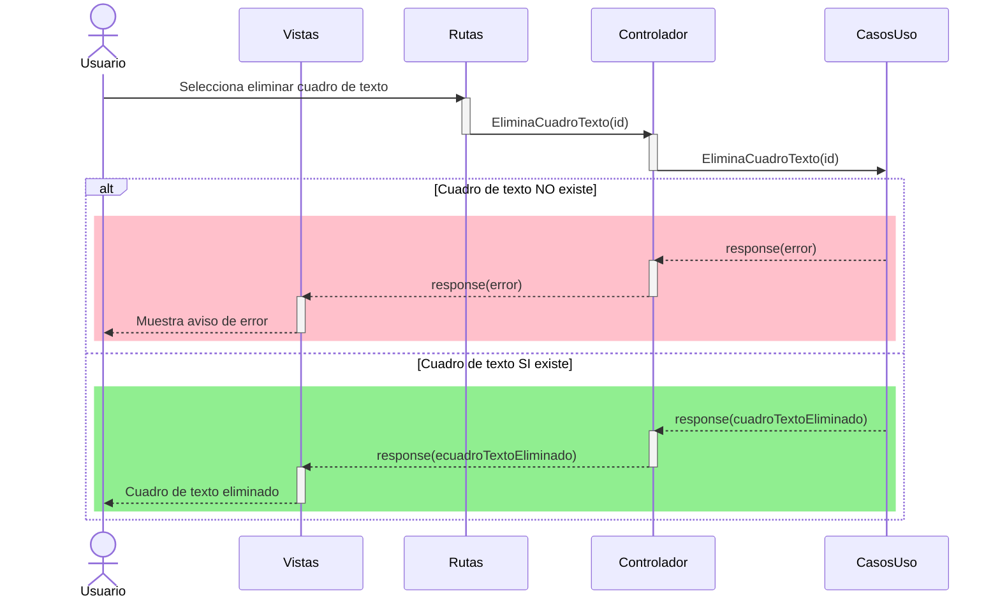

# RF20: Usuario elimina cuadro de texto del reporte.

### Historia de Usuario

Yo como usuario quiero eliminar cuadros de texto de mi reporte para limpiar la información agregada y eliminar los cuadros de texto necesarios.

  **Criterios de Aceptación:**
  - El usuario debe de poder eliminar cualquier cuadro de texto dentro del reporte
  - La eliminación debe de reflejarse de inmediato
  - El cuadro de texto eliminado no debe aparecer en el reporte guardado

---

### Diagrama de Secuencia

![Mockup]

> *Descripción*: El mockup representa la interfaz donde el usuario puede eliminar cuadros de texto del reporte.

---

### Pruebas Unitarias 
| ID Prueba | Descripción | Resultado Esperado |
|-----------|-------------|--------------------|
|PU-RF19-01|Eliminar un cuadro de texto.|El cuadro deaparece del reporte|
|PU-RF20-02|Verificar actualización inmediata.|La eliminación se refleja sin necesidad de recargar.|
|PU-RF20-03|Guardar reporte sin el cuadro eliminado.|El cuadro de texto eliminado no aparece en el reporte generado.|

---

### Pull Request
[https://github.com/CodeAnd-Co/App-Local-TracTech/pull/27](https://github.com/CodeAnd-Co/App-Local-TracTech/pull/27)
