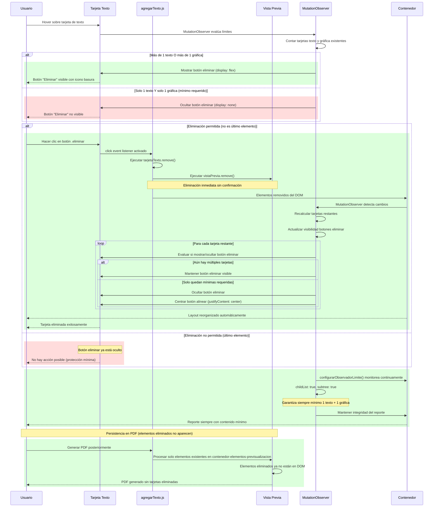
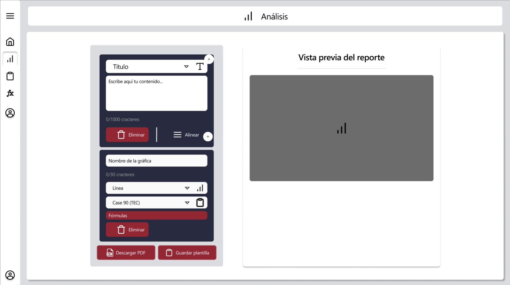

# RF20: Usuario elimina cuadro de texto del reporte.

**Última actualización:** 31 de mayo de 2025

### Historia de Usuario

Yo como usuario quiero eliminar cuadros de texto de mi reporte para limpiar la información agregada y eliminar los cuadros de texto innecesarios.

 **Criterios de Aceptación:**
 - El usuario debe poder eliminar cualquier cuadro de texto dentro del reporte haciendo clic en el botón "Eliminar".
 - La eliminación debe reflejarse de inmediato (menos de 1 segundo).
 - El cuadro de texto eliminado no debe aparecer en el reporte guardado.
 - El sistema debe mantener al menos una tarjeta de texto y una tarjeta de gráfica en el reporte.
 - Después de eliminar una tarjeta, el layout del reporte debe reorganizarse automáticamente.
 - La eliminación debe remover tanto la tarjeta de edición como su previsualización correspondiente.
 - Se deben de poder eliminar las graficas hasta tener un mínimo de 1 tarjeta dentro del reporte para asegurar que se puedan seguir agregando tarjetas de texto.

---

### Diagrama de Secuencia

> *Descripción*: El mockup representa la interfaz donde el usuario puede eliminar cuadros de texto del reporte.

---

### Pruebas Unitarias 

#### [Pruebas del RF](https://docs.google.com/spreadsheets/d/1W-JW32dTsfI22-Yl5LydMhiu-oXHH_xo3hWvK6FHeLw/edit?gid=1914045690#gid=1914045690)

---

### Pull Request
[https://github.com/CodeAnd-Co/App-Local-TracTech/pull/27](https://github.com/CodeAnd-Co/App-Local-TracTech/pull/27)

---

| **Tipo de Versión** | **Descripción**              | **Fecha**  | **Colaborador**          |
| ------------------- | ---------------------------- | ---------- | ------------------------ |
| **1.0**             | Creación del requisito       | 6/3/2025   | Antonio Landeros         |
| **2.0**             | Ordenar las RFs              | 1/6/2025   | Mauricio Anguiano          |
| **2.1**             | Agregar Mockups         | 4/6/2025   | Mauricio Anguiano           |