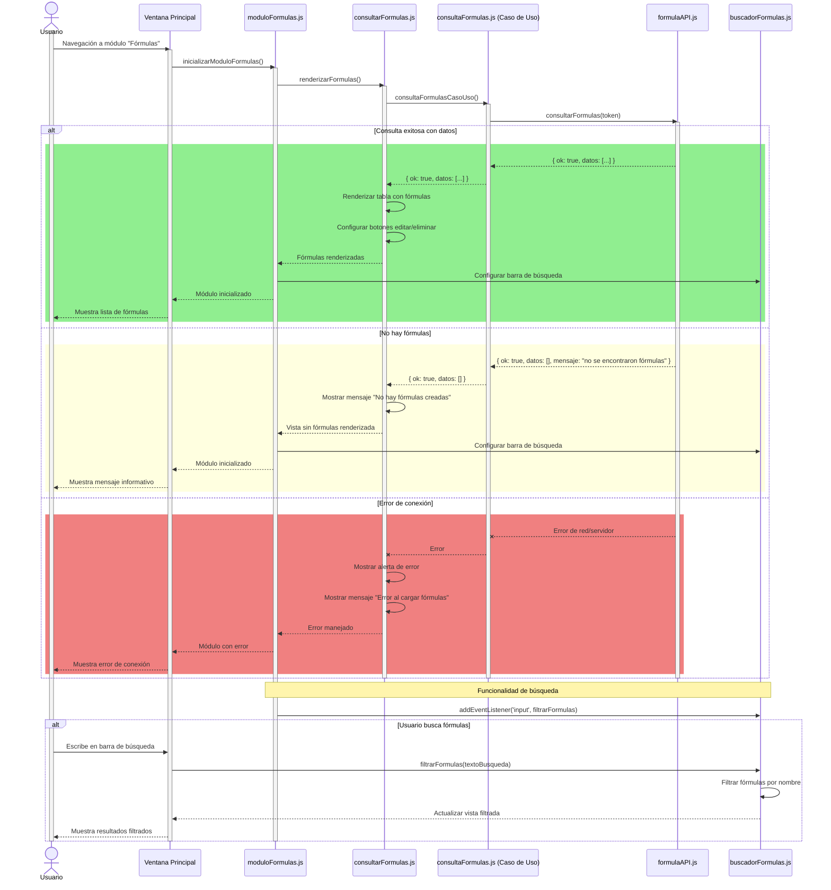
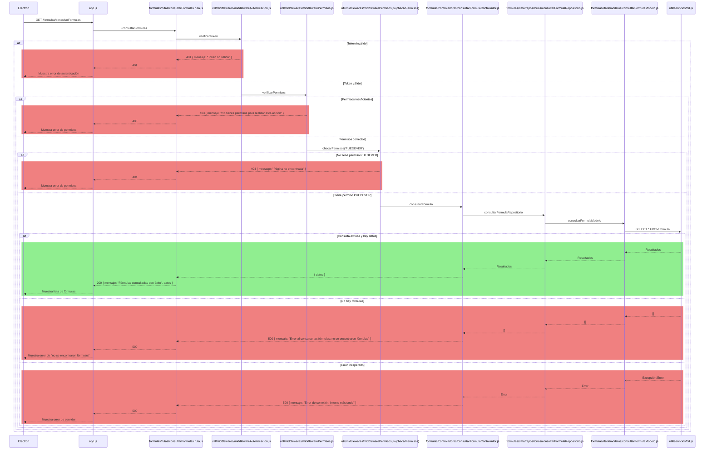

# RF21: Usuario consulta fórmulas

### Historia de Usuario

Yo como usuario quiero poder consultar las fórmulas que previamente fueron definidas para conocer las que podré aplicar a los datos que usaré en la generación de reportes.

  **Dependencias:**
  - US 14: Usuario selecciona datos a comparar en el análisis.

  **Criterios de Aceptación:**
  - El sistema debe mostrar al usuario el listado de fórmulas previamente guardadas de manera clara y accesible.
  - El sistema debe permitir buscar y filtrar fórmulas por nombre para facilitar su localización.
  - El sistema debe mostrar para cada fórmula su nombre y parámetros de manera organizada en una lista de todas las fórmulas.
  - El sistema debe proporcionar botones de acción (editar/eliminar) para cada fórmula listada.
  - El sistema debe notificar visualmente al usuario en caso de que ocurra cualquier error durante la consulta de las fórmulas, indicando el motivo del error.
  - El sistema debe manejar adecuadamente los casos en los que no existan fórmulas guardadas, mostrando un mensaje informativo al usuario.
  - El sistema debe cargar automáticamente las fórmulas al acceder al módulo sin requerir acción adicional del usuario.
  - El sistema debe mantener la funcionalidad de búsqueda en tiempo real mientras el usuario escribe en el campo de búsqueda.

---

### Diagrama de Secuencia

> *Descripción*: Los diagramas de secuencia muestran cómo, una vez que el usuario ha seleccionado los datos a analizar, el sistema consulta las fórmulas previamente definidas. Si la consulta es exitosa, se devuelve el listado de fórmulas disponibles; si falla, se muestra un mensaje de error.

#### Primera Parte (Electron)

#### Segunda Parte (Backend Desacoplado)

---

### Mockup

> *Descripción*: El mockup representa la interfaz del sistema donde el usuario puede consultar la página de consultar formulas. 

---

### Link Pruebas

#### [Pruebas del RF](https://docs.google.com/spreadsheets/d/1W-JW32dTsfI22-Yl5LydMhiu-oXHH_xo3hWvK6FHeLw/edit?gid=1978361660#gid=1978361660)
---

### Pull Request
[https://github.com/CodeAnd-Co/App-Local-TracTech/pull/62](https://github.com/CodeAnd-Co/App-Local-TracTech/pull/62)

[https://github.com/CodeAnd-Co/Backend-Desacoplado-TracTech/pull/30](https://github.com/CodeAnd-Co/Backend-Desacoplado-TracTech/pull/30)

---

| **Tipo de Versión** | **Descripción**              | **Fecha**  | **Colaborador**          |
| ------------------- | ---------------------------- | ---------- | ------------------------ |
| **1.0**             | Creación del requisito       | 6/3/2025   | Antonio Landeros         |
| **2.0**             | Ordenar las RFs              | 1/6/2025   | Mauricio Anguiano          |
| **2.1**             | Agregar criterios de acceptación y ajustes al diagrama de secuencia         | 4/6/2025   | Galo Alejandro del Rio Viggiano           |
| **2.2**             | Terminar de agregar links de pruebas         | 4/6/2025   | Daniel Quejeiro           |  
|**2.3**|Agregar criterios de aceptación y especificar diagrama de app local|5/6/2025| Mauricio Anguiano 
