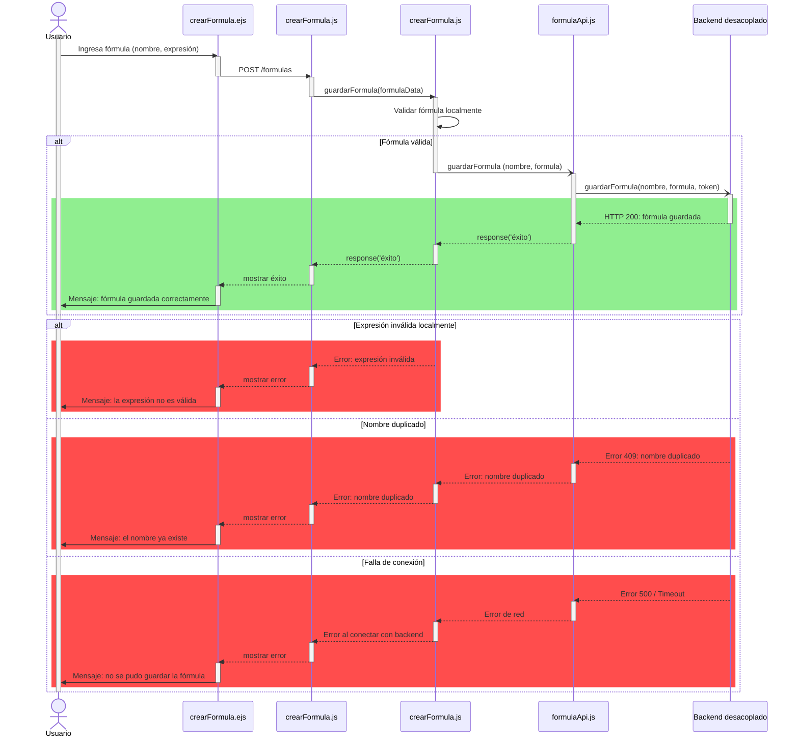
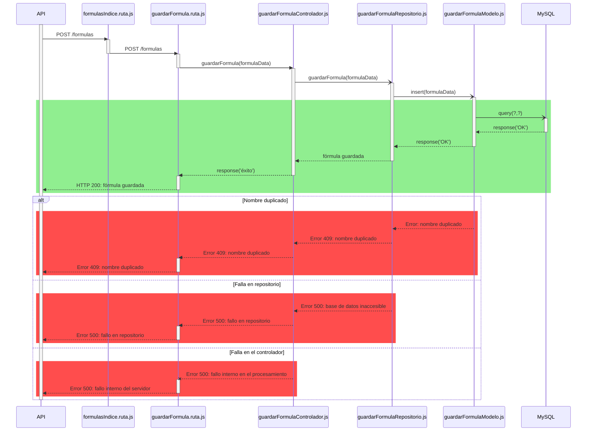
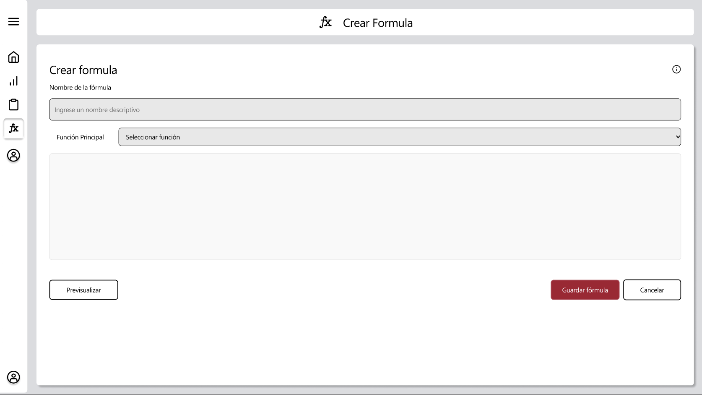

# RF22: Usuario guarda fórmula.

### Historia de Usuario

Yo como usuario quiero guardar una fórmula matemática/comercial personalizada que pueda aplicarse en futuras tablas, filtrar datos, generar reportes y mostrar información relevante para la toma de decisiones, sin necesidad de reescribir expresiones complejas manualmente cada vez.

  **Precondiciones:**
  - Es necesario haber cargado un archivo Excel.

  **Criterios de Aceptación:**
  
  - El usuario debe de poder guardar fórmulas con variables modificables.
  - La fórmula guardada debe de estar accesible en la lista de fórmulas disponibles.
  - Los campos de texto evitan inyecciones de código.
  - El límite de caracteres para la fórmula es de 512.
  - El límite de caracteres para el nombre es de 50.
  - El sistema debe permitir anidar fórmulas (fórmulas dentro de fórmulas) hasta un máximo de 10 antes de perder legibilidad.
  - El sistema debe mostrar un mensaje de éxito al crear la fórmula.
  - El sistema debe monstrar un mensaje de error dependiendo de lo falló.

---

### Diagrama de Secuencia

### Segunda parte

---

### Mockup

> *Descripción*: El mockup representa la interfaz del sistema donde el usuario puede crear y guardar una fórmula.

> *Descripción*: El mockup representa la interfaz del sistema donde el usuario ya a seleccionado una formula.

---

### Pruebas Unitarias 
  - [Pruebas](https://docs.google.com/spreadsheets/d/1W-JW32dTsfI22-Yl5LydMhiu-oXHH_xo3hWvK6FHeLw/edit?gid=1362976154#gid=1362976154)

### Pull Request
[https://github.com/CodeAnd-Co/App-Local-TracTech/pull/38](https://github.com/CodeAnd-Co/App-Local-TracTech/pull/38)