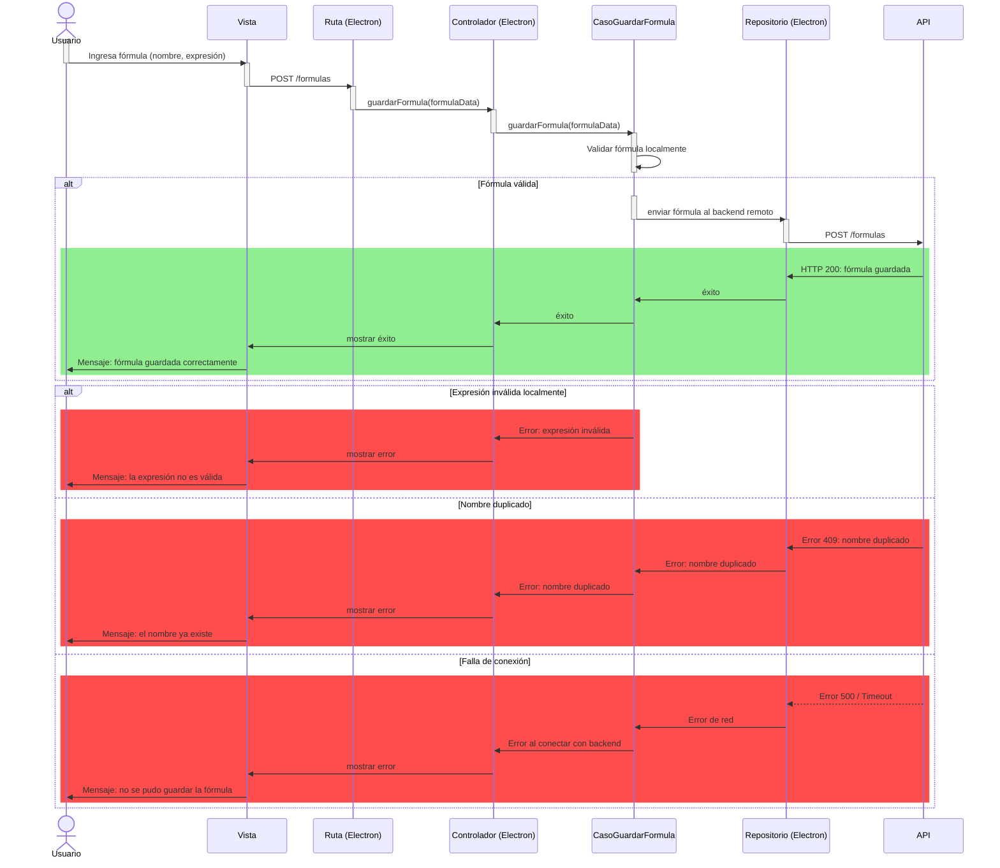
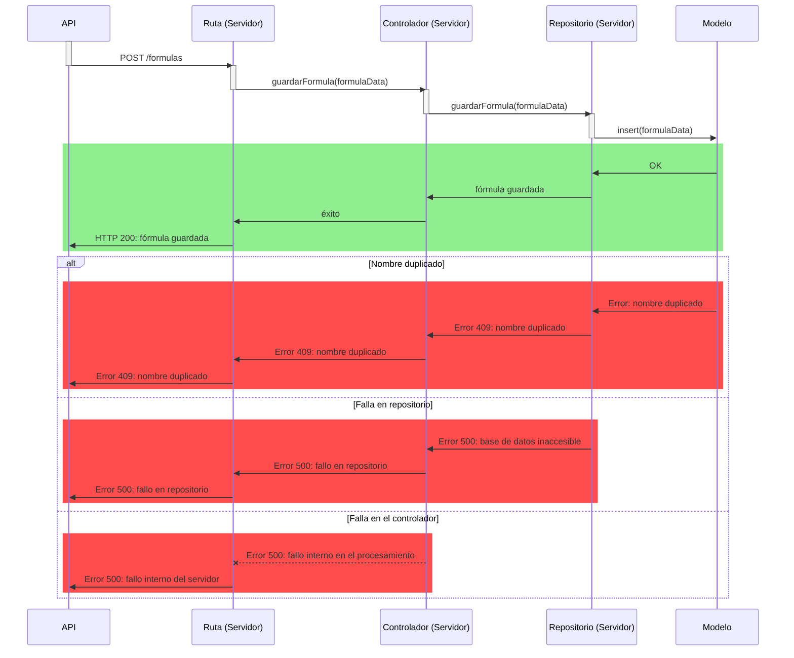

# RF22: Usuario guarda fórmula.

### Historia de Usuario

Yo como usuario quiero guardar una fórmula matemática/comercial personalizada que pueda aplicarse en futuras tablas, filtrar datos, generar reportes y mostrar información relevante para la toma de decisiones, sin necesidad de reescribir expresiones complejas manualmente cada vez.

  **Criterios de Aceptación:**
  
  - El usuario debe de poder guardar fórmulas con variables modificables.
  - La fórmula guardada debe de estar accesible en la lista de fórmulas disponibles.

---

### Diagrama de Secuencia

### Segunda parte

---

### Mockup

![Mockup]

---

### Pruebas Unitarias 
  - [Pruebas](https://docs.google.com/spreadsheets/d/1W-JW32dTsfI22-Yl5LydMhiu-oXHH_xo3hWvK6FHeLw/edit?gid=1362976154#gid=1362976154)
