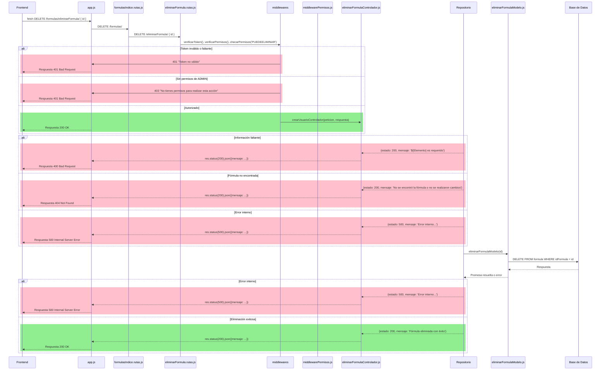

# RF23: Usuario elimina formula.

### Historia de Usuario

Yo como usuario quiero eliminar una formula guardada para mantener las fórmulas organizadas y mantener solo las fórmulas útiles.

  **Precondiciones:**
  - El usuario se encuentra en el módulo de fórmulas, en la vista de consultar fórmulas.
  - Debe haber fórmulas guardadas en base de datos.

  **Criterios de Aceptación:**
  - La fórmula se elimina desde el menú de fórmulas.
  - Hay un popup para confirmar la eliminación de una fórmula
  - Si se confirma la eliminación la fórmula se debe eliminar y no estar disponible para utilizarse
  - Si se cancela la eliminación no se hace ningún cambio a la fórmula
  - Se muestra una alerta indicando que se eliminó la fórmula
  - Si ocurre algún error durante la eliminación debe haber una alerta informando el error
  - La fórmula debe existir antes de ser eliminada
  
---

### Diagrama de Secuencia

#### Frontend

#### Diagrama de secuencia - Backend Desacoplado

---

### Mockup

---

### Pruebas Unitarias 

[Pruebas](https://docs.google.com/spreadsheets/d/1W-JW32dTsfI22-Yl5LydMhiu-oXHH_xo3hWvK6FHeLw/edit?gid=1374043065#gid=1374043065)

---

### Pull Request
[https://github.com/CodeAnd-Co/App-Local-TracTech/pull/69](https://github.com/CodeAnd-Co/App-Local-TracTech/pull/69)
