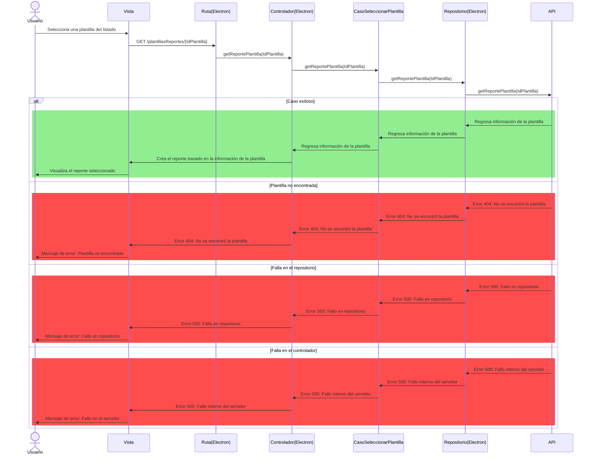
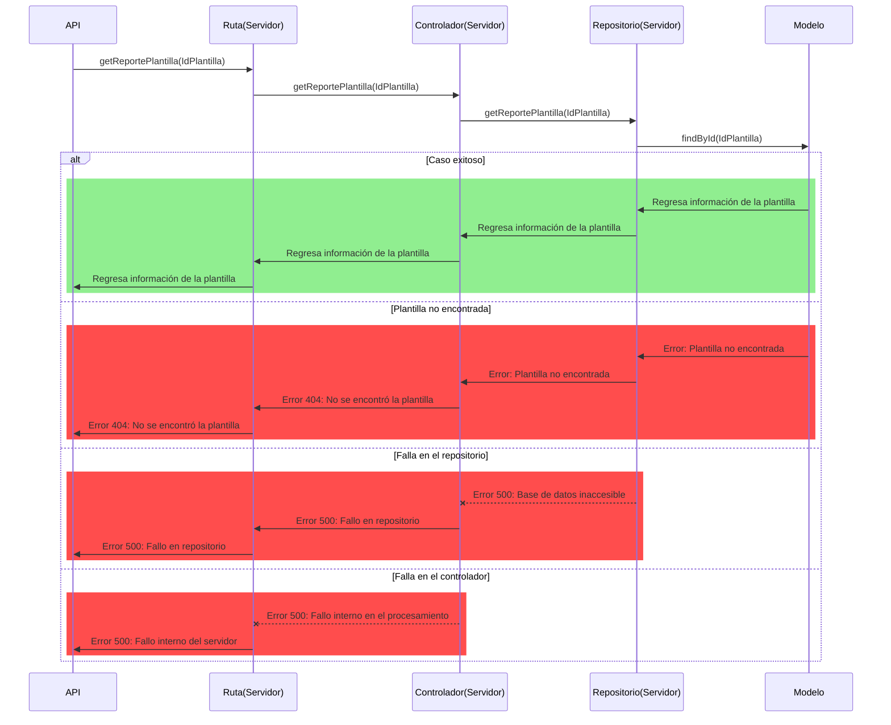

# RF24: Usuario selecciona plantilla de reporte.

**Última actualización:** 08 de marzo de 2025

### Historia de Usuario

Yo como usuario quiero seleccionar una plantilla de reporte para generar un informe en formato de PDF.

  **Criterios de Aceptación:**
  - El usuario debe de poder seleccionar una plantilla de la lista
  - La plantilla seleccionada debe de aplicarse automaticamente. 

---

### Diagrama de Secuencia
El diagrama de secuencia está separado en dos partes para facilitar la visualización. La mitad de arriba corresponde a la aplicación de Electron y la otra mitad al servidor desacoplado.

Primera parte (Electron)

Segunda parte (Servidor desacoplado)

> *Descripción*: El diagrama de secuencia muestra cómo el usuario selecciona una plantilla y esta se aplica automaticamente.

### Mockup

![Mockup]

> *Descripción*: El mockup representa la interfaz donde el usuario selecciona y aplica una plantilla de reporte. 

---

### Pruebas Unitarias 
| ID Prueba | Descripción | Resultado Esperado |
|-----------|-------------|--------------------|
|PU-RF24-01|Seleccionar una plantilla.|La plantilla se aplica correctamente al reporte.|
|PU-RF24-02|Verificar datos.|El reporte muestra la configuración de la plantilla guardada previamente|

| Autor | Descripción del cambio | Versión |
|---------|-------------------------|---------|
| Daniel Queijeiro Albo | Agregar diagrama de secuencia | V.1.1 |