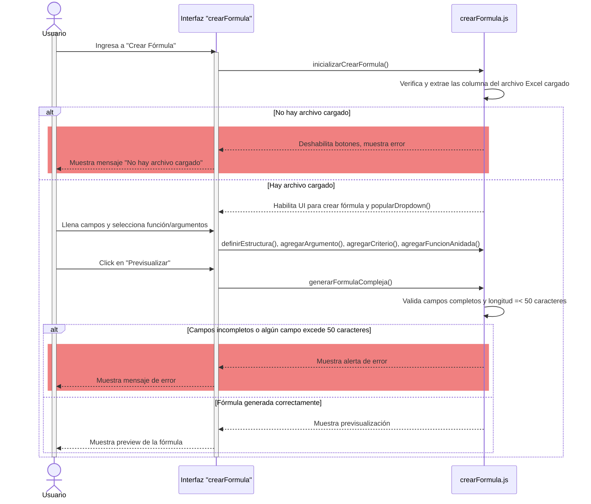
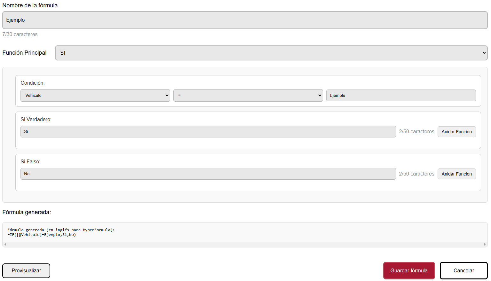

# RF24: Usuario define fórmula

### Historia de Usuario

Yo como usuario quiero definir mis propias fórmulas para utilizarlas en los reportes.

  **Criterios de Aceptación:**
  - El sistema debe permitir al usuario crear fórmulas personalizadas, tanto simples como complejas.
  - Las fórmulas definidas deben estar siempre accesibles para su consulta, edición y reutilización.
  - El sistema debe validar que todos los campos obligatorios estén completos antes de guardar una fórmula.
  - El sistema debe validar el formato de las fórmulas, incluyendo el número de caracteres y el uso de caracteres válidos.
  - Si algún campo no cumple con los requisitos de longitud (50 caracteres) y los campos esten llenos, el sistema debe mostrar un mensaje de error claro e informativo al usuario.
  - El usuario debe recibir retroalimentación visual sobre el éxito o fallo en la creación y almacenamiento de fórmulas.

---

### Diagrama de Secuencia

#### Primera Parte (Electron)

### Mockup

> *Descripción*: El mockup representa la interfaz del sistema donde el usuario puede crear y guardar una fórmula.

> *Descripción*: El mockup representa la interfaz del sistema donde el usuario ya a seleccionado una formula.

> *Descripción*: El mockup representa la interfaz del sistema donde el usuario ya definio una formula y este la cosulta con "Preview" .

### Pruebas Unitarias 

#### [https://docs.google.com/spreadsheets/d/1W-JW32dTsfI22-Yl5LydMhiu-oXHH_xo3hWvK6FHeLw/edit?gid=1643463360#gid=1643463360](https://docs.google.com/spreadsheets/d/1W-JW32dTsfI22-Yl5LydMhiu-oXHH_xo3hWvK6FHeLw/edit?gid=1643463360#gid=1643463360)
---

### Pull Request
[https://github.com/CodeAnd-Co/App-Local-TracTech/pull/38](https://github.com/CodeAnd-Co/App-Local-TracTech/pull/38)

[https://github.com/CodeAnd-Co/Backend-Desacoplado-TracTech/pull/11](https://github.com/CodeAnd-Co/Backend-Desacoplado-TracTech/pull/11)

---

| **Tipo de Versión** | **Descripción**              | **Fecha**  | **Colaborador**          |
| ------------------- | ---------------------------- | ---------- | ------------------------ |
| **1.0**             | Creación del requisito       | 6/3/2025   | Antonio Landeros         |
| **2.0**             | Ordenar las RFs              | 1/6/2025   | Mauricio Anguiano          |
| **2.1**             | Ajuste en criterios de aceptación y agregar Mockups           | 3/6/2025   | Galo Alejandro del Rio Viggiano            |  