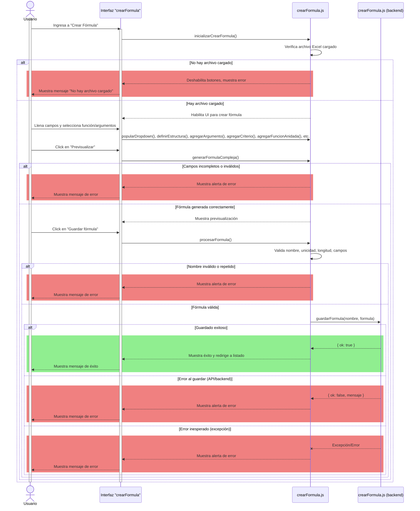
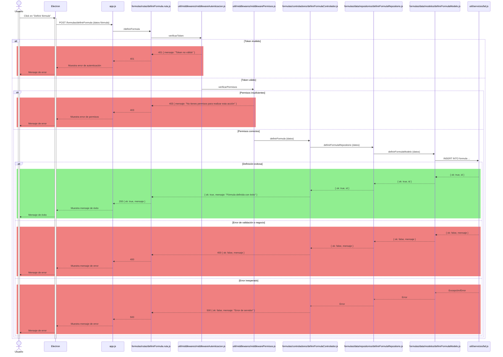
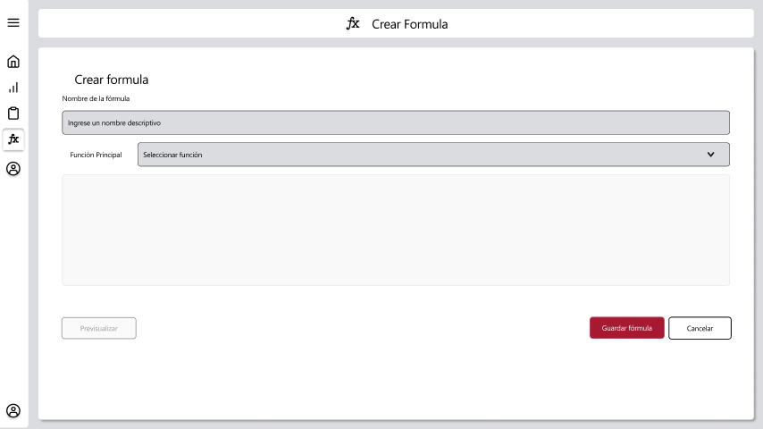
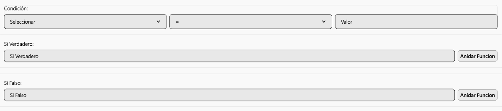
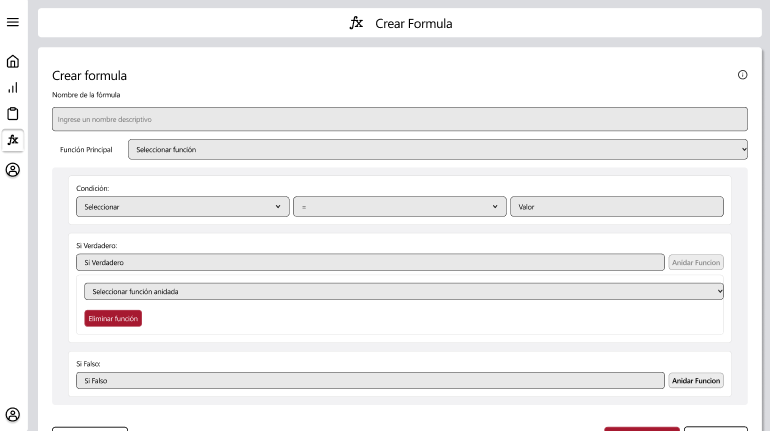

# RF24: Usuario define fórmula

### Historia de Usuario

Yo como usuario quiero definir mis propias fórmulas para utilizarlas en los reportes.

  **Criterios de Aceptación:**
  - El sistema debe permitir al usuario crear y guardar fórmulas personalizadas, tanto simples como complejas.
  - Las fórmulas definidas deben estar siempre accesibles para su consulta, edición y reutilización.
  - El sistema debe validar la unicidad y el formato de las fórmulas antes de guardarlas, mostrando mensajes claros en caso de error.
  - El usuario debe recibir retroalimentación visual sobre el éxito o fallo en la creación y almacenamiento de fórmulas.

---

### Diagrama de Secuencia

#### Primera Parte (Electron)

![Diagrama de Secuencia] 

#### Segunda Parte (Backend Desacoplado)

### Mockup

### Pruebas Unitarias 

#### [https://docs.google.com/spreadsheets/d/1W-JW32dTsfI22-Yl5LydMhiu-oXHH_xo3hWvK6FHeLw/edit?gid=1643463360#gid=1643463360](https://docs.google.com/spreadsheets/d/1W-JW32dTsfI22-Yl5LydMhiu-oXHH_xo3hWvK6FHeLw/edit?gid=1643463360#gid=1643463360)
---

### Pull Request
[https://github.com/CodeAnd-Co/App-Local-TracTech/pull/38](https://github.com/CodeAnd-Co/App-Local-TracTech/pull/38)
