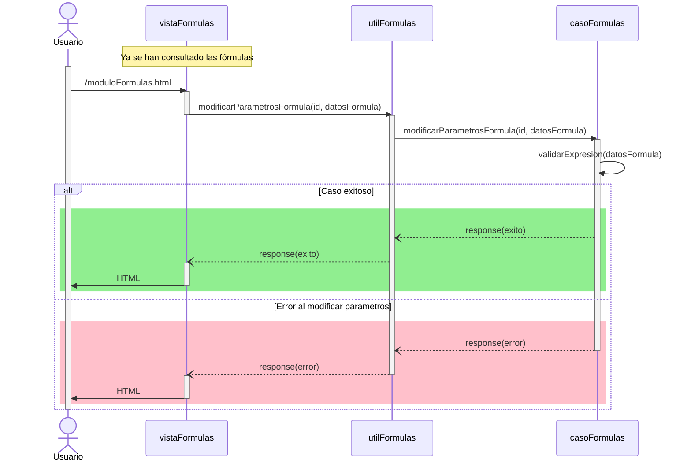

# RF25: Usuario selecciona parámetros de fórmula.

### Historia de Usuario

Yo como usuario quiero seleccionar los parámetros de la fórmula que voy a aplicar para mis gráficas 

  **Precondiciones:**
  - Se hizo la consulta a base de datos con las fórmulas
  - Las formulas se muestran en un menú desplegable

  **Criterios de Aceptación:**
  - Los parámetros de la fórmula se modifican correctamente
  
---

### Diagrama de Secuencia

---

### Mockup

![Mockup]

---

### Pruebas Unitarias 
  - [Pruebas](https://docs.google.com/spreadsheets/d/1W-JW32dTsfI22-Yl5LydMhiu-oXHH_xo3hWvK6FHeLw/edit?gid=1279661615#gid=1279661615)
