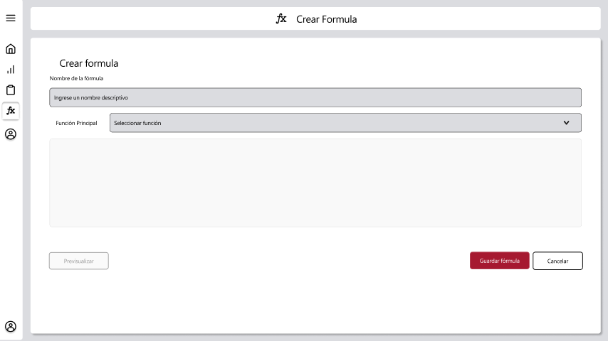

# RF25: Usuario selecciona parámetros de fórmula.

### Historia de Usuario

Yo como usuario quiero seleccionar los parámetros de la fórmula que voy a aplicar para mis gráficas 

  **Precondiciones:**
  - Estar en la vista de crear fórmula
  - Haber seleccionad una fórmula de tipo SI
  - Tener un archivo de excel cargado

  **Criterios de Aceptación:**
  - La selección de parámetros solo aparece una vez se selecciona un tipo de fórmula
  - La selección de parámetros solo aparece en funciones de tipo SI
  - Debe mostrar solo las columnas seleccionadas por el usuario
  - Debe poder seleccionar los datos de los tractores seleccionados
  - Las columnas mostradas en selectores de funciones deben corresponder con el tractor seleccionado
  
---

### Diagrama de Secuencia

---

### Mockup

---

### Pruebas Unitarias 
  - [Pruebas](https://docs.google.com/spreadsheets/d/1W-JW32dTsfI22-Yl5LydMhiu-oXHH_xo3hWvK6FHeLw/edit?gid=1279661615#gid=1279661615)
