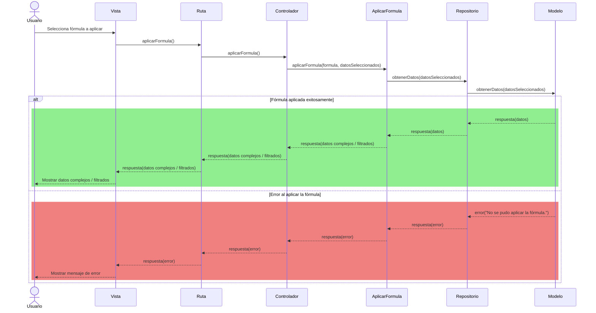

# RF27: Usuario aplica fórmula

### Historia de Usuario

Yo como usuario quiero aplicar las fórmulas que previamente fueron definidas para generar datos complejos o filtrar los datos que usaré en la generación de reportes.

  **Prerequisitos:**
  - Se debe tener datos seleccionados.
  - Es necesario contar con fórmulas guardadas.
  - Es necesario estar conectado a internet.

  **Dependencias:**
  - RF2: Usuario registrado inicia sesión.
  - RF21: Usuario consulta fórmulas.

  **Criterios de Aceptación:**
  - El sistema debe permitir seleccionar una fórmula previamente guardada.
  - El sistema debe permitir buscar las fórmulas guardadas desde el cuadro de fórmulas.
  - El sistema notifica cuando no hay fórmulas guardadas.
  - Las entradas de texto no deben permitir inyección de código.
  - El sistema debe aplicar la fórmula sobre los datos seleccionados.
  - El usuario debe poder ver el resultado aplicado en una tabla o gráfica.
  - El sistema debe notificar visualmente al usuario en caso de un error al aplicar la fórmula.
  - El sistema debe notificar visualmente al usuario cuando la operación es exitosa.
  
---

### Diagrama de Secuencia

> *Descripción*: El diagrama de secuencia muestra cómo, tras que el usuario selecciona una fórmula de la lista (con datos ya previamente seleccionados), se invoca la función de aplicar fórmula. La aplicación procesa la fórmula sobre esos datos y, en caso de éxito, devuelve datos complejos filtrados para la generación de reportes; si falla, muestra un mensaje de error.

---

### Mockup

> *Descripción*: El mockup representa la interfaz del sistema donde el usuario puede seleccionar las fórmulas a aplicar en el reporte.

---

### Pruebas Unitarias 

  - [Pruebas](https://docs.google.com/spreadsheets/d/1W-JW32dTsfI22-Yl5LydMhiu-oXHH_xo3hWvK6FHeLw/edit?gid=2009483418#gid=2009483418)

---

### Pull Request
[https://github.com/CodeAnd-Co/App-Local-TracTech/pull/92](https://github.com/CodeAnd-Co/App-Local-TracTech/pull/92)
